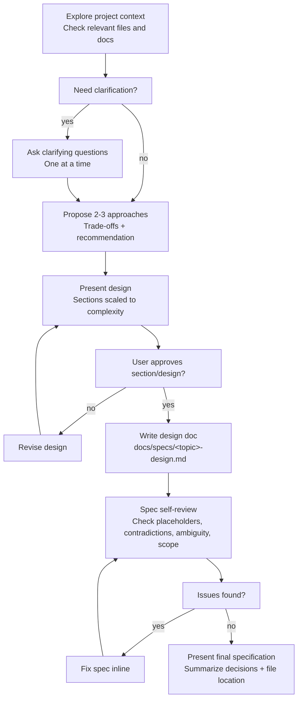

# Brainstorming Ideas Into Designs

Help turn ideas into fully formed designs and specs through natural collaborative dialogue.

Start by understanding the current project context, then ask questions one at a time to refine the idea. Once you understand what you're building, present the design and get user approval.

<HARD-GATE>
Do NOT invoke any implementation skill, write any code, scaffold any project, or take any implementation action until you have presented a design and the user has approved it. This applies to EVERY project regardless of perceived simplicity.
</HARD-GATE>

## Anti-Pattern: "This Is Too Simple To Need A Design"

Every project goes through this process. A todo list, a single-function utility, a config change — all of them. "Simple" projects are where unexamined assumptions cause the most wasted work. The design can be short (a few sentences for truly simple projects), but you MUST present it and get approval.

## Checklist

You MUST create a task for each of these items and complete them in order:

1. **Explore project context** — check files, docs relevant to the project
2. **Ask clarifying questions** — one at a time, understand purpose/constraints/success criteria
3. **Propose 2-3 approaches** — with trade-offs and your recommendation
4. **Present design** — in sections scaled to their complexity, get user approval after each section
5. **Write design doc** — save to `docs/specs/<topic>-design.md`
6. **Spec self-review** — quick inline check for placeholders, contradictions, ambiguity, scope (see below)
7. **Present final specification** — summarize key decisions and location of the spec file

## Process Flow



## The Process

**Understanding the idea:**

- Explore only the project context that is relevant to the request:
  - Existing files
  - Existing docs
  - Related modules or features

- If the request is too large for a single spec, suggest decomposing it into smaller specs.
- Ask clarifying questions only when important information is missing.
- Ask one question at a time.
- Focus on:
  - Purpose
  - Constraints
  - Success criteria

**Exploring approaches:**

- Propose 2-3 possible approaches.
- Explain the trade-offs of each approach.
- Lead with the recommended approach and explain why it is the best fit.
- Keep the recommendation practical and avoid unnecessary complexity.

**Presenting the design:**

- Present the design after the problem is understood.
- Scale the detail based on complexity:
  - Small feature: short explanation
  - Medium feature: sections for flow, components, data, edge cases
  - Large feature: architecture, modules, data flow, error handling, testing

- Ask for approval only when the design has important decisions or trade-offs.
- Do not ask for approval after every small section unless the design is complex.

**Design for isolation and clarity:**

- Break the solution into small units with clear responsibilities.
- Each unit should have:
  - One clear purpose
  - Clear inputs and outputs
  - Minimal dependencies

- Prefer simple boundaries that are easy to understand and test.
- Avoid unnecessary abstraction.

**Working in existing codebases:**

- Follow the existing project structure and naming patterns.
- Include small targeted improvements only when they directly support the current work.
- Do not propose unrelated refactoring.

## After the Design

**Documentation:**

- Write the final design specification to:

```text
docs/specs/<topic>-design.md
```

- The spec should include:
  - Problem
  - Goal
  - Scope
  - Requirements
  - Proposed design
  - Data flow
  - Edge cases
  - Testing notes
  - Acceptance criteria

**Spec Self-Review:**

After writing the spec document:

1. Perform an internal review:
   - Remove `TBD`, `TODO`, empty sections, or vague text
   - Check consistency between requirements, design, and acceptance criteria
   - Verify scope is appropriate for a single implementation plan
   - Clarify ambiguous requirements

2. Dispatch the independent spec reviewer using:
   `brainstorming/spec-document-reviewer-prompt.md`

3. If issues are found:
   - Update the spec
   - Re-run the reviewer

4. Continue only when the reviewer returns:

```text
Status: Approved
```

Fix issues inline and continue.

**Final Output:**

- Summarize the key design decisions.
- Show the spec file location.
- Do not automatically invoke the implementation planning skill.
- The next step should be triggered separately by the user, for example:

```text
docs/specs/<topic>-design.md
```

## Key Principles

- **One question at a time** — avoid overwhelming the user.
- **Clarify only when needed** — do not ask unnecessary questions.
- **YAGNI** — remove unnecessary features and complexity.
- **Explore alternatives** — compare 2-3 approaches before choosing.
- **Keep specs focused** — one spec should lead to one implementation plan.
- **Do not auto-transition** — brainstorming ends after the spec is written and reviewed.
