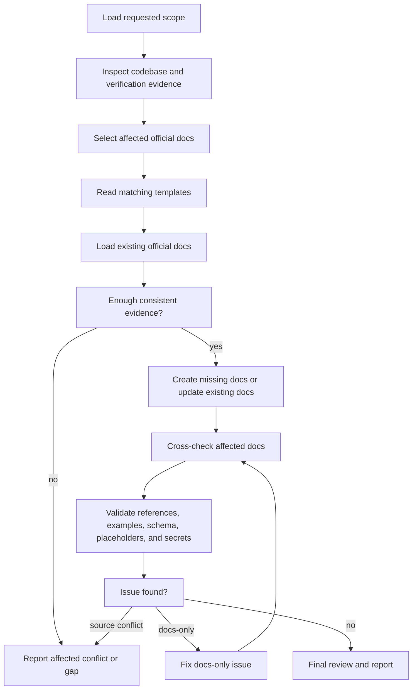

# Documenting the Codebase

Analyze the current codebase and maintain only these official documents:

- `docs/architecture.md`
- `docs/api.md`
- `docs/database.md`

Use implementation evidence rather than temporary plans. Read the matching
template before every create or update, apply it flexibly, and report anything
that cannot be verified.

<HARD-GATE>
Do not depend on `docs/specs/` or `docs/plans/`; they are optional context.
During a documentation task, edit only the three official docs listed above.
Do not edit source code, schema, configuration, tests, generated artifacts,
diagrams, other documentation files, or the templates.

Do not invent behavior, contracts, fields, relationships, ownership, or
errors to fill a template. Do not install documentation tools, generators, or
dependencies. Never hide conflicts between implementation, tests, runtime
contracts, and existing docs.
</HARD-GATE>

## Required Input

Use the documentation scope in the user's current request. When the user asks
to document the whole codebase, inspect the repository and determine which of
the three official docs have sufficient evidence to create or update.

Specs and plans may be read as optional context when they exist, but the skill
must work when `docs/specs/` and `docs/plans/` are absent.

## Sources of Truth

Use sources in this order:

1. **Current implementation** — source, module structure, controllers,
   routers, DTOs, models, migrations, schemas, repositories, and
   configuration.
2. **Verification evidence** — tests, builds, lint, type checks, integration
   checks, and relevant command output.
3. **Runtime or generated contracts** — OpenAPI, generated schema, or metadata
   when its source is known.
4. **Existing official docs** — preserve content that remains accurate.
5. **Optional spec or plan context** — use for orientation only.

When code, tests, or runtime contracts conflict, stop the affected
documentation update and report the sources and mismatch. Continue only
independent documentation with consistent evidence.

For current behavior, verified codebase evidence takes precedence over
temporary spec or plan text. Report optional-reference mismatches rather than
documenting behavior that does not exist.

If verification cannot run, use explicit static evidence and report every
unrun check. Do not claim static inspection is passing runtime verification.

## Checklist

Create a task for each item and complete them in order:

1. **Load scope** — identify the requested codebase and documentation scope.
2. **Inspect evidence** — read relevant code, schema, configuration,
   contracts, tests, and existing official docs.
3. **Discover checks** — identify project verification commands already
   available.
4. **Select docs** — choose each affected official document using evidence.
5. **Read templates** — load every matching template before editing.
6. **Resolve evidence** — confirm sufficient evidence and classify conflicts.
7. **Create or update** — write missing docs or update existing docs
   selectively.
8. **Cross-check** — compare architecture, API, and database terminology,
   ownership, and relationships.
9. **Validate** — check references, examples, schema details, placeholders,
   stale content, and secrets.
10. **Review and report** — inspect the final diff and report evidence,
    changes, checks, conflicts, and gaps.

## Process Flow



## Document Selection

Update `docs/architecture.md` when evidence shows changes to:

- Module or service boundaries.
- Responsibilities or ownership.
- Component relationships.
- System flow or data flow.
- References to existing diagrams.

Update `docs/api.md` when evidence shows changes to:

- Route, method, or path.
- Authentication or authorization.
- Request or response contract.
- Status code or error behavior.
- API versioning or compatibility.

Update `docs/database.md` when evidence shows changes to:

- Storage, table, collection, or schema structure.
- Field, type, default, or nullability.
- Key, relationship, index, or constraint.
- Data ownership or lifecycle.

One change can affect multiple official docs. Update every affected document
within the requested scope when sufficient evidence exists.

## Template Rules

Before creating or updating an official doc, read its template:

- `docs/architecture.md` uses `templates/architecture.md`.
- `docs/api.md` uses `templates/api.md`.
- `docs/database.md` uses `templates/database.md`.

During documentation tasks, templates are read-only format references:

- Start a missing official doc from the matching template.
- Preserve useful conventions and accurate content in an existing doc.
- Remove non-applicable and empty sections.
- Add a section only when evidence requires it and it fits the document role.
- Do not rewrite a complete file solely to impose template order.
- Never copy instructional comments, `METHOD /path`, `table_name`, or other
  sample placeholders into official docs.

Templates define format, not system behavior. Every final statement must be
supported by codebase or verification evidence.

## Codebase Analysis

Use `rg --files` and `rg` first to discover relevant files and symbols. Prefer
structured project parsers, framework tooling, and existing verification
commands when available. Do not assume a particular language or framework.

### Architecture Evidence

Inspect:

- Module, package, workspace, and build structure.
- Application entry points and services.
- Component dependencies and ownership boundaries.
- Queues, storage, external integrations, and data flows.
- Existing diagram references.

Reference existing diagrams only. Do not create or edit diagram sources or
generated images.

### API Evidence

Inspect:

- Controller annotations, routers, and route registration.
- Request and response DTOs or schemas.
- Validation rules.
- Authentication and security configuration.
- Exception handling and error mapping.
- OpenAPI source and API-focused tests.

Do not infer an endpoint field, header, status, or error that is absent from
the implementation evidence.

### Database Evidence

Inspect:

- Migrations and schema files.
- Entity or model mappings.
- Repositories and queries.
- Keys, relationships, indexes, and constraints.
- Database metadata when locally available.

Do not infer ownership, type, nullability, default, relationship, index, or
constraint from naming alone.

## Conflict Handling

### Code vs Tests or Runtime Contracts

- Do not document the conflict as confirmed behavior.
- Report the exact sources and mismatch.
- Continue only documentation areas independent of the conflict.
- Do not fix code, tests, contracts, or generated artifacts in this skill.

### Existing Docs vs Codebase

- Update or remove stale content when implementation evidence shows it is
  incorrect.
- Preserve accurate content and unrelated user changes.
- Keep historical rationale only when clearly labeled and still useful.

### Spec or Plan vs Codebase

- Treat specs and plans as optional context.
- Document evidenced current implementation behavior.
- Report a mismatch when optional context differs from verified code.

### Missing Evidence

- Do not guess.
- Record the sources inspected and the unresolved gap.
- Ask the user only when the missing evidence blocks accurate documentation
  and cannot be discovered from the repository.

## Create and Update Rules

- Create only affected missing official docs.
- Read relevant existing official docs fully before editing.
- Preserve accurate content, local conventions, and unrelated user changes.
- Normalize only affected sections when the current structure remains useful.
- Remove stale statements when evidence proves they are no longer true.
- Do not edit any file outside the three official docs during a documentation
  task.

## Validation Rules

- Prefer existing build, test, lint, docs, API, and schema commands.
- Confirm referenced local paths exist.
- Check API examples against controllers, DTOs, contracts, or tests.
- Check table details against migration, schema, entity, or metadata evidence.
- Cross-check module, service, entity, field, authentication, and ownership
  names across all affected official docs.
- Check internal links or anchors when project tooling supports them.
- Scan for unresolved template markers, stale content, broken references, and
  likely credentials or secrets.
- Use safe placeholder credentials in examples.
- Do not install new validation tooling.
- Never report an unrun check as passing.

## Stop Conditions

Stop the affected documentation work when:

- Evidence is insufficient for an accurate statement.
- Code, tests, or runtime contracts conflict.
- The request targets a document outside architecture, API, or database docs.
- Completion requires an implementation, generated-artifact, or diagram
  change.
- A required permission or environment state is unavailable.

Continue independent documentation only when its evidence and scope are
clearly separable from the blocker.

## Final Review

Before reporting:

- Inspect every changed official doc.
- Confirm no file outside the allowed three was changed.
- Confirm matching templates were read and not modified.
- Remove empty sections, template instructions, sample placeholders, invented
  contracts, and stale content.
- Check for exposed secrets and unsafe example credentials.
- Confirm cross-document terminology, relationships, authentication, and
  ownership are consistent.
- Record every unrun validation and unresolved gap.

## Final Output

Use this result format:

```text
Documentation Scope
- Codebase scope analyzed and official docs affected.

Evidence
- Source, schema, config, contracts, and tests inspected.

Created or Updated
- Files and sections created or updated.

Validation
- Commands and targeted checks run with outcomes.

Conflicts and Gaps
- Mismatches, missing evidence, unrun checks, or none.
```

Keep the report concise and evidence-based. Do not claim a document is fully
verified when required checks were not run or a relevant conflict remains.
