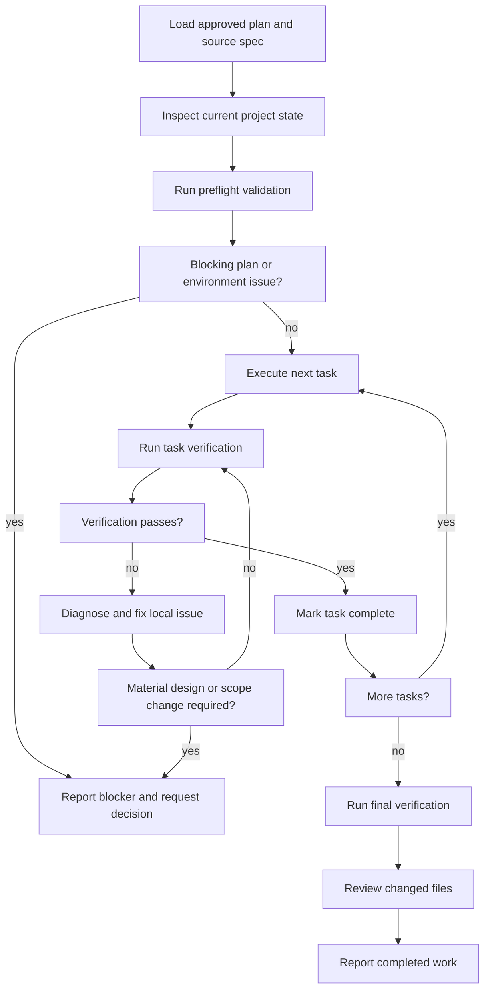

# Executing Implementation Plans

Implement an approved plan carefully from start to finish. Treat the plan as
the execution contract, but verify it against the current project before
changing files.

<HARD-GATE>
Do not start from a design spec alone. Require an approved implementation plan
and an explicit user request to execute it. Do not add Git, commit, branch,
worktree, pull request, or release steps.
</HARD-GATE>

## Required Input

Start from an approved plan, normally:

```text
docs/plans/<topic>-implementation-plan.md
```

The plan should reference its source spec. If the user provides a different
path, use it.

Stop before implementation when:

- The plan is missing or has not been approved.
- The plan contains unresolved placeholders or contradictory instructions.
- A required product, architecture, security, or data decision is absent.
- The current repository has changed so substantially that the plan is no
  longer buildable.

Minor implementation details that are safely determined by existing project
conventions do not require another user decision.

## Checklist

Create a task for each item and complete them in order:

1. **Load plan and source spec** — understand the goal, scope, exclusions,
   task order, acceptance criteria, and final verification.
2. **Inspect current project state** — confirm relevant files, dependencies,
   commands, services, and existing changes.
3. **Run preflight validation** — execute the smallest useful baseline check
   and identify blockers before editing.
4. **Execute tasks in order** — follow each checkbox step, edit only the
   required files, and verify each task.
5. **Handle deviations explicitly** — fix safe local issues, record material
   differences, and stop for decisions that alter the approved design.
6. **Run final verification** — execute focused and broader checks from the
   plan and confirm acceptance criteria.
7. **Review the completed work** — inspect all changed files for omissions,
   accidental scope growth, and inconsistent behavior.
8. **Present the result** — summarize implementation, verification,
   deviations, and any remaining prerequisites or risks.

## Process Flow



## Step 1: Load and Review

Read the complete plan and its source spec before editing. Confirm:

- The plan path and project root.
- The task dependency order.
- Files expected to be created or modified.
- Required dependencies, environment variables, databases, and services.
- Focused verification commands and final regression commands.
- Acceptance criteria and out-of-scope behavior.

Compare the plan with the current project. Existing user changes are part of
the current state: preserve them and work with them. Never discard unrelated
changes to make the plan easier to execute.

If the plan has a critical error, stop and explain the exact task or step that
must be corrected. Do not silently rewrite approved architecture during
execution.

## Step 2: Preflight

Before edits:

1. Confirm commands referenced by the plan exist in this project.
2. Confirm required local services and configuration are available when they
   are needed for the first task.
3. Run a quick baseline test, build, lint, type-check, or equivalent command
   appropriate to the project.
4. Record pre-existing failures so they are not misattributed to the new work.

If a dependency must be downloaded, a service started, or external access
approved, request the required permission through the available tool flow.

## Step 3: Execute Tasks

For each plan task:

1. Mark the task `in_progress` in the active task tracker.
2. Read the entire task before editing.
3. Confirm its prerequisites were completed.
4. Follow its steps in order.
5. Make the smallest changes that satisfy the task and source spec.
6. Run every focused verification command specified for the task.
7. Inspect failures and fix implementation defects before moving on.
8. Mark the plan checkboxes for completed steps when the plan is being used as
   the persistent progress record.
9. Mark the task `completed` only after its verification passes.

Do not batch-complete unchecked steps merely because later tests happen to
pass. The plan should accurately reflect what was executed.

## Deviation Rules

Plans describe expected work, but repositories can change. Classify
differences before acting.

### Safe Local Deviations

Proceed without asking when the change:

- Corrects an obvious typo, import, package path, or command mismatch.
- Adapts a snippet to the repository's established syntax or API version.
- Adds a narrowly required test fixture, configuration value, or error
  handling detail already implied by the spec.
- Fixes an implementation defect discovered by a planned test.

Record meaningful deviations for the final report.

### Material Deviations

Stop and ask the user before continuing when the change would:

- Alter an approved API, schema, security rule, user flow, or acceptance
  criterion.
- Add a new dependency or infrastructure component not anticipated by the
  plan.
- Expand into a feature explicitly excluded by the spec.
- Replace the approved architecture or substantially reorder project
  boundaries.
- Require destructive data or filesystem operations.

Update the plan first when a material decision changes the work. Resume only
after the updated direction is clear.

## Verification Rules

- Never skip a planned verification because the implementation appears
  correct.
- Prefer focused checks during each task and broader checks after related
  tasks or at the end.
- Use the actual project commands, not generic substitutes.
- A failing test must be explained and resolved, or explicitly identified as
  a verified pre-existing failure.
- Do not weaken, delete, or bypass tests merely to obtain a passing result.
- Do not claim success for checks that were not run.

When a verification command fails repeatedly:

1. Diagnose the root cause.
2. Attempt reasonable fixes within the approved scope.
3. Re-run the smallest relevant check.
4. Stop and report the blocker when progress requires a material decision,
   unavailable service, missing credential, or external-state change.

## Final Verification

After all tasks:

1. Run the plan's complete final verification section.
2. Run the relevant full test, build, lint, or type-check suite when feasible.
3. Confirm each acceptance criterion against implementation and test evidence.
4. Inspect all changed and newly created files.
5. Check for debug output, temporary files, exposed secrets, placeholders,
   disabled tests, and accidental unrelated changes.
6. Confirm generated artifacts are updated only when the project expects them
   to be tracked.

If final verification fails, the work is not complete. Return to the
responsible task or report the exact blocker.

## Updating the Plan

The plan may be edited only to:

- Mark completed checkbox steps.
- Correct a safe local mismatch discovered during execution.
- Record an approved material deviation.
- Update a verification command to the confirmed project command.

Do not rewrite unfinished tasks to make incomplete work appear complete.

## Final Output

Report:

- What was implemented.
- Which verification commands ran and their outcomes.
- Any deviations from the plan and why they were necessary.
- Any pre-existing failures, unrun checks, remaining prerequisites, or risks.
- The implementation plan path and whether all planned tasks are complete.

Do not claim completion while required tasks or verification remain
unfinished. Do not perform Git or release workflow actions.
