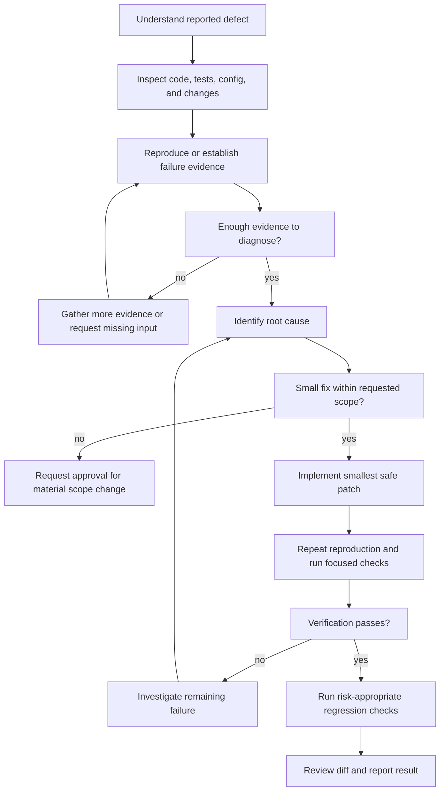

# Fixing Bugs

Diagnose and correct a confirmed defect with the smallest safe change. Base
the fix on evidence, preserve existing behavior outside the affected scope,
and verify both the original failure and relevant surrounding behavior.

<HARD-GATE>
Do not patch before understanding the observed failure and investigating its
cause. Do not expand a fix into a feature, architecture change, dependency
replacement, or unrelated refactor without explicit user approval.

Never delete, disable, weaken, or bypass tests merely to make verification
pass. Never claim success without evidence from completed verification.
</HARD-GATE>

## Required Input

Start from at least one observable defect:

- A user report with expected and actual behavior.
- An error message, stack trace, log, or failing command.
- A failing test, build, lint, type-check, or runtime check.
- A regression linked to a known working behavior.

If the report is incomplete, inspect the project and available evidence first.
Ask the user only when missing information cannot be discovered and a
reasonable assumption could lead to the wrong fix.

## Checklist

Create a task for each item and complete them in order:

1. **Understand the problem** — identify the expected behavior, actual
   behavior, affected area, and available evidence.
2. **Inspect the current state** — read relevant source, tests, configuration,
   documentation, and existing user changes.
3. **Reproduce or establish evidence** — run the smallest reliable check that
   demonstrates the failure or confirms the reported symptom.
4. **Find the root cause** — trace the failing path and distinguish the cause
   from downstream symptoms.
5. **Implement the patch** — make the smallest change that fixes the root
   cause and follows project conventions.
6. **Verify the fix** — repeat the reproduction, run focused tests, and run
   broader regression checks when the risk justifies them.
7. **Review the change** — inspect the diff for scope growth, debug artifacts,
   weakened checks, exposed secrets, and accidental behavior changes.
8. **Present the result** — report `Root Cause`, `Patch`, and `Verification`,
   including any remaining risks or unrun checks.

## Process Flow



## Investigation Rules

### Confirm the Failure

- Prefer a deterministic automated reproduction.
- Use the narrowest command or scenario that exposes the defect.
- Record pre-existing failures so they are not attributed to the patch.
- Do not change files merely to create a passing baseline.

When the exact issue cannot be reproduced:

1. Validate that the reported path and environment match the current project.
2. Search for direct evidence in code, tests, logs, and configuration.
3. Add a focused regression test only when the expected behavior is clear.
4. State the evidence used and avoid claiming the original symptom was
   reproduced.

### Identify the Root Cause

- Trace inputs, state changes, dependencies, and outputs through the failing
  path.
- Explain why the defect occurs, not only where it becomes visible.
- Check whether the same cause affects adjacent paths.
- Prefer fixing the origin over suppressing an exception or symptom.

If multiple causes are plausible, gather more evidence before editing.

## Patch Rules

The patch must:

- Address the confirmed root cause.
- Stay within the user's requested behavior.
- Follow existing architecture, naming, error handling, and test patterns.
- Preserve unrelated behavior and existing user changes.
- Add or update a regression test when practical.

Proceed without asking for small implementation details implied by the
existing project. Stop and request approval when the fix requires:

- A public API, schema, security rule, or accepted behavior change.
- A new dependency or infrastructure component.
- A destructive operation or data migration.
- A substantial refactor or architecture change.
- Work explicitly outside the reported defect.

## Verification Rules

Verify in increasing scope:

1. Re-run the original reproduction or strongest available evidence.
2. Run tests focused on the changed behavior.
3. Run relevant module-level build, lint, type-check, or test commands.
4. Run broader regression checks when the affected code is shared or the
   blast radius is significant.

A fix is not complete when:

- The original failure still occurs.
- A new relevant failure appears.
- Required verification could not run and the blocker is unresolved.
- The patch only hides the symptom.
- Acceptance depends on a material decision that has not been approved.

Never report an unrun command as passing. Distinguish patch failures,
pre-existing failures, and environment blockers.

## Final Review

Before reporting:

- Inspect every changed file.
- Remove temporary logging, debug code, commented-out code, and placeholders.
- Confirm tests were not weakened or skipped.
- Confirm no unrelated files or behavior were changed.
- Check that documentation is updated when the public behavior or operational
  workflow changed.

## Final Output

Use this result format:

```text
Root Cause
- What caused the defect and the evidence supporting it.

Patch
- What changed, where it changed, and why the change is sufficient.

Verification
- Commands or scenarios run and their outcomes.
- Unrun checks, environment limitations, pre-existing failures, and remaining
  risks, or state that none remain.
```

Keep the summary concise and evidence-based. Do not claim the defect is fixed
when required verification remains incomplete.
