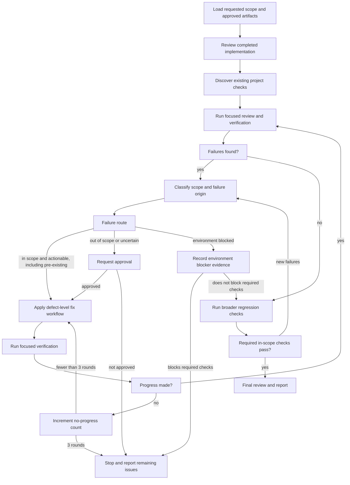

# Reviewing and Fixing in a Loop

Review completed work, route multiple failures by scope, apply focused fixes,
and repeat verification until the required in-scope checks pass or a defined
stop condition is reached. This skill orchestrates the loop; each actionable
defect follows the investigation, patch, and verification principles in
`.agents/skills/fix/SKILL.md`.

<HARD-GATE>
Do not edit an out-of-scope or uncertain failure without user approval. Do not
change an approved API, schema, security rule, architecture, dependency, or
acceptance criterion without approval.

Do not install test frameworks, scanners, dependencies, or infrastructure.
Never delete, disable, skip, weaken, or bypass tests to obtain a passing
result. Never claim that all tests pass when failures remain unreported.

Do not repeat indefinitely. Stop after the same failure shows no progress for
three consecutive rounds unless the user explicitly approves continuation.
</HARD-GATE>

## Required Input

Determine the review scope from these sources in order:

1. The user's current request.
2. The approved specification and implementation plan when present.
3. The relevant acceptance criteria and completed implementation.

Use `fix` for one localized defect. Use `loop` when reviewing completed work
or running verification can expose multiple failures, changing failures, or
several fix-and-verify cycles.

## Checklist

Create a task for each item and complete them in order:

1. **Load scope** — read the current request and relevant approved artifacts.
2. **Inspect implementation** — review completed work and existing user
   changes without discarding unrelated edits.
3. **Discover checks** — identify verification commands already defined by
   the project.
4. **Run focused review** — inspect the changed behavior and run the narrowest
   relevant checks.
5. **Assess failures** — classify every failure by scope and origin.
6. **Route defects** — apply the defect-level fix workflow only to approved,
   in-scope failures.
7. **Verify each patch** — repeat focused verification after every change.
8. **Run regression checks** — broaden verification after focused checks pass.
9. **Repeat** — reassess new or remaining failures and continue the loop.
10. **Stop explicitly** — finish on success, an approval boundary, a blocker,
    or the no-progress limit.
11. **Review and report** — inspect all changes and present evidence-based
    results.

## Process Flow



## Scope and Routing Rules

Classify every failure by scope:

- `in-scope`: directly related to the requested implementation or a required
  acceptance criterion.
- `out-of-scope`: unrelated to the requested work.
- `uncertain`: available evidence is insufficient to determine scope. Route
  this exactly like an out-of-scope failure.

Classify its origin separately when evidence supports it:

- `pre-existing`: the failure existed before the current work.
- `environment-blocker`: verification depends on unavailable credentials,
  network, service, permission, or environment state.

Scope and origin are separate dimensions. A failure can be both in-scope and
pre-existing. Pre-existing status does not permit skipping a required
in-scope acceptance criterion.

Route failures as follows:

- Fix in-scope, actionable defects without additional approval.
- Request approval before fixing out-of-scope or uncertain defects.
- Record evidence for pre-existing and environment-blocked failures, then
  determine whether they block required in-scope verification.
- Request approval before changing an approved API, schema, security rule,
  architecture, dependency, acceptance criterion, or performing a destructive
  operation.

## Assess and Fix Rules

- Start with focused review and focused checks before broader verification.
- Give each failure a stable signature using the command, failing test or
  check, and a concise symptom.
- Reproduce the failure or establish the strongest available evidence before
  editing.
- For each in-scope defect, follow the investigation, patch, and verification
  principles in `.agents/skills/fix/SKILL.md`.
- Fix the root cause with the smallest change that follows project
  conventions and preserves unrelated user changes.
- Group failures only when evidence shows they share one root cause.
- Reclassify every newly observed failure. Never assume a new failure belongs
  to the current scope merely because it appeared after a patch.
- Add a focused regression test only when the expected behavior is clear and
  in scope.

## Loop State

Track this state for each failure:

- Failure signature.
- First observed command and evidence.
- Scope classification and origin classification.
- Approval status.
- Root cause and patches attempted.
- Focused verification results.
- Consecutive rounds without progress.
- Final state: fixed, deferred, pre-existing, blocked, or awaiting approval.

Count a round as progress when at least one of these is true:

- The failure is fixed.
- An evidence-based patch changes the failure signature or failing assertion.
- New evidence materially narrows the root cause.
- A blocker is resolved and verification can advance.

Repeating the same command with unchanged evidence is not progress. Reset the
no-progress counter only after real progress. Stop after three consecutive
no-progress rounds for the same failure unless the user approves continuation.

## Verification Rules

Verify in increasing scope:

1. Re-run the focused reproduction after each patch.
2. Run related focused tests or checks.
3. Run the relevant module-level build, lint, type-check, test, or existing
   scan command.
4. Run broader regression checks appropriate to the changed code's blast
   radius.
5. Return to classification whenever a check reveals a new failure.

Use only scanners and verification commands already defined by the project.
Do not install a new tool as part of this workflow.

In-scope work is successful only when all required in-scope checks pass.
Out-of-scope, uncertain, pre-existing, unrun, and blocked checks must remain
visible in the final report.

## Stop Conditions

Stop the loop when:

- All required in-scope verification passes.
- Approval is required for out-of-scope, uncertain, or material changes.
- A required service, credential, permission, network, or environment state
  is unavailable.
- The same failure reaches three consecutive no-progress rounds.
- No evidence-based patch remains.
- The user pauses, changes, or narrows the scope.

## Final Review

Before reporting:

- Inspect every file changed during the loop.
- Preserve unrelated user changes.
- Remove debug output, temporary files, placeholders, and commented-out code.
- Confirm no test was disabled, skipped, weakened, or bypassed.
- Confirm no unapproved out-of-scope or material change was made.
- Update documentation when public or operational behavior changed within the
  approved scope.

## Final Output

Use this result format:

```text
Scope
- Scope reviewed and the source used to determine it.

Review Findings
- Failures found, classification, evidence, and final status.

Fixes
- Root cause and patch for each defect fixed.

Verification
- Focused and broader commands run with outcomes.

Remaining Issues
- Out-of-scope or uncertain failures, pre-existing failures, blockers,
  approvals needed, unrun checks, or state that none remain.
```

Keep the report concise and evidence-based. Do not claim that the complete
suite passed when only the required in-scope verification passed. Report every
known remaining failure and distinguish it from completed in-scope work.
