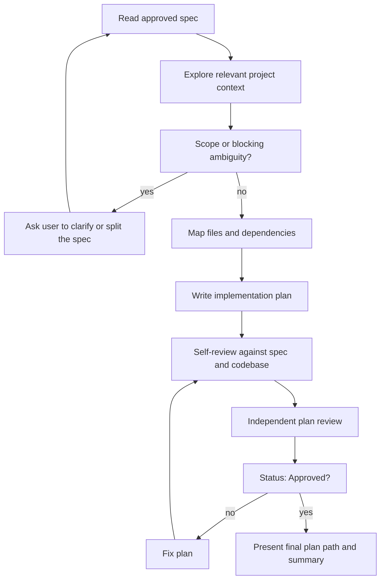

# Writing Implementation Plans

Turn an approved design specification into a concrete, reviewable
implementation plan. The plan must be executable by an engineer who has not
participated in the brainstorming conversation.

<HARD-GATE>
Do NOT apply implementation code to project files, modify production or test
files, install dependencies, scaffold modules, or invoke an execution skill.
Concrete code snippets belong inside the plan document only. This skill ends
after the implementation plan is written and independently approved.
</HARD-GATE>

## Required Input

Start from an approved spec, normally:

```text
docs/specs/<topic>-design.md
```

If the user provides a different path, use it. If no approved spec exists,
stop and ask the user to run or complete brainstorming first. Do not silently
invent unresolved product or architecture decisions.

## Checklist

Create a task for each item and complete them in order:

1. **Read the approved spec** — identify requirements, constraints, exclusions,
   edge cases, testing notes, and acceptance criteria.
2. **Explore implementation context** — inspect only relevant source,
   configuration, tests, build files, and local conventions.
3. **Check scope and unresolved decisions** — stop for clarification if the
   spec is contradictory, technically impossible, or missing a decision that
   materially changes implementation.
4. **Map files and dependencies** — list files to create or modify and the
   responsibility of each.
5. **Write the implementation plan** — use small ordered tasks with exact
   paths, concrete changes, validation commands, and expected results.
6. **Plan self-review** — verify spec coverage, buildability, consistency,
   task ordering, and absence of placeholders.
7. **Independent plan review** — dispatch a reviewer using the sibling file
   `plan-document-reviewer-prompt.md` in this skill directory.
8. **Fix and re-review** — repeat until the reviewer returns
   `Status: Approved`.
9. **Present the final plan** — summarize the implementation sequence and show
   the plan path. Do not start execution.

## Process Flow



## Planning Rules

### Stay Aligned With the Spec

- Every in-scope requirement and acceptance criterion must map to at least one
  task or validation step.
- Do not add features listed as out of scope.
- Do not redesign approved architecture unless project inspection proves it
  cannot work. Raise that conflict before writing the plan.
- Preserve existing project structure and conventions unless the spec
  explicitly requires a targeted change.

### Inspect Before Naming Files

Confirm actual package names, module paths, dependency versions, test
frameworks, commands, and configuration style from the repository. Never
invent file paths, APIs, or line numbers from memory.

Use line references only when they are stable and useful. Prefer a symbol or
section name when generated files or ongoing edits make line numbers brittle.

### Map Files Before Tasks

Before task details, include a file map:

```markdown
## File Map

- Create: `exact/path/NewFile.java` — responsibility
- Modify: `exact/path/ExistingFile.java` — intended change
- Test: `exact/path/NewFeatureTest.java` — behavior covered
```

Each file should have one clear responsibility. Files that change together
should live together according to the project's existing organization.

### Use Ordered, Buildable Tasks

Tasks must respect dependencies. Foundation and configuration come before
consumers; behavior comes before end-to-end verification.

Each task should produce a coherent, testable increment. Use TDD where it is
practical:

1. Add or update a focused failing test.
2. Run it and state the expected failure.
3. Implement the minimum required change.
4. Run focused verification and state the expected success.
5. Run the relevant broader test set.

Do not force artificial failing tests for declarative files where a direct
validation command is clearer, such as migrations or static configuration.

## Plan Document

Save the plan to:

```text
docs/plans/<topic>-implementation-plan.md
```

User-provided locations override this default. Keep the plan beside the
project described by the spec, not beside the skill files.

Every plan starts with:

```markdown
# <Feature Name> Implementation Plan

**Source spec:** `docs/specs/<topic>-design.md`

**Goal:** One sentence describing the implemented outcome.

**Architecture:** Two or three sentences summarizing the approved approach.

**Tech stack:** Relevant languages, frameworks, libraries, and infrastructure.

---
```

Then include:

1. `## File Map`
2. Ordered `### Task N: <Outcome>` sections
3. `## Final Verification`
4. `## Spec Coverage`

## Task Format

Use checkbox steps so execution can track progress:

````markdown
### Task N: <Concrete outcome>

**Files:**

- Create: `exact/path/to/file`
- Modify: `exact/path/to/file`
- Test: `exact/path/to/test`

- [ ] **Step 1: Add the focused failing test**

```java
// Complete test code or the exact relevant change.
```

- [ ] **Step 2: Verify the expected failure**

Run: `./mvnw -Dtest=SpecificTest test`

Expected: FAIL because the planned behavior does not exist yet.

- [ ] **Step 3: Implement the behavior**

```java
// Complete implementation for this step or a precise patch-sized snippet.
```

- [ ] **Step 4: Verify the task**

Run: `./mvnw -Dtest=SpecificTest test`

Expected: PASS.
````

Adapt the language and commands to the actual project.

## Required Detail

- Exact paths for every created or modified file.
- Concrete class, function, endpoint, schema, and configuration names.
- Complete code for small additions; precise patch-sized snippets for larger
  files.
- Exact commands that exist in the project.
- Expected outcome for every verification command.
- Explicit handling of spec-defined errors and edge cases.
- Focused tests plus broader regression verification.
- A final mapping from each acceptance criterion to task and verification.

Never use:

- `TBD`, `TODO`, `implement later`, or placeholder sections.
- "Add validation", "handle errors", or "write tests" without exact behavior.
- "Same as Task N" instead of self-contained instructions.
- References to types, functions, dependencies, or files not introduced by an
  earlier step or already present in the repository.
- Commands or dependencies that were not verified against the project.

## Self-Review

Before independent review:

1. **Spec coverage:** Map every requirement and acceptance criterion.
2. **Scope:** Remove work not required by the spec.
3. **Repository accuracy:** Re-check paths, package names, dependencies, and
   commands.
4. **Ordering:** Confirm each task has all prerequisites from earlier tasks.
5. **Consistency:** Check names, signatures, data shapes, configuration keys,
   and error contracts across tasks.
6. **Buildability:** Ensure an engineer can execute each step without making a
   missing design decision.
7. **Placeholder scan:** Remove vague or incomplete instructions.

Fix issues inline before dispatching the reviewer.

## Independent Review

Dispatch an independent reviewer with:

```text
.agents/skills/writing-plans/plan-document-reviewer-prompt.md
```

Provide both the plan path and source spec path. The reviewer must not edit
the plan.

When the reviewer returns `Issues Found`, update the plan and dispatch the
reviewer again. Continue only when it returns:

```text
Status: Approved
```

## Final Output

- State that the implementation plan passed independent review.
- Summarize the major task sequence.
- Show the exact plan file path.
- Mention any execution prerequisites, such as environment variables,
  dependencies, or required services.
- Do not invoke an implementation skill or execute the plan automatically.
- The user triggers execution separately.
