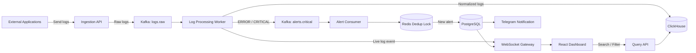

# Tổng quan hệ thống Log Monitoring

## 1. Mục tiêu hệ thống

Hệ thống Log Monitoring được thiết kế để thu thập log từ nhiều ứng dụng, xử lý bất đồng bộ, lưu trữ tối ưu cho tìm kiếm/phân tích và cảnh báo thời gian thực khi có lỗi nghiêm trọng.

Mục tiêu chính:

- Nhận log tốc độ cao từ nhiều service/application.
- Tránh ghi trực tiếp từng log vào database để không gây quá tải.
- Chuẩn hóa log về cùng một format.
- Hiển thị live log cho kỹ sư vận hành.
- Cảnh báo khi xuất hiện log `ERROR` hoặc `CRITICAL`.
- Chống spam cảnh báo bằng Redis.
- Cho phép phân quyền người dùng theo vai trò và phạm vi ứng dụng.

## 2. Sơ đồ luồng xử lý



## 3. Luồng hoạt động chính

1. Ứng dụng bên ngoài gửi log về `Ingestion API`.
2. Backend chỉ validate nhanh và đẩy log thô vào Kafka topic `logs.raw`.
3. `Log Processing Worker` consume log từ Kafka, chuẩn hóa dữ liệu như `applicationName`, `level`, `message`, `timestamp`, `traceId`.
4. Log chuẩn hóa được lưu vào ClickHouse để tối ưu ghi nhanh, tìm kiếm và analytics.
5. Log mới được đẩy qua WebSocket để dashboard hiển thị realtime.
6. Nếu log có level `ERROR` hoặc `CRITICAL`, worker tạo alert event vào Kafka topic `alerts.critical`.
7. `Alert Consumer` kiểm tra Redis để chống trùng cảnh báo trong một khoảng thời gian ngắn.
8. Alert hợp lệ được lưu vào PostgreSQL, gửi Telegram và đẩy realtime lên dashboard.
9. Người dùng có thể tìm kiếm/lọc log lịch sử qua `Query API`.

## 4. Chức năng hệ thống

Chức năng chính:

- Quản lý tài khoản người dùng: đăng ký, đăng nhập, refresh token, đổi mật khẩu.
- Phân quyền người dùng theo vai trò `ADMIN` và `ENGINEER`.
- Quản lý application/source gửi log vào hệ thống.
- Tiếp nhận log từ các ứng dụng bên ngoài qua API.
- Hỗ trợ gửi log đơn lẻ hoặc theo batch.
- Đẩy log thô vào Kafka để xử lý bất đồng bộ.
- Chuẩn hóa log về format thống nhất.
- Lưu trữ log chuẩn hóa vào ClickHouse.
- Tìm kiếm và lọc log theo application, level, thời gian, keyword, trace id.
- Hiển thị live log realtime trên dashboard.
- Theo dõi metric tổng quan như số log/phút, error rate, critical alerts, processing lag.
- Phát hiện log `ERROR` hoặc `CRITICAL` để tạo cảnh báo.
- Chống trùng cảnh báo bằng Redis trong một khoảng thời gian cấu hình được.
- Gửi cảnh báo qua WebSocket và Telegram.
- Quản lý alert rule/ngưỡng cảnh báo cho admin.
- Thống kê sức khỏe ứng dụng theo tỷ lệ lỗi và tần suất log.
- Dọn dẹp hoặc nén log cũ theo retention policy.

Chức năng phi chức năng:

- Chịu tải tốt khi có nhiều log gửi đến trong thời gian ngắn.
- Phản hồi nhanh ở tầng ingestion vì không ghi trực tiếp từng log vào database.
- Có thể tăng năng lực xử lý log trong monolith bằng cách tăng số Kafka consumer/thread xử lý hoặc chạy thêm instance của cùng backend khi cần.
- Đảm bảo log không bị mất trong luồng xử lý bằng cơ chế queue và retry phù hợp.
- Dashboard cập nhật realtime với độ trễ thấp.
- Dữ liệu log có thể truy vấn nhanh theo thời gian và bộ lọc phổ biến.
- Hệ thống cảnh báo hạn chế spam, tránh alert fatigue.
- Dễ triển khai local/demo bằng Docker Compose.
- Dễ mở rộng module mới nhờ chia backend theo nghiệp vụ.
- Có bảo mật API bằng JWT và phân quyền truy cập theo vai trò.
- Có tài liệu API/OpenAPI để frontend và backend đồng bộ contract.

## 5. Bố cục hệ thống

```text
log-monitoring-system/
├── apps/
│   ├── backend/
│   │   ├── api/              # REST controller, WebSocket endpoint, request/response DTO
│   │   ├── modules/
│   │   │   ├── identity/         # User, role, login, token, permission
│   │   │   ├── applications/     # Quản lý app/source gửi log
│   │   │   ├── ingestion/        # Nhận log, validate nhanh, publish Kafka
│   │   │   ├── processing/       # Consume Kafka, parse, normalize log
│   │   │   ├── logs/             # Query log, filter, search, log schema
│   │   │   ├── alerting/         # Alert rule, alert event, dedup, occurrence
│   │   │   ├── notification/     # Telegram/email/webhook notification
│   │   │   ├── realtime/         # WebSocket event cho dashboard
│   │   │   ├── analytics/        # Health metric, chart data, error rate
│   │   │   └── retention/        # Job dọn dẹp/nén log cũ
│   │   └── shared/               # Security, DTO, exception, config, common utilities
│   └── frontend/
│       ├── features/
│       │   ├── auth/             # Login, token, protected route
│       │   ├── dashboard/        # Metric, chart, pipeline status
│       │   ├── live-logs/        # Live stream log, filter, detail drawer
│       │   ├── alerts/           # Danh sách alert, trạng thái xử lý
│       │   ├── applications/     # Quản lý application/source
│       │   ├── analytics/        # Báo cáo sức khỏe ứng dụng
│       │   ├── settings/         # Alert rule, retention, integration
│       │   └── profile/          # Thông tin người dùng
│       └── shared/               # Layout, component, API client, hook dùng chung
├── docs/                         # Tài liệu API, yêu cầu, thiết kế
├── scripts/                      # Script hỗ trợ generate type/API
├── compose.yml                   # PostgreSQL, ClickHouse, Redis, Kafka
└── Makefile                      # Lệnh chạy dev/build/test
```

## 6. Vai trò từng thành phần

| Thành phần          | Vai trò                                                            |
| ------------------- | ------------------------------------------------------------------ |
| Backend Spring Boot | Xử lý API, auth, ingestion, worker, alerting và realtime gateway   |
| React Dashboard     | Giao diện giám sát log, alert, metric và trạng thái pipeline       |
| Kafka               | Hàng đợi trung gian giúp chống quá tải và xử lý bất đồng bộ        |
| ClickHouse          | Lưu log số lượng lớn, hỗ trợ query và analytics nhanh              |
| PostgreSQL          | Lưu user, role, alert rule, alert occurrence và metadata nghiệp vụ |
| Redis               | Lưu khóa tạm thời để chống trùng cảnh báo                          |
| WebSocket/STOMP     | Đẩy live log và alert realtime lên frontend                        |
| Telegram Bot        | Gửi cảnh báo lỗi nghiêm trọng cho kỹ sư vận hành                   |
| Docker Compose      | Đóng gói môi trường chạy local/demo                                |

## 7. Công nghệ sử dụng

Backend:

- Java 21
- Spring Boot
- Spring Web, Spring Security, Spring Data JPA
- JWT authentication
- Flyway migration
- Springdoc OpenAPI
- Kafka client
- Redis client
- ClickHouse JDBC

Frontend:

- React
- TypeScript
- Vite
- React Router
- TanStack React Query
- Axios
- Tailwind CSS
- ECharts

Infrastructure:

- Docker, Docker Compose
- PostgreSQL
- ClickHouse
- Redis
- Apache Kafka
- Nginx

## 8. Ý tưởng thiết kế quan trọng

- Dùng Kafka làm buffer để hệ thống chịu được burst traffic, ví dụ nhiều log đến cùng lúc trong vài giây.
- Trong cùng backend monolith, tách bước nhận log khỏi bước xử lý nặng bằng Kafka: API chỉ validate/enqueue log, còn worker nội bộ xử lý normalize, lưu trữ và alert bất đồng bộ.
- Dùng ClickHouse thay vì chỉ dùng PostgreSQL cho log vì log là dữ liệu ghi nhiều, query theo thời gian và cần thống kê.
- Dùng Redis TTL để tránh trường hợp một lỗi lặp lại liên tục làm Telegram/dashboard bị spam.
- Dùng WebSocket để dashboard thấy log và alert gần như ngay lập tức.
- Chia backend theo module nghiệp vụ để dễ mở rộng: identity, logs, alerting, realtime.

## 9. Luồng demo mong muốn

```text
Generate 500 logs in 2 seconds
  -> Ingestion API accepts all logs
  -> Kafka buffers raw logs
  -> Worker normalizes logs
  -> ClickHouse stores logs
  -> Dashboard shows live stream
  -> ERROR/CRITICAL logs trigger alert
  -> Redis deduplicates repeated alerts
  -> Telegram and dashboard receive one clean notification
```

Kết quả mong muốn khi demo:

- API không bị lỗi khi nhận nhiều log liên tục.
- Dashboard hiển thị log realtime mượt.
- Có thể lọc log theo application, level, keyword hoặc trace id.
- Alert không bị spam dù cùng một lỗi xuất hiện nhiều lần.
