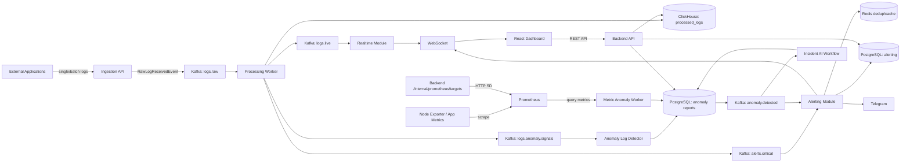

# Tổng quan hệ thống Log Monitoring

## 1. Định hướng hệ thống

Hệ thống Log Monitoring được xây dựng theo hướng **real-time log monitoring kết
hợp anomaly và incident investigation**. Hệ thống không chỉ nhận log thô, mà còn
chuẩn hóa log, phát realtime event, phát hiện cảnh báo, theo dõi metric sức khỏe
ứng dụng qua Prometheus và hỗ trợ AI phân tích anomaly/incident evidence.

Cách tiếp cận hiện tại giúp kỹ sư vận hành quan sát log theo thời gian thực,
giảm cảnh báo trùng lặp, theo dõi sức khỏe application và có thêm ngữ cảnh khi
cần điều tra sự cố.

Mục tiêu chính:

- Thu thập log đơn lẻ hoặc batch từ nhiều application/service.
- Xử lý log bất đồng bộ qua Kafka để giảm tải cho ingestion API.
- Chuẩn hóa log và lưu vào ClickHouse để phục vụ truy vấn theo thời gian.
- Phát live log, alert và anomaly notification tới dashboard qua WebSocket.
- Quản lý user, role, application, API key và phạm vi truy cập theo application.
- Quản lý alert rule, alert occurrence, chat room và Telegram notification.
- Phát hiện anomaly từ log signal và metric health lấy từ Prometheus.
- Lưu anomaly report, incident evidence và hỗ trợ AI phân tích nguyên nhân.
- Cấu hình retention policy cho dữ liệu log theo level và thời gian lưu.

## 2. Luồng xử lý tổng quan


```mermaid
flowchart LR
    A[External Applications] -->|single/batch logs| B[Ingestion API]
    B -->|RawLogReceivedEvent| C[Kafka: logs.raw]
    C --> D[Processing Worker]
    D --> E[(ClickHouse: processed_logs)]
    D --> F[Kafka: logs.live]
    D --> G[Kafka: alerts.critical]
    D --> H[Kafka: logs.anomaly.signals]

    F --> I[Realtime Module]
    I --> J[WebSocket]
    J --> K[React Dashboard]

    G --> L[Alerting Module]
    L --> M[(Redis dedup/cache)]
    L --> N[(PostgreSQL: alerting)]
    L --> O[Telegram]
    L --> J

    H --> P[Anomaly Log Detector]
    Q[Prometheus] -->|query metrics| R[Metric Anomaly Worker]
    S[Node Exporter / App Metrics] -->|scrape| Q
    T[Backend /internal/prometheus/targets] -->|HTTP SD| Q
    P --> U[(PostgreSQL: anomaly reports)]
    R --> U
    U --> V[Kafka: anomaly.detected]
    V --> L
    V --> W[Incident AI Workflow]
    W --> U

    K -->|REST API| X[Backend API]
    X --> N
    X --> U
    X --> E
```

Luồng chính:

1. Application gửi log vào `Ingestion API`.
2. Backend validate, kiểm tra idempotency bằng Redis và publish event vào Kafka
   topic `logs.raw`.
3. Processing worker consume `logs.raw`, parse/normalize/enrich log, tạo
   fingerprint và lưu bản ghi chuẩn hóa vào ClickHouse `processed_logs`.
4. Processing publish các event downstream: `logs.live`, `alerts.critical`,
   `logs.anomaly.signals` và `processing.errors` khi có lỗi xử lý.
5. Realtime module consume live log và đẩy dữ liệu qua WebSocket tới React
   dashboard.
6. Alerting module xử lý alert rule, threshold/dedup bằng Redis, lưu alert vào
   PostgreSQL và gửi notification qua Telegram/WebSocket.
7. Anomaly module nhận log signal từ Kafka và metric health từ Prometheus để tạo
   hoặc cập nhật anomaly report trong PostgreSQL.
8. Alerting consume `anomaly.detected` để tạo anomaly alert và kích hoạt AI
   workflow khi cần.
9. Dashboard gọi REST API để quản lý user/application/rule/incident/retention và
   xem live log, alert, anomaly, analytics.

## 3. Chức năng chính

- Đăng nhập, refresh token, logout, đổi mật khẩu và JWT blacklist bằng Redis.
- Quản lý user, role `ADMIN`/`ENGINEER`, application và application access.
- Quản lý API key theo application để external service gửi log.
- Quản lý metric source và endpoint Prometheus service discovery.
- Nhận log single/batch với idempotency key và publish Kafka `logs.raw`.
- Chuẩn hóa log, fingerprint, ghi ClickHouse và publish live/anomaly/alert event.
- Hiển thị live log realtime qua WebSocket.
- Quản lý alert rule, active time window, chat room và delivery target.
- Gửi alert qua dashboard/WebSocket và Telegram.
- Phát hiện anomaly từ log pattern và Prometheus metrics như CPU, memory, disk,
  network.
- Lưu anomaly report, resolve report và tạo alert từ anomaly event.
- Hỗ trợ AI phân tích anomaly report/incident evidence và lưu kết quả phân tích.
- Dashboard analytics cho overview, log volume, error rate và health signal.
- Quản lý retention policy và lịch sử retention run.

## 4. Bố cục hệ thống

Backend là một Spring Boot Modular Monolith. Controller/transport DTO nằm trong
package `api`, business logic và adapter nằm trong `modules`, còn DTO dùng chung,
exception và security nằm trong `shared`.

```text
log-monitoring-system/
├── apps/
│   ├── backend/
│   │   ├── src/main/java/com/vdt/log_monitoring/
│   │   │   ├── api/
│   │   │   │   ├── alerting/
│   │   │   │   ├── analytics/
│   │   │   │   ├── anomaly/
│   │   │   │   ├── identity/
│   │   │   │   ├── incident/
│   │   │   │   ├── ingestion/
│   │   │   │   ├── processing/
│   │   │   │   ├── realtime/
│   │   │   │   └── retention/
│   │   │   ├── modules/
│   │   │   │   ├── identity/     # User, auth, API key, app access, metric source
│   │   │   │   ├── ingestion/    # Nhận log, idempotency, publish logs.raw
│   │   │   │   ├── processing/   # Consume logs.raw, normalize, ClickHouse writer
│   │   │   │   ├── realtime/     # Kafka live log consumer và WebSocket publisher
│   │   │   │   ├── alerting/     # Rule, alert, dedup, Telegram, anomaly alert
│   │   │   │   ├── anomaly/      # Log/metric anomaly detection và report
│   │   │   │   ├── incident/     # Incident evidence và AI analysis workflow
│   │   │   │   ├── analytics/    # Dashboard overview từ ClickHouse
│   │   │   │   └── retention/    # Retention policy và retention run
│   │   │   └── shared/           # Security, DTO, exception
│   │   └── src/main/resources/
│   │       └── db/migration/     # PostgreSQL Flyway và ClickHouse migration
│   └── frontend/
│       └── src/features/
│           ├── alert-rules/
│           ├── alerts/
│           ├── anomaly/
│           ├── application-health/
│           ├── applications/
│           ├── auth/
│           ├── dashboard/
│           ├── incidents/
│           ├── live-logs/
│           ├── log-search/
│           ├── notification-channels/
│           ├── profile/
│           ├── retention/
│           └── user-access/
├── docs/
│   ├── architecture.md
│   ├── api.md
│   ├── database.md
│   └── diagram/
├── compose.yml
├── prometheus.yml
└── Makefile
```

## 5. Thành phần chính

| Thành phần          | Vai trò                                                        |
| ------------------- | -------------------------------------------------------------- |
| Backend Spring Boot | REST API, WebSocket, worker, auth, processing, alert, anomaly  |
| React Dashboard     | UI quản trị, live log, alert, anomaly, incident, retention     |
| Kafka               | Buffer log và truyền event giữa các bước xử lý                 |
| ClickHouse          | Lưu `processed_logs`, search và analytics theo thời gian       |
| PostgreSQL          | Lưu identity, alerting, anomaly report, incident, retention    |
| Redis               | Idempotency, JWT blacklist, cache, dedup và metric snapshot    |
| Prometheus          | Scrape metric target và cung cấp query API cho anomaly module  |
| Node Exporter       | Cung cấp CPU, memory, disk, network metrics cho Prometheus     |
| WebSocket           | Đẩy live log, alert và anomaly notification realtime           |
| Telegram Bot        | Gửi cảnh báo và anomaly/AI report notification                 |
| AI Provider         | Phân tích anomaly/incident evidence và đề xuất hướng xử lý     |

## 6. Công nghệ sử dụng

Backend:

- Java 21, Spring Boot 3.5
- Spring Web, Spring Security, Spring Data JPA, Spring WebSocket
- JWT, Flyway, Springdoc OpenAPI
- Spring Kafka, Redis, ClickHouse JDBC, PostgreSQL

Frontend:

- React 19, TypeScript, Vite
- React Router, TanStack React Query, Axios
- Tailwind CSS, ECharts, Radix UI, lucide-react
- STOMP/WebSocket client cho realtime

Infrastructure:

- Docker, Docker Compose
- PostgreSQL 17, ClickHouse 25.3, Redis 8, Kafka 4
- Kafka UI, Prometheus, Node Exporter
- Telegram Bot API
- Gemini-compatible incident AI provider

## 7. Ý tưởng thiết kế quan trọng

- Kafka tách bước nhận log khỏi các bước xử lý nặng và cho phép retry/DLT theo
  từng luồng event.
- ClickHouse phù hợp cho dữ liệu log lớn, append-heavy và truy vấn theo thời
  gian.
- PostgreSQL lưu dữ liệu nghiệp vụ có quan hệ như user, application, alert rule,
  anomaly report, incident và retention policy.
- Redis được dùng cho idempotency, token blacklist, cache rule, alert dedup và
  snapshot metric anomaly có TTL.
- Prometheus không thay thế log; Prometheus cung cấp metric định lượng để phát
  hiện bất thường tài nguyên và làm giàu ngữ cảnh anomaly.
- Alerting không chỉ dựa trên log level mà còn nhận anomaly event từ module
  anomaly.
- AI không nằm trong hot path ingestion; AI chạy sau khi đã có anomaly/incident
  evidence để hỗ trợ RCA, severity và recommended action.
- Frontend tách feature theo domain để khớp với module backend và workflow vận
  hành.

## 8. Metrics, Anomaly và AI

Hệ thống hiện dùng Prometheus theo mô hình HTTP service discovery. Backend expose
endpoint `/internal/prometheus/targets` dựa trên metric source đã cấu hình cho
từng application. Prometheus scrape node/application metrics, còn anomaly module
query Prometheus để lấy CPU, memory, disk và network signal.

Nguồn anomaly hiện tại:

- Log signal từ processing qua Kafka `logs.anomaly.signals`.
- Metric snapshot từ Prometheus query, lưu tạm trong Redis.
- Threshold/dedup state cho anomaly rule trong Redis.

Luồng anomaly:

```text
logs.raw
  -> processing
  -> logs.anomaly.signals
  -> anomaly log detector
  -> anomaly_reports
  -> anomaly.detected
  -> alerting / Telegram / WebSocket / AI workflow

Prometheus targets
  -> Prometheus scrape
  -> anomaly metric worker query Prometheus
  -> Redis metric snapshot
  -> metric anomaly detector
  -> anomaly_reports
  -> anomaly.detected
```

AI workflow nhận anomaly/incident evidence sau khi anomaly được phát hiện. Kết
quả AI được lưu lại vào anomaly report hoặc incident analysis để dashboard hiển
thị tóm tắt, giả thuyết nguyên nhân và hành động đề xuất.

## 9. Luồng demo mong muốn

```text
Generate logs and metrics
  -> Ingestion API accepts single/batch logs
  -> Kafka buffers raw logs
  -> Processing worker normalizes and stores logs in ClickHouse
  -> Realtime module pushes live logs to dashboard
  -> Alerting evaluates critical/error signals with Redis dedup
  -> Prometheus scrapes node/application metrics
  -> Anomaly module detects log/metric anomalies
  -> Anomaly alert and AI analysis are created
  -> Dashboard and Telegram receive clear notifications
```

Kết quả mong muốn:

- Hệ thống nhận nhiều log liên tục mà không chặn API ingestion.
- Dashboard hiển thị live log, alert, anomaly report, incident và health metric.
- Alert không bị spam khi cùng một lỗi hoặc anomaly lặp lại trong cửa sổ dedup.
- Prometheus metric giúp phát hiện bất thường tài nguyên bên cạnh log error.
- AI đưa ra tóm tắt nguyên nhân, mức độ ảnh hưởng và hướng xử lý ban đầu.
