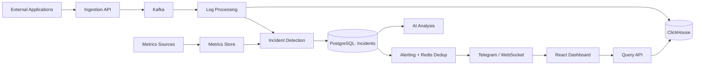

# Tổng quan hệ thống Log Monitoring

## 1. Định hướng hệ thống

Hệ thống Log Monitoring được xây dựng theo hướng **Incident-Centric Monitoring**.
Thay vì chỉ thu thập và hiển thị log thô, hệ thống chuẩn hóa log, phát hiện lỗi
và gom nhóm nhiều log lỗi có cùng nguyên nhân thành một **Incident** duy nhất.

Cách tiếp cận này giúp giảm nhiễu thông tin, hạn chế cảnh báo trùng lặp và hỗ
trợ kỹ sư vận hành tập trung vào sự cố thực sự thay vì đọc thủ công hàng nghìn
dòng log tương tự nhau.

Mục tiêu chính:

- Thu thập log từ nhiều application/service.
- Mở rộng nhận biết sức khỏe hệ thống bằng metrics như CPU, RAM, restart,
  service down, request/error rate và tín hiệu đăng nhập bất thường.
- Xử lý log bất đồng bộ để chịu được tải cao.
- Chuẩn hóa, lưu trữ và tìm kiếm log hiệu quả.
- Phát hiện log lỗi, tương quan với metrics bất thường và gom nhóm thành
  incident.
- Cảnh báo realtime theo incident, tránh spam cảnh báo.
- Tích hợp AI để hỗ trợ phân tích nguyên nhân, phân loại mức độ nghiêm trọng
  và hướng xử lý.
- Phân quyền người dùng theo vai trò và phạm vi ứng dụng.

## 2. Luồng xử lý tổng quan


```mermaid
flowchart LR
    A[External Applications] --> B[Ingestion API]
    B --> C[Kafka]
    C --> D[Log Processing]
    D --> E[(ClickHouse)]
    D --> F[Incident Detection]
    M[Metrics Sources] --> N[Metrics Store]
    N --> F
    F --> G[(PostgreSQL: Incidents)]
    G --> H[Alerting + Redis Dedup]
    H --> I[Telegram / WebSocket]
    G --> J[AI Analysis]
    I --> K[React Dashboard]
    K --> L[Query API]
    L --> E
```

Luồng chính:

1. Application gửi log vào `Ingestion API`.
2. Backend validate nhanh và đưa log vào Kafka.
3. Worker xử lý log, chuẩn hóa dữ liệu và lưu vào ClickHouse.
4. Log lỗi được phân tích để tạo fingerprint/correlation key.
5. Metrics từ backend/application/node được đọc từ metrics store để bổ sung
   ngữ cảnh như RAM cao, service restart, spike lỗi hoặc login bất thường.
6. Các lỗi và tín hiệu bất thường liên quan được gom vào một incident.
7. Incident mới hoặc incident quan trọng được cảnh báo realtime.
8. Redis deduplication giúp tránh gửi cảnh báo trùng lặp.
9. AI phân tích incident để hỗ trợ root cause analysis, severity và hướng xử lý.
10. Dashboard hiển thị live log, incident và kết quả phân tích.

## 3. Chức năng chính

- Quản lý người dùng, đăng nhập, refresh token và đổi mật khẩu.
- Phân quyền theo vai trò `ADMIN` và `ENGINEER`.
- Quản lý application/source gửi log.
- Nhận log đơn lẻ hoặc batch từ external application.
- Chuẩn hóa và lưu trữ log vào ClickHouse.
- Tìm kiếm log theo application, level, thời gian, keyword và trace id.
- Hiển thị live log realtime.
- Phát hiện log lỗi, tương quan với metrics bất thường và gom nhóm thành
  incident.
- Quản lý incident theo trạng thái, severity, số lần xuất hiện, log mẫu và tín
  hiệu metrics liên quan.
- Cảnh báo qua dashboard và Telegram.
- Chống trùng cảnh báo bằng Redis.
- Hỗ trợ AI phân tích nguyên nhân và đề xuất hướng xử lý.

## 4. Bố cục hệ thống

Backend là một Spring Boot Modular Monolith. Module được chia theo nhóm chức
năng chính, không bắt buộc tuân theo DDD. Bên trong mỗi module có thể tổ chức
theo logic riêng để phù hợp với nghiệp vụ của module đó.

```text
log-monitoring-system/
├── apps/
│   ├── backend/
│   │   └── src/main/java/com/vdt/log_monitoring/
│   │       ├── api/              # Controller và transport DTO
│   │       ├── modules/
│   │       │   ├── identity/     # User, auth, role, application access
│   │       │   ├── ingestion/    # Nhận log, idempotency, publish logs.raw
│   │       │   ├── processing/   # Future: consume logs.raw, normalize, store
│   │       │   ├── log-query/    # Future: search log đã xử lý
│   │       │   ├── incidents/    # Detect, group và quản lý incident
│   │       │   ├── alerting/     # Rule, dedup và gửi cảnh báo
│   │       │   ├── metrics/      # Future: đọc metrics/health signals
│   │       │   ├── ai/           # RCA, severity, suggestion
│   │       │   └── realtime/     # WebSocket event cho dashboard
│   │       └── shared/           # Security, DTO, exception, config
│   └── frontend/
│       ├── features/
│       │   ├── auth/
│       │   ├── dashboard/
│       │   ├── live-logs/
│       │   ├── incidents/
│       │   ├── alerts/
│       │   ├── applications/
│       │   └── profile/
│       └── shared/
├── docs/
├── scripts/
├── compose.yml
└── Makefile
```

## 5. Thành phần chính

| Thành phần          | Vai trò                                      |
| ------------------- | ------------------------------------------- |
| Backend Spring Boot | API, auth, xử lý log, incident và alerting  |
| React Dashboard     | Giao diện live log, incident và alert       |
| Kafka               | Buffer log và xử lý bất đồng bộ             |
| ClickHouse          | Lưu trữ và truy vấn log số lượng lớn        |
| PostgreSQL          | Lưu user, application, incident và alert    |
| Redis               | Dedup cảnh báo bằng TTL                     |
| WebSocket           | Đẩy live log, incident và alert realtime    |
| Metrics Store       | Future: Prometheus/Mimir/Thanos hoặc tương đương để đọc metrics |
| Telegram Bot        | Gửi cảnh báo quan trọng                     |
| AI Service          | Phân tích nguyên nhân và đề xuất xử lý      |

## 6. Công nghệ sử dụng

Backend:

- Java 21, Spring Boot
- Spring Web, Spring Security, Spring Data JPA
- JWT, Flyway, Springdoc OpenAPI
- Kafka, Redis, ClickHouse

Frontend:

- React, TypeScript, Vite
- React Router, TanStack React Query, Axios
- Tailwind CSS, ECharts

Infrastructure:

- Docker, Docker Compose
- PostgreSQL, ClickHouse, Redis, Kafka
- Future metrics: Prometheus/node exporter hoặc OpenTelemetry Collector; khi
  cần scale dài hạn có thể dùng Mimir/Thanos làm remote storage.

## 7. Ý tưởng thiết kế quan trọng

- Kafka giúp tách bước nhận log khỏi bước xử lý nặng.
- ClickHouse phù hợp cho dữ liệu log có khối lượng lớn và truy vấn theo thời gian.
- Incident giúp gom nhiều log lỗi tương tự thành một sự cố có ý nghĩa hơn.
- Metrics không thay thế log; metrics cung cấp tín hiệu định lượng để phát
  hiện bất thường và làm giàu ngữ cảnh incident.
- Redis deduplication giúp giảm alert fatigue.
- AI chỉ phân tích trên incident đã được gom nhóm và đã redaction để giảm nhiễu,
  tiết kiệm ngữ cảnh và tránh đưa dữ liệu nhạy cảm vào prompt.
- Severity được phân loại sau bước correlation: `HIGH` cần xử lý khẩn cấp,
  `MEDIUM` cần điều tra trong SLA, `LOW` dùng để theo dõi hoặc có thể bỏ qua.
- Dashboard tập trung vào live log, incident và cảnh báo realtime.

## 8. Hướng Mở Rộng Metrics và AI

Phần mở rộng theo định hướng mentor không đưa AI vào hot path nhận log. Hệ
thống sẽ tiếp tục nhận log qua Kafka, còn metrics được đọc từ backend thông qua
metrics store riêng.

Nguồn metrics dự kiến:

- Node/service metrics: CPU, RAM, disk, service uptime/restart.
- Application metrics: request rate, latency, error rate, queue lag.
- Security/auth signals: login failed spike, login từ nguồn bất thường.

Luồng mở rộng:

```text
Node exporter / application metrics / OpenTelemetry
  -> Prometheus-compatible metrics store
  -> metrics query/correlation component
  -> incident detection
  -> AI analysis
  -> severity classification
  -> alerting / dashboard
```

Khi cần scale:

- Metrics collection scale bằng nhiều scraper/collector theo service hoặc
  namespace.
- Metrics storage scale bằng remote write sang Mimir/Thanos hoặc hệ tương
  đương.
- Correlation worker chạy async và scale ngang theo application/time window.
- AI analysis chạy async qua Kafka `incidents.ai`, không chặn ingestion,
  processing hoặc alert delivery.

## 9. Luồng demo mong muốn

```text
Generate many logs
  -> Ingestion API accepts logs
  -> Kafka buffers logs
  -> Worker normalizes and stores logs
  -> Similar errors are grouped into one incident
  -> Related metrics enrich incident context
  -> AI analyzes the incident
  -> Redis prevents duplicate notifications
  -> Dashboard and Telegram receive one clear alert
```

Kết quả mong muốn:

- Hệ thống nhận nhiều log liên tục mà không bị quá tải.
- Dashboard hiển thị live log và incident realtime.
- Nhiều log lỗi giống nhau được gom thành một incident dễ hiểu.
- Alert không bị spam khi cùng một lỗi lặp lại.
- AI đưa ra tóm tắt nguyên nhân và hướng xử lý ban đầu.
