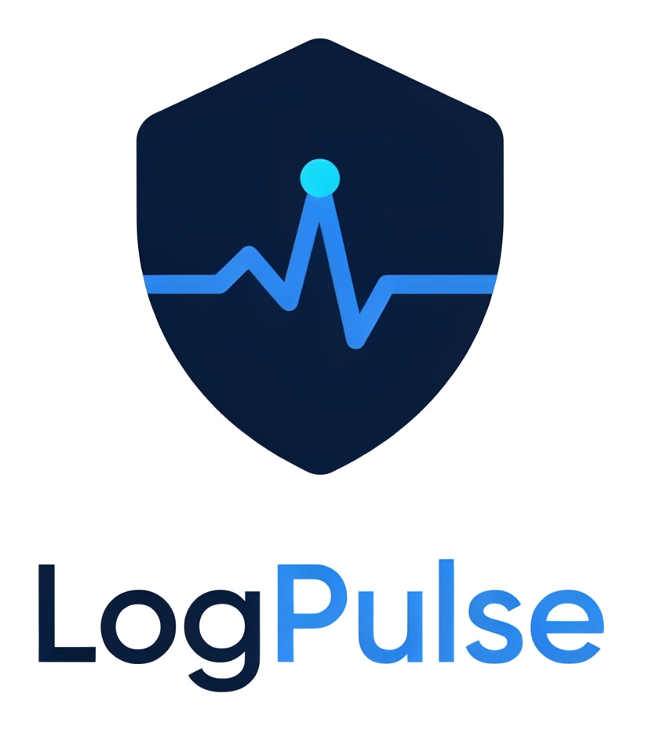
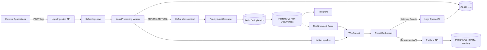

<!-- Improved compatibility of back to top link: See: https://github.com/othneildrew/Best-README-Template/pull/73 -->

<a id="readme-top"></a>

<!-- PROJECT SHIELDS -->

[![MIT License][license-shield]][license-url]
[![Java][java-shield]][Java-url]
[![Spring Boot][spring-shield]][Spring-Boot-url]
[![React][react-shield]][React-url]

<!-- PROJECT LOGO -->
<br />
<div align="center">
  <a href="https://github.com/nguyentrongduc2005/log-monitoring-system">
  
</a>

  <h3 align="center">Log Monitoring System</h3>

  <p align="center">
    Nền tảng thu thập, chuẩn hóa, lưu trữ và phân tích log theo thời gian thực.
    <br />
    <a href="https://github.com/nguyentrongduc2005/log-monitoring-system"><strong>Explore the repository »</strong></a>
    <br />
    <br />
    <a href="https://github.com/nguyentrongduc2005/log-monitoring-system/issues/new?labels=bug">Report Bug</a>
    &middot;
    <a href="https://github.com/nguyentrongduc2005/log-monitoring-system/issues/new?labels=enhancement">Request Feature</a>
  </p>
</div>

<!-- TABLE OF CONTENTS -->
<details>
  <summary>Table of Contents</summary>
  <ol>
    <li>
      <a href="#about-the-project">About The Project</a>
      <ul>
        <li><a href="#architecture">Architecture</a></li>
        <li><a href="#built-with">Built With</a></li>
        <li><a href="#project-structure">Project Structure</a></li>
      </ul>
    </li>
    <li>
      <a href="#getting-started">Getting Started</a>
      <ul>
        <li><a href="#prerequisites">Prerequisites</a></li>
        <li><a href="#installation">Installation</a></li>
      </ul>
    </li>
    <li><a href="#usage">Usage</a></li>
    <li><a href="#api-documentation">API Documentation</a></li>
    <li><a href="#roadmap">Roadmap</a></li>
    <li><a href="#license">License</a></li>
  </ol>
</details>

<!-- ABOUT THE PROJECT -->

## About The Project

Log Monitoring System giúp tập trung log từ nhiều ứng dụng vào một nền tảng
duy nhất. Hệ thống tiếp nhận log qua API, sử dụng message queue để cân bằng tải,
chuẩn hóa dữ liệu bằng worker và lưu trữ log phục vụ tìm kiếm, giám sát và phân
tích.

Các chức năng chính:

- Tiếp nhận log tốc độ cao từ nhiều ứng dụng.
- Chuẩn hóa `applicationName`, `level`, `message`, `timestamp` và `traceId`.
- Tìm kiếm và lọc log theo ứng dụng, cấp độ lỗi và thời gian.
- Hiển thị live log trên dashboard mà không cần reload trang.
- Phát hiện log `ERROR` hoặc `CRITICAL` và gửi cảnh báo thời gian thực.
- Chống cảnh báo trùng lặp bằng Redis để hạn chế alert fatigue.
- Phân quyền kỹ sư theo ứng dụng và cung cấp quyền quản trị alert rule.
- Điểm cộng: analytics sức khỏe ứng dụng, retention policy và phân tích AI.

> [!NOTE]
> Dự án đang trong giai đoạn phát triển. Frontend scaffold, Dockerfile và hạ
> tầng Docker Compose đã được thiết lập. Backend triển khai trước các module
> `identity`, `logs`, `alerting`, `realtime`; ingestion và processing là hai
> component bên trong `logs`, cùng với query, trong một Spring Boot Modular
> Monolith. Analytics là phạm vi điểm cộng.

<p align="right">(<a href="#readme-top">back to top</a>)</p>

### Architecture



Worker chỉ commit offset `logs.raw` sau khi ClickHouse và các Kafka event
downstream bắt buộc đều được acknowledge. `alerts.critical` có consumer group
và tài nguyên xử lý riêng; Kafka không tự cung cấp message priority.

Business module `logs` sở hữu event contract và ClickHouse dataset.
`ingestion`, `processing`, `query` là component nội bộ trong cùng Spring Boot
application, không phải module hoặc service độc lập.

HTTP/WebSocket controller nằm ở top-level `api`; chúng chỉ chuyển request đến
public facade của module. Business logic, persistence và Kafka/ClickHouse
adapter vẫn nằm bên trong module sở hữu.

| Component  | Responsibility                                            |
| ---------- | --------------------------------------------------------- |
| PostgreSQL | Identity, alert rule, occurrence và delivery state         |
| ClickHouse | Log chuẩn hóa, search và analytics điểm cộng               |
| Kafka      | Buffer log thô và truyền event giữa các bước xử lý         |
| Redis      | Khóa cảnh báo trùng lặp và dữ liệu tạm thời có TTL         |
| WebSocket  | Truyền live log và alert tới React dashboard              |
| Telegram   | Kênh gửi cảnh báo bắt buộc                                |

<p align="right">(<a href="#readme-top">back to top</a>)</p>

### Built With

#### Backend

- [![Java][Java]][Java-url]
- [![Spring Boot][Spring-Boot]][Spring-Boot-url]
- [![PostgreSQL][PostgreSQL]][PostgreSQL-url]
- [![ClickHouse][ClickHouse]][ClickHouse-url]
- [![Apache Kafka][Kafka]][Kafka-url]
- [![Redis][Redis]][Redis-url]

#### Frontend

- [![React][React.js]][React-url]
- [![TypeScript][TypeScript]][TypeScript-url]
- [![Vite][Vite]][Vite-url]
- [![Nginx][Nginx]][Nginx-url]

#### Infrastructure

- [![Docker][Docker]][Docker-url]

<p align="right">(<a href="#readme-top">back to top</a>)</p>

### Project Structure

```text
log-monitoring-system/
├── apps/
│   ├── backend/                 # Spring Boot API và worker
│   │   ├── src/main/java/
│   │   ├── src/main/resources/
│   │   ├── Dockerfile
│   │   └── pom.xml
│   └── frontend/                # React monitoring dashboard
│       ├── src/
│       ├── Dockerfile
│       ├── nginx.conf
│       └── package.json
├── docs/
│   ├── api/                     # API overview và OpenAPI được export
│   ├── diagram/                 # Sơ đồ hệ thống
│   ├── module-requirement.md    # Bản nháp định hướng module
│   ├── report/                  # Tài liệu và báo cáo
│   └── store-requirement.md     # Bản nháp định hướng storage
├── scripts/
│   └── generate-api-types.sh    # Sinh TypeScript type từ OpenAPI
├── compose.yml                  # PostgreSQL, ClickHouse, Kafka và Redis
├── Makefile                     # Các lệnh phát triển thường dùng
├── .env.example
└── README.md
```

<p align="right">(<a href="#readme-top">back to top</a>)</p>

<!-- GETTING STARTED -->

## Getting Started

Thực hiện các bước dưới đây để chạy dự án trên máy local.

### Prerequisites

- Git
- Java 21
- Node.js 22 trở lên
- Docker và Docker Compose
- GNU Make, tùy chọn nhưng được khuyến nghị

Kiểm tra phiên bản:

```sh
java --version
node --version
npm --version
docker compose version
```

### Installation

1. Clone repository
   ```sh
   git clone https://github.com/nguyentrongduc2005/log-monitoring-system.git
   cd log-monitoring-system
   ```
2. Tạo file environment cho Docker Compose
   ```sh
   cp .env.example .env
   ```
3. Thay đổi password mặc định trong `.env`
   ```env
   POSTGRES_PASSWORD=your-secure-password
   CLICKHOUSE_PASSWORD=your-secure-password
   ```
4. Khởi động PostgreSQL, ClickHouse, Redis và Kafka
   ```sh
   docker compose up -d postgres clickhouse redis kafka
   ```
5. Tạo file environment cho frontend
   ```sh
   cp apps/frontend/.env.example apps/frontend/.env.local
   ```
6. Cài đặt frontend dependencies
   ```sh
   cd apps/frontend
   npm ci
   cd ../..
   ```
7. Chạy backend
   ```sh
   cd apps/backend
   ./mvnw spring-boot:run
   ```
8. Mở terminal khác và chạy frontend
   ```sh
   cd apps/frontend
   npm run dev
   ```

Backend chạy tại `http://localhost:8080` và frontend chạy tại
`http://localhost:5173`.

Không commit `.env`, credential, token hoặc API key vào repository.

<p align="right">(<a href="#readme-top">back to top</a>)</p>

<!-- USAGE EXAMPLES -->

## Usage

### Development commands

| Command           | Description                                      |
| ----------------- | ------------------------------------------------ |
| `make infra-up`   | Khởi động PostgreSQL, ClickHouse, Redis và Kafka |
| `make infra-down` | Dừng các container                               |
| `make backend`    | Chạy Spring Boot backend                         |
| `make frontend`   | Chạy Vite development server                     |
| `make api`        | Sinh TypeScript API type từ OpenAPI              |
| `make build`      | Build backend và frontend                        |
| `make test`       | Chạy backend tests                               |
| `make lint`       | Chạy frontend ESLint                             |
| `make clean`      | Xóa output build                                 |

### Build Docker images

```sh
docker build -t log-monitoring-backend ./apps/backend
docker build -t log-monitoring-frontend ./apps/frontend
```

`compose.yml` hiện quản lý các service hạ tầng. Backend và frontend sẽ được
thêm vào Compose sau khi cấu hình production của backend hoàn tất.

Đây là khoảng trống triển khai hiện tại so với yêu cầu bàn giao cuối: Compose
phải chạy được backend Modular Monolith, frontend, PostgreSQL, ClickHouse,
Kafka và Redis.

### Local service ports

| Service           | Port   |
| ----------------- | ------ |
| Backend           | `8080` |
| Frontend          | `5173` |
| PostgreSQL        | `5432` |
| ClickHouse HTTP   | `8123` |
| ClickHouse Native | `9000` |
| Kafka             | `9094` |
| Redis             | `6379` |

<p align="right">(<a href="#readme-top">back to top</a>)</p>

<!-- API DOCUMENTATION -->

## API Documentation

Khi backend đang chạy:

```text
Swagger UI:  http://localhost:8080/swagger-ui
OpenAPI JSON: http://localhost:8080/v3/api-docs
```

Sinh TypeScript type cho frontend:

```sh
make api
```

```text
Spring Controller/DTO
        ↓
    /v3/api-docs
        ↓
docs/api/openapi.json
        ↓
apps/frontend/src/api/generated/api-types.ts
```

Không chỉnh sửa file generated bằng tay.

Quy ước target cho ingestion API, giới hạn batch, idempotency và backpressure
được mô tả tại [`docs/api/README.md`](docs/api/README.md). Tài liệu này không
khẳng định endpoint đã tồn tại nếu controller tương ứng chưa được triển khai.

<p align="right">(<a href="#readme-top">back to top</a>)</p>

<!-- ROADMAP -->

## Roadmap

- [x] Khởi tạo monorepo Spring Boot và React
- [x] Thiết lập Vite, routing, query provider và API client
- [x] Thiết lập Docker Compose cho PostgreSQL, ClickHouse, Kafka và Redis
- [x] Tạo backend và frontend Dockerfile
- [x] Thiết lập OpenAPI và script generate TypeScript type
- [ ] Thiết kế PostgreSQL schema và Flyway migrations
- [ ] Thiết kế ClickHouse log table và retention policy
- [ ] Xây dựng single và batch ingestion API
- [ ] Đẩy log thô vào Kafka topic `logs.raw`
- [ ] Xây dựng parsing worker và dead-letter topic
- [ ] Lưu log chuẩn hóa vào ClickHouse
- [ ] Xây dựng API tìm kiếm và phân trang log
- [ ] Hiển thị live log qua WebSocket
- [ ] Gửi cảnh báo `ERROR` và `CRITICAL`
- [ ] Chống cảnh báo trùng bằng Redis TTL
- [ ] Tích hợp Telegram notification
- [ ] Thêm authentication và application-level permissions
- [ ] [Điểm cộng] Thêm dashboard throughput, error rate và application health
- [ ] [Điểm cộng] Thêm retention INFO quá 7 ngày
- [ ] [Điểm cộng] Thêm AI phân tích và phân loại nhóm lỗi
- [ ] Viết k6 scenario cho demo 500 log trong 2 giây
- [ ] Thêm backend và frontend vào Docker Compose

See the [open issues](https://github.com/nguyentrongduc2005/log-monitoring-system/issues)
for a full list of proposed features and known issues.

<p align="right">(<a href="#readme-top">back to top</a>)</p>

<!-- LICENSE -->

## License

Distributed under the MIT License. See `LICENSE` for more information.

<p align="right">(<a href="#readme-top">back to top</a>)</p>

<!-- MARKDOWN LINKS & IMAGES -->
<!-- https://www.markdownguide.org/basic-syntax/#reference-style-links -->

[license-shield]: https://img.shields.io/badge/License-MIT-blue.svg?style=for-the-badge
[license-url]: LICENSE
[java-shield]: https://img.shields.io/badge/Java-21-ED8B00?style=for-the-badge&logo=openjdk&logoColor=white
[spring-shield]: https://img.shields.io/badge/Spring_Boot-3.5-6DB33F?style=for-the-badge&logo=springboot&logoColor=white
[react-shield]: https://img.shields.io/badge/React-19-20232A?style=for-the-badge&logo=react&logoColor=61DAFB
[Java]: https://img.shields.io/badge/Java_21-ED8B00?style=for-the-badge&logo=openjdk&logoColor=white
[Java-url]: https://openjdk.org/
[Spring-Boot]: https://img.shields.io/badge/Spring_Boot_3.5-6DB33F?style=for-the-badge&logo=springboot&logoColor=white
[Spring-Boot-url]: https://spring.io/projects/spring-boot
[React.js]: https://img.shields.io/badge/React_19-20232A?style=for-the-badge&logo=react&logoColor=61DAFB
[React-url]: https://react.dev/
[TypeScript]: https://img.shields.io/badge/TypeScript_5-3178C6?style=for-the-badge&logo=typescript&logoColor=white
[TypeScript-url]: https://www.typescriptlang.org/
[Vite]: https://img.shields.io/badge/Vite_8-646CFF?style=for-the-badge&logo=vite&logoColor=white
[Vite-url]: https://vite.dev/
[PostgreSQL]: https://img.shields.io/badge/PostgreSQL_17-4169E1?style=for-the-badge&logo=postgresql&logoColor=white
[PostgreSQL-url]: https://www.postgresql.org/
[ClickHouse]: https://img.shields.io/badge/ClickHouse_25.3-FFCC01?style=for-the-badge&logo=clickhouse&logoColor=black
[ClickHouse-url]: https://clickhouse.com/
[Kafka]: https://img.shields.io/badge/Apache_Kafka_4-231F20?style=for-the-badge&logo=apachekafka&logoColor=white
[Kafka-url]: https://kafka.apache.org/
[Redis]: https://img.shields.io/badge/Redis_8-DC382D?style=for-the-badge&logo=redis&logoColor=white
[Redis-url]: https://redis.io/
[Nginx]: https://img.shields.io/badge/Nginx_1.27-009639?style=for-the-badge&logo=nginx&logoColor=white
[Nginx-url]: https://nginx.org/
[Docker]: https://img.shields.io/badge/Docker-2496ED?style=for-the-badge&logo=docker&logoColor=white
[Docker-url]: https://www.docker.com/
