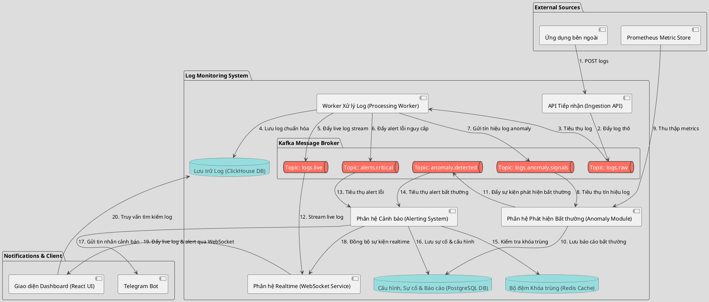

# TÀI LIỆU THIẾT KẾ HỆ THỐNG TỔNG QUÁT
## (HIGH-LEVEL SYSTEM DESIGN OVERVIEW)

Tài liệu này cung cấp thiết kế kiến trúc tổng quát của hệ thống **Log Monitoring System** để đưa vào báo cáo. Tài liệu tập trung vào luồng đi của dữ liệu và các thành phần cốt lõi một cách ngắn gọn, đi kèm sơ đồ tổng quan bằng mã **PlantUML**.

---

## 1. Sơ đồ kiến trúc tổng quan (Overall System Architecture)

Hệ thống sử dụng cơ chế xử lý bất đồng bộ thông qua các **Kafka Topic** riêng biệt làm bộ đệm để chịu tải cao và tách biệt luồng xử lý, kết hợp **ClickHouse** để lưu trữ log dung lượng lớn, **Redis** để chống trùng lặp cảnh báo, **Prometheus** để giám sát metrics hệ thống, và **PostgreSQL** để lưu cấu hình nghiệp vụ, sự cố cũng như báo cáo bất thường.

---

## 2. Mô tả các thành phần cốt lõi (Core Components)

Hệ thống được chia thành các thành phần chính sau:

*   **API Tiếp nhận (Ingestion API)**: Đầu mối nhận log từ các ứng dụng bên ngoài. API này thực hiện xác thực nhanh bằng API Key, kiểm tra tính trùng lặp qua Redis và đẩy log thô vào **logs.raw** Kafka topic mà không ghi trực tiếp xuống database, đảm bảo tốc độ phản hồi tối ưu dưới tải cao.
*   **Hàng đợi sự kiện (Kafka Topics)**: Chia tách các luồng dữ liệu độc lập:
    *   `logs.raw`: Buffer nhận các log thô ban đầu.
    *   `logs.live`: Stream live logs thời gian thực cho UI.
    *   `alerts.critical`: Chứa các sự kiện log cấp độ nguy cấp cần cảnh báo.
    *   `logs.anomaly.signals`: Tín hiệu cảnh báo bất thường trong log.
    *   `anomaly.detected`: Các sự kiện bất thường hệ thống/metrics đã được phát hiện.
*   **Worker Xử lý Log (Processing Worker)**: Nhận log từ `logs.raw`, thực hiện bóc tách, làm sạch, chuẩn hóa các trường thông tin quan trọng (`applicationName`, `level`, `message`, `timestamp`, `traceId`) và đẩy dữ liệu xuống ClickHouse. Đồng thời phân phối sự kiện cảnh báo sang các Kafka topic tương ứng.
*   **Lưu trữ ClickHouse (ClickHouse DB)**: Lưu trữ cơ sở dữ liệu log đã chuẩn hóa, tối ưu cho việc ghi hàng loạt (batch write) và tìm kiếm log lịch sử cực nhanh.
*   **Phân hệ Phát hiện Bất thường (Anomaly Module)**: Tiêu thụ tín hiệu từ `logs.anomaly.signals` và thu thập dữ liệu chỉ số hệ thống từ **Prometheus**. Sử dụng các quy tắc hoặc mô hình phân loại để phát hiện bất thường, lập báo cáo sự cố (Anomaly Report) vào PostgreSQL và gửi sự kiện qua topic `anomaly.detected`.
*   **Phân hệ Cảnh báo (Alerting System)**: Lắng nghe từ `alerts.critical` và `anomaly.detected`. Áp dụng cơ chế khóa trùng (Deduplication) qua Redis để tránh spam thông báo (Alert Fatigue), lưu sự cố (Incident) vào PostgreSQL và gửi tin nhắn cảnh báo qua Telegram.
*   **Phân hệ Realtime & Dashboard (WebSocket & React UI)**: WebSocket Service tiêu thụ từ `logs.live` để đẩy luồng live log và cảnh báo thời gian thực lên Dashboard của kỹ sư vận hành giúp theo dõi hệ thống mà không cần reload trang.

---

## 3. Luồng đi của dữ liệu (Data Flow Steps)

Quy trình hoạt động tổng quát của hệ thống diễn ra qua các bước sau:

1.  **Gửi log**: Ứng dụng nguồn gửi HTTP POST log tới **Ingestion API**.
2.  **Đẩy vào hàng đợi**: API phản hồi ngay sau khi log được đẩy vào Kafka topic **logs.raw**.
3.  **Xử lý & Lưu trữ**: **Worker** lấy log thô từ `logs.raw`, thực hiện chuẩn hóa, ghi xuống **ClickHouse** và chia luồng lỗi/bất thường sang các topic tương ứng.
4.  **Phát hiện bất thường**: **Anomaly Module** lấy tín hiệu từ `logs.anomaly.signals` kết hợp metrics từ **Prometheus**, tạo báo cáo bất thường lưu xuống **PostgreSQL** và đẩy lên topic `anomaly.detected`.
5.  **Cảnh báo & Chống trùng**: Phân hệ **Alerting** lấy dữ liệu từ `alerts.critical` và `anomaly.detected`, kiểm tra khóa trùng trên **Redis**. Nếu thỏa mãn điều kiện, ghi nhận sự cố xuống **PostgreSQL** và gửi đi qua **Telegram**.
6.  **Giám sát trực quan**: Luồng sự kiện từ `logs.live` được truyền qua **WebSocket** đến **Dashboard** giao diện người dùng theo thời gian thực.
