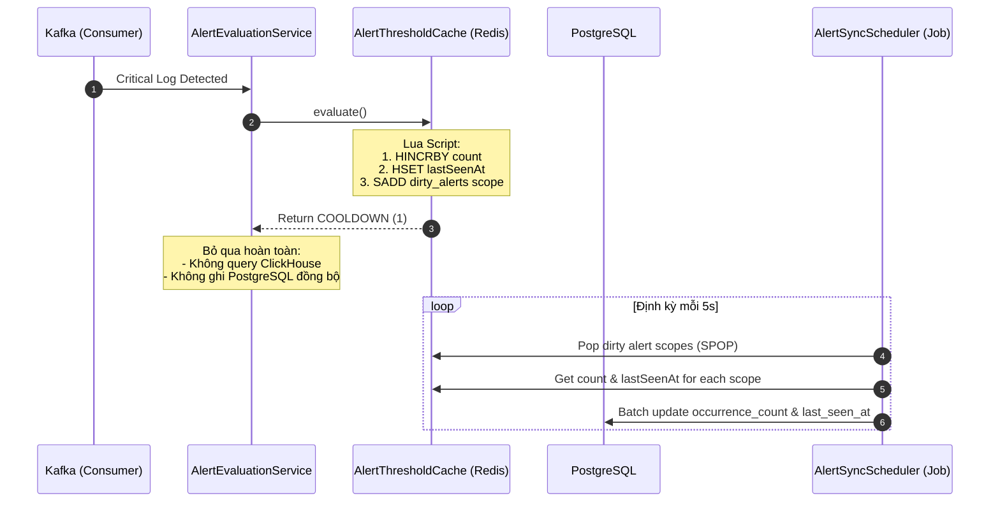

# Kế hoạch tối ưu hóa Cooldown Alert bằng Batch Job (Redis + PostgreSQL)

Tài liệu này mô tả chi tiết giải pháp kỹ thuật nhằm giảm tải cho hệ thống giám sát log khi có lượng log lớn đổ về liên tục trong thời gian Cooldown của Alert.

---

## 1. Vấn đề hiện tại (Current Bottlenecks)

Khi một Alert đang trong trạng thái `COOLDOWN` (đã kích hoạt trước đó và chưa được `RESOLVED` hoặc vẫn trong thời gian cooldown):
1. **Truy vấn ClickHouse quá nhiều**: Hệ thống luôn thực hiện truy vấn ClickHouse lấy top 5 log mẫu đại diện (`evidenceReader.findTopErrorLogSamples`) trên mỗi sự kiện log. Tuy nhiên, nếu Alert đã tồn tại trong DB, các log mẫu này sẽ bị loại bỏ và không được lưu lại.
2. **Ghi PostgreSQL tần suất cao**: Hệ thống thực hiện một transaction cập nhật PostgreSQL (tăng `occurrence_count` và cập nhật `last_seen_at`) cho mỗi log nhận được, dẫn tới tranh chấp khóa dòng (row locking) và giảm hiệu năng nghiêm trọng dưới tải cao.

---

## 2. Giải pháp đề xuất (Proposed Architecture)

Chúng ta sẽ chuyển dịch cơ chế cập nhật từ **Đồng bộ ghi trực tiếp (Synchronous Write)** sang **Gom cụm ghi bất đồng bộ (Asynchronous Batch Sync)** sử dụng Redis làm bộ đệm và một Scheduler chạy ngầm để đồng bộ định kỳ về PostgreSQL.



---

## 3. Chi tiết các bước thực hiện

### Bước 1: Kích hoạt Scheduling trong Spring Boot
*   Thêm `@EnableScheduling` vào class chạy chính của ứng dụng: [LogMonitoringApplication.java](file:///wsl$/Ubuntu/home/nguye/Workspace/project/log-monitoring-system/apps/backend/src/main/java/com/vdt/log_monitoring/LogMonitoringApplication.java).

### Bước 2: Nâng cấp Redis Lua Script & Key-Design
Trong [AlertThresholdCache.java](file:///wsl$/Ubuntu/home/nguye/Workspace/project/log-monitoring-system/apps/backend/src/main/java/com/vdt/log_monitoring/modules/alerting/internal/cache/AlertThresholdCache.java):
*   Khóa mới thêm vào danh sách `KEYS`:
    *   `KEYS[4]`: `log-monitoring:alerting:dirty_alerts` (Redis Set lưu trữ các scope cần đồng bộ).
*   Cập nhật logic Lua Script (`EVALUATE_SCRIPT`):
    *   Cập nhật `lastSeenAt` trong Redis Hash: `redis.call('HSET', KEYS[2], 'lastSeenAt', ARGV[5])`.
    *   Thêm scope vào set dirty để Scheduler quét: `redis.call('SADD', KEYS[4], KEYS[2])`.

### Bước 3: Thay đổi logic tại AlertEvaluationService
Trong [AlertEvaluationService.java](file:///wsl$/Ubuntu/home/nguye/Workspace/project/log-monitoring-system/apps/backend/src/main/java/com/vdt/log_monitoring/modules/alerting/internal/evaluation/AlertEvaluationService.java):
*   Khi kết quả đánh giá là `COOLDOWN`:
    *   **Loại bỏ hoàn toàn** đoạn code truy vấn ClickHouse (`findTopErrorLogSamples`).
    *   **Không gọi** `alertService.recordOccurrenceOrTrigger(...)`.
    *   Chỉ đơn giản trả về `List.of()` để kết thúc luồng xử lý đồng bộ mà không tốn tài nguyên DB.

### Bước 4: Thêm phương thức Update nhanh trong AlertRepository
Trong [AlertRepository.java](file:///wsl$/Ubuntu/home/nguye/Workspace/project/log-monitoring-system/apps/backend/src/main/java/com/vdt/log_monitoring/modules/alerting/internal/alert/AlertRepository.java):
*   Thêm method cập nhật trực tiếp:
    ```java
    @Modifying
    @Query("UPDATE AlertEntity a SET a.occurrenceCount = :occurrenceCount, a.lastSeenAt = :lastSeenAt, a.updatedAt = :updatedAt " +
           "WHERE a.ruleId = :ruleId AND a.applicationId = :applicationId AND a.status <> com.vdt.log_monitoring.modules.alerting.internal.alert.AlertStatus.RESOLVED")
    int updateOccurrenceCountAndLastSeenAt(
        @Param("ruleId") UUID ruleId,
        @Param("applicationId") UUID applicationId,
        @Param("occurrenceCount") long occurrenceCount,
        @Param("lastSeenAt") Instant lastSeenAt,
        @Param("updatedAt") Instant updatedAt
    );
    ```

### Bước 5: Viết Background Job đồng bộ dữ liệu
Tạo mới class `AlertSyncScheduler.java` trong package `modules.alerting.internal.alert`:
*   Sử dụng `@Scheduled(fixedDelay = 5000)` (chạy mỗi 5 giây).
*   Sử dụng lệnh `SPOP` từ Redis để lấy ngẫu nhiên và loại bỏ các dirty keys khỏi `alerting:dirty_alerts`.
*   Tách thông tin `ruleId` và `applicationId` từ key.
*   Lấy dữ liệu `count` và `lastSeenAt` tương ứng của từng key trong Redis.
*   Thực hiện chạy transaction cập nhật dữ liệu về PostgreSQL bằng cách gọi Repository vừa viết ở Bước 4.

---

## 4. Đánh giá Hiệu năng & Rủi ro

*   **Hiệu năng**: Giảm tải đọc của ClickHouse đi 100% trong thời gian Cooldown. Tải ghi của PostgreSQL giảm từ $O(N)$ (với $N$ là số log) xuống còn tối đa 1 transaction ghi gộp mỗi 5 giây.
*   **Tính nhất quán dữ liệu**: Số liệu trên UI có thể bị trễ tối đa 5 giây (bằng chu kỳ quét của Job), đây là độ trễ hoàn toàn chấp nhận được đối với hệ thống Alerting.
