# Sơ đồ Luồng Chi tiết Các Phân hệ Hệ thống (Detailed Flow Diagrams)

Tài liệu này cung cấp các sơ đồ luồng chi tiết cho từng phân hệ trong hệ thống Log Monitoring System. Mỗi phân hệ bao gồm 2 phiên bản sơ đồ: **Mermaid** (tích hợp trực tiếp hiển thị trên Markdown) và **PlantUML** (dành cho các công cụ thiết kế chuyên nghiệp).

---

## 1. Phân hệ Identity & Access (Quản lý Định danh & Quyền truy cập)

* **Loại sơ đồ**: Sơ đồ tuần tự (Sequence Diagram) mô tả luồng đăng nhập.
* **Mô tả**: Mô tả chi tiết quá trình xác thực tài khoản người dùng, đối chiếu thông tin với cơ sở dữ liệu PostgreSQL và tạo Token JWT phiên làm việc để lưu vào Redis.

### Bản vẽ Mermaid:
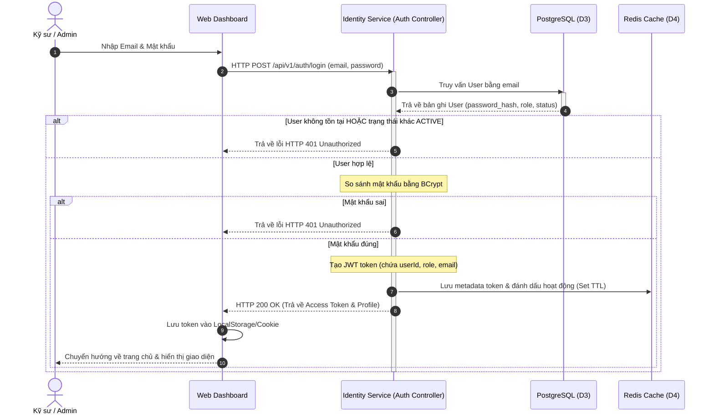

### Bản vẽ PlantUML:
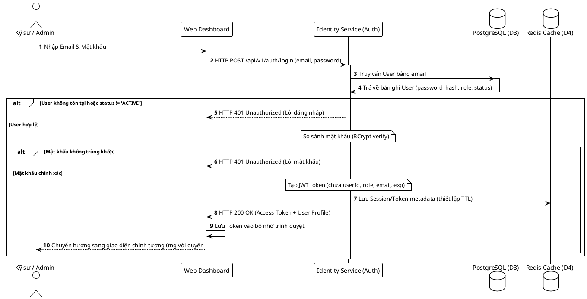

### Bảng Phân quyền Vai trò (Permission Matrix)

Hệ thống phân tách quyền lợi cụ thể giữa vai trò **Admin** và **Engineer** như sau:

| Danh mục | Chức năng nghiệp vụ | Quyền Admin | Quyền Engineer | Ghi chú |
| :--- | :--- | :---: | :---: | :--- |
| **Quản trị người dùng** | Tạo mới, khóa hoặc xóa tài khoản người dùng | **Có** | **Không** | Quyền quản trị hệ thống tối cao |
| | Thay đổi vai trò người dùng (`role`) | **Có** | **Không** | Chỉ Admin mới được nâng/hạ quyền |
| **Quản lý ứng dụng** | Đăng ký ứng dụng mới cần theo dõi log | **Có** | **Không** | Tạo dự án giám sát mới |
| | Cấu hình quyền truy cập ứng dụng (`user_application_access`) | **Có** | **Không** | Gán ứng dụng cho kỹ sư cụ thể |
| | Tạo mới, thu hồi API Key của ứng dụng | **Có** | **Có** | Engineer chỉ thực hiện trên ứng dụng được cấp quyền `MANAGE` |
| | Cấu hình nguồn cào chỉ số (`metric_sources`) | **Có** | **Có** | Engineer chỉ thực hiện trên ứng dụng được cấp quyền `MANAGE` |
| **Giám sát & Logs** | Xem log realtime & truy vấn logs từ ClickHouse | **Có** | **Có** | Engineer chỉ xem được ứng dụng được gán quyền `VIEW` hoặc `MANAGE` |
| | Xem danh sách cảnh báo phát sinh (`alerts`) | **Có** | **Có** | Engineer chỉ xem cảnh báo của ứng dụng được phân quyền |
| **Cấu hình Cảnh báo** | Thiết lập luật cảnh báo (`alert_rules`) | **Có** | **Có** | Engineer chỉ cấu hình trên ứng dụng có quyền `MANAGE` |
| | Cấu hình chat room nhận tin nhắn (Telegram) | **Có** | **Có** | Toàn quyền thiết lập cổng kết nối |
| **Điều tra Sự cố** | Mở sự cố mới (`incidents`) | **Có** | **Có** | Ghi nhận sự cố để điều tra |
| | Đóng/Giải quyết sự cố, cập nhật timeline | **Có** | **Có** | Cập nhật tiến độ xử lý |
| | Yêu cầu trợ lý AI phân tích sự cố (`AI analysis`) | **Có** | **Có** | Gọi API phân tích bundle bằng chứng |
| **Chính sách lưu trữ** | Thiết lập chính sách lưu giữ logs (`retention_policies`) | **Có** | **Không** | Tránh rủi ro thất thoát dữ liệu logs |
| | Kích hoạt chạy tiến trình dọn dẹp log thủ công | **Có** | **Không** | Chỉ Admin mới kích hoạt dọn dẹp đĩa cứng ClickHouse |

---

## 2. Logs Ingestion & Processing (Tiếp nhận & Chuẩn hóa Log)

* **Loại sơ đồ**: Sơ đồ tuần tự (Sequence Diagram).
* **Mô tả**: Mô tả luồng đi của log từ khi ứng dụng bên ngoài đẩy về API, qua hàng đợi Kafka, được Worker chuẩn hóa và lưu trữ theo cơ chế Batch vào ClickHouse.

### Bản vẽ Mermaid:
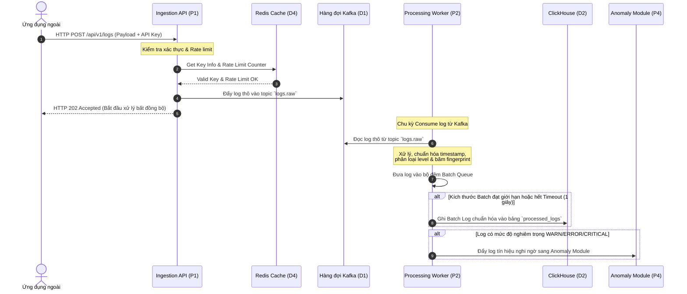

### Bản vẽ PlantUML:
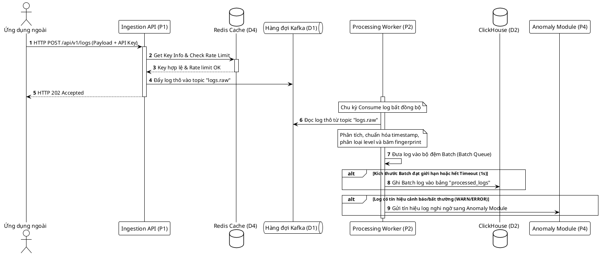

---

## 3. Real-time Stream (Stream dữ liệu thời gian thực)

* **Loại sơ đồ**: Sơ đồ tuần tự (Sequence Diagram).
* **Mô tả**: Thể hiện quá trình thiết lập kết nối WebSocket giữa Web Dashboard của Kỹ sư vận hành và Real-time Gateway để nhận logs/alerts tức thời.

### Bản vẽ Mermaid:
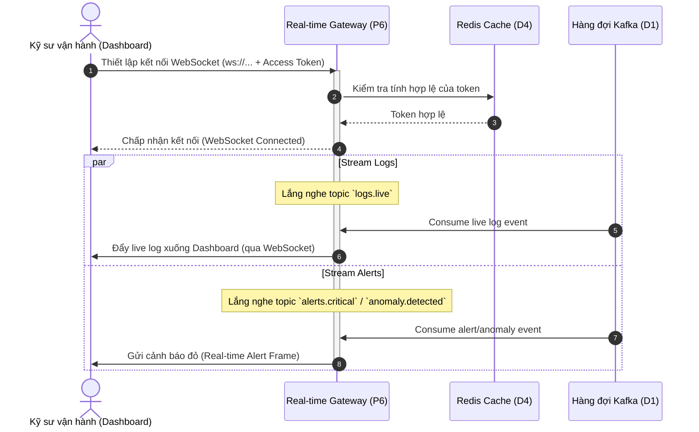

### Bản vẽ PlantUML:
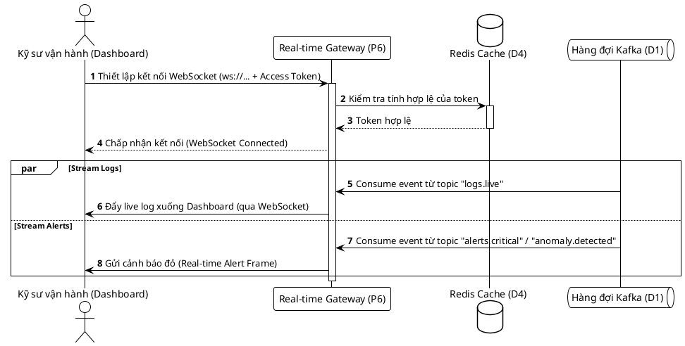

---

## 4. Anomaly Detection (Phát hiện Bất thường)

* **Loại sơ đồ**: Sơ đồ hoạt động/luồng xử lý (Flowchart / Activity Diagram).
* **Mô tả**: Mô tả luồng tự động quét và đánh giá các tín hiệu hệ thống (Metrics từ Prometheus và Logs nghi ngờ từ Worker) để kết luận và tạo báo cáo bất thường.

### Bản vẽ Mermaid:
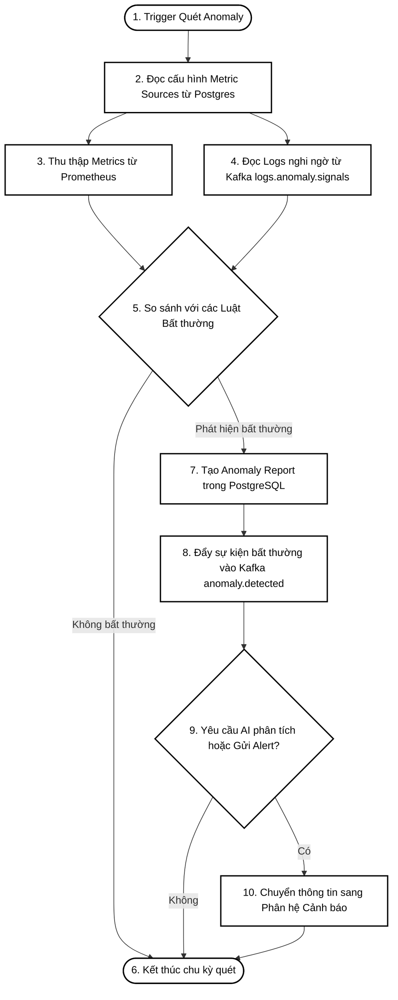

### Bản vẽ PlantUML:
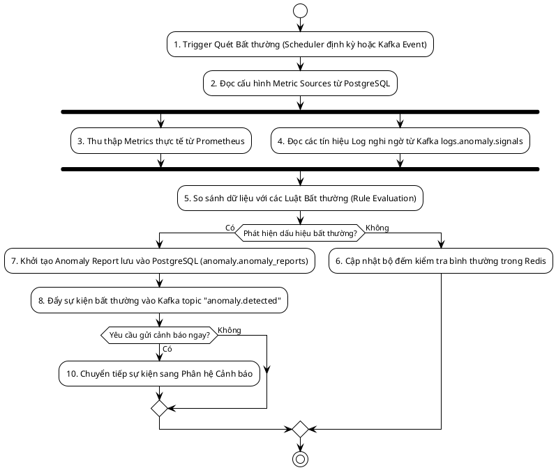

---

## 5. Alerting & Deduplication (Đánh giá Cảnh báo & Khử trùng lặp)

* **Loại sơ đồ**: Sơ đồ hoạt động (Activity Diagram).
* **Mô tả**: Logic kiểm tra luật cảnh báo và khử trùng lặp (Deduplication) dựa trên bộ đếm Redis nhằm ngăn ngừa ngập lụt cảnh báo (Alert Fatigue).

### Bản vẽ Mermaid:
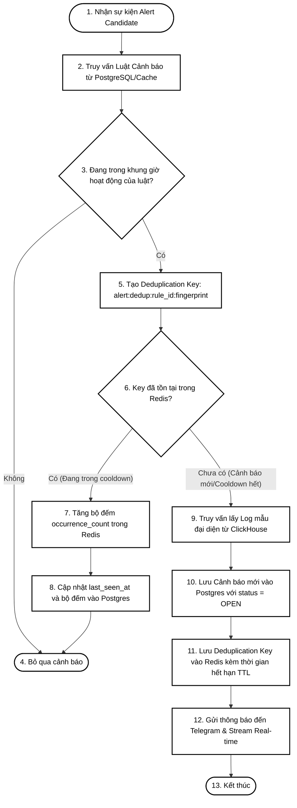

### Bản vẽ PlantUML:
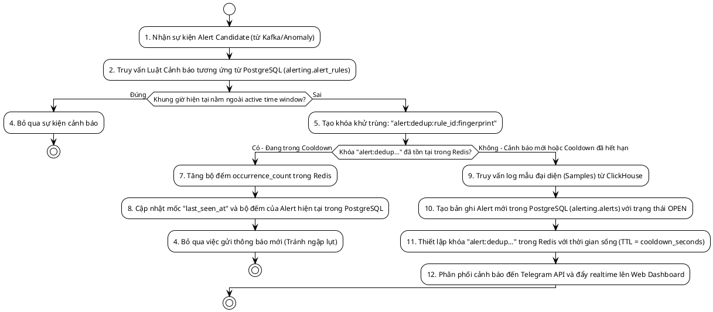

---

## 6. Incident Management & AI Assistant (Quản lý Sự cố & Trợ lý AI)

* **Loại sơ đồ**: Sơ đồ tuần tự (Sequence Diagram).
* **Mô tả**: Quy trình điều tra sự cố bằng công nghệ AI, tự động thu thập thông tin logs, metrics và cảnh báo làm bằng chứng để AI phân tích nguyên nhân gốc rễ.

### Bản vẽ Mermaid:
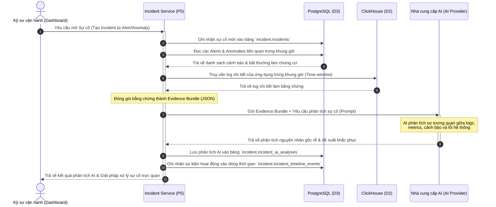

### Bản vẽ PlantUML:
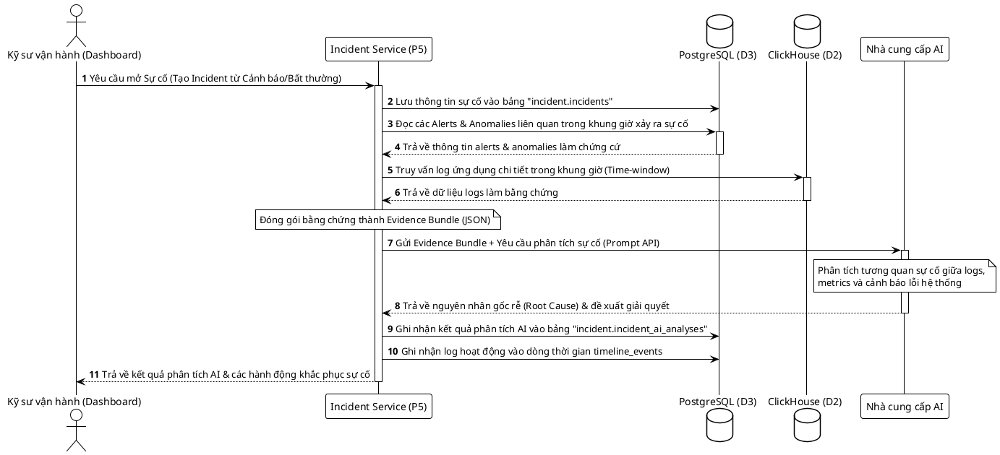

---

## 7. Data Retention (Quản lý thời hạn và dọn dẹp log)

* **Loại sơ đồ**: Sơ đồ hoạt động (Activity Diagram).
* **Mô tả**: Cơ chế chạy tự động hàng ngày quét cấu hình chính sách lưu giữ để xóa sạch các log quá hạn phân vùng ClickHouse nhằm giải phóng đĩa cứng.

### Bản vẽ Mermaid:
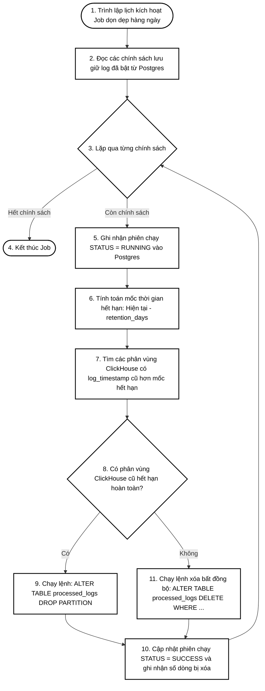

### Bản vẽ PlantUML:
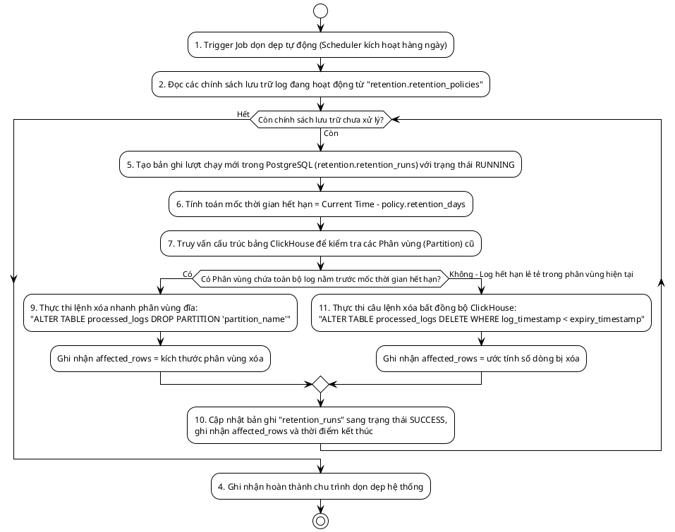
