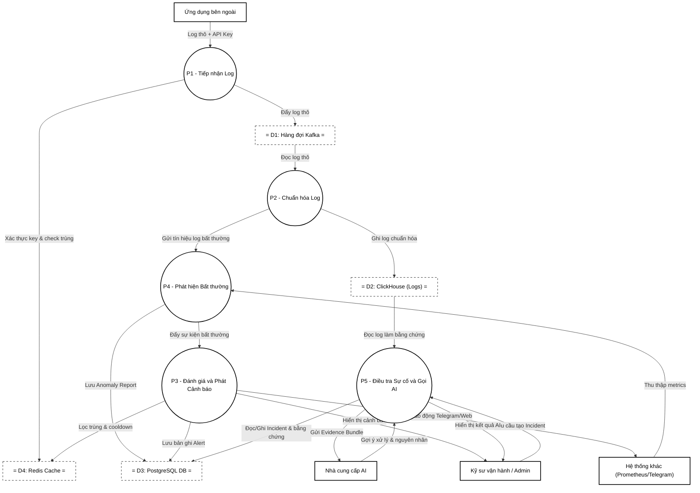

# Architecture

## Overview

Hệ thống giám sát log (Log Monitoring System) được thiết kế theo kiến trúc **Modular Monolith** (Đơn khối phân rã mô-đun) chạy trên nền tảng Spring Boot. Hệ thống tách biệt các trách nhiệm xử lý thông qua hàng đợi thông điệp (Kafka) để cô lập tài nguyên, đảm bảo khả năng mở rộng cao, tiếp nhận log tốc độ cao mà không làm gián đoạn các luồng truy vấn trực quan thời gian thực.

---

## System Context

Hệ thống tiếp nhận các sự kiện log thô từ các **Ứng dụng bên ngoài (External Applications)** thông qua cổng giao tiếp HTTP/HTTPS sử dụng API Key. Sau khi tiếp nhận và chuyển tiếp xử lý, hệ thống phục vụ các **Vận hành viên / Kỹ sư (Operators / Engineers)** theo dõi trạng thái hệ thống thời gian thực qua Web Dashboard, nhận cảnh báo tức thời qua Telegram và điều tra sự cố được hỗ trợ bởi Trí tuệ nhân tạo (AI Provider).

---

## Modules and Services

Các cấu phần nghiệp vụ được tổ chức độc lập dưới dạng các package module bên trong backend Spring Boot:

| Component | Responsibility | Depends On | Owns |
| --------- | -------------- | ---------- | ---- |
| `identity` | Quản lý người dùng, ứng dụng, phân quyền và API Key | Không phụ thuộc | PostgreSQL `identity` schema |
| `logs` (Ingestion, Processing, Query) | Tiếp nhận log thô, chuẩn hóa ghi ClickHouse, phát hiện lỗi nhanh | `identity` | ClickHouse `processed_logs`, Kafka topics: `logs.raw`, `logs.live`, `alerts.critical`, `logs.anomaly.signals` |
| `alerting` | Đánh giá luật cảnh báo, lọc trùng lặp qua Redis, phân phối qua Telegram/Websocket | `identity`, `logs` | PostgreSQL `alerting` schema, Redis active rules cache |
| `realtime` | Thiết lập phiên WebSocket và lọc log thời gian thực theo phân quyền | `identity`, `logs`, `alerting` | WebSocket sessions, authorized subscription topic |
| `anomaly` | Phát hiện bất thường qua Prometheus metrics và tín hiệu log | `identity`, `alerting` | PostgreSQL `anomaly` schema |
| `incident` | Quản lý vòng đời sự cố, thu thập bằng chứng và phối hợp AI phân tích | `identity`, `alerting`, `anomaly`, `logs` | PostgreSQL `incident` schema |
| `retention` | Điều phối chính sách dọn dẹp log quá hạn trong ClickHouse | `logs` | PostgreSQL `retention` schema |

---

## Boundaries and Ownership

- **Ranh giới giao tiếp**: Các module không được phép gọi trực tiếp các lớp Repository hoặc Entity của module khác. Mọi giao tiếp liên module phải thông qua các **Facade Interface** nằm ở thư mục `api` của từng module (ví dụ: `modules.<module>.api`).
- **Phân chia cơ sở dữ liệu**: PostgreSQL được cấu hình đa schema theo tên module. ClickHouse chỉ được ghi bởi luồng `processing` của module `logs`, các module khác chỉ có quyền đọc để truy xuất thông tin hoặc làm bằng chứng.
- **Ranh giới bất đồng bộ**: Các sự kiện phân phối trung gian được định tuyến qua Kafka topics riêng biệt để đảm bảo xử lý bất đồng bộ an toàn và độc lập.

---

## Component Relationships

Các thành phần tương tác chặt chẽ với nhau thông qua luồng dữ liệu bất đồng bộ dựa trên Kafka và bộ đệm Redis để thực hiện các quy trình nghiệp vụ:
- Ingestion API tương tác với Identity để xác thực API Key trước khi ghi nhận.
- Processing Worker phân rã luồng logs thành: logs thô ghi ClickHouse, logs trực tiếp (live) đẩy sang Realtime, logs lỗi đẩy sang Alerting, logs bất thường đẩy sang Anomaly.
- Incident Module liên kết dữ liệu từ logs, alerting và anomaly để gửi yêu cầu phân tích thông minh tới AI Provider.

---

## Data Flow

### Luồng xử lý dữ liệu tổng quát

Luồng xử lý tổng quát của hệ thống từ lúc tiếp nhận log đến khi cảnh báo và hỗ trợ điều tra sự cố được tóm tắt qua các bước sau:

| Bước | Mô tả |
| :---: | ----- |
| **1** | Ứng dụng bên ngoài gửi log về Ingestion API. |
| **2** | Ingestion API đưa log thô vào Kafka để xử lý bất đồng bộ. |
| **3** | Processing Worker consume log, chuẩn hóa và phân loại dữ liệu. |
| **4** | Log đã xử lý được lưu trữ vào ClickHouse theo cơ chế batch. |
| **5** | Log nghiêm trọng hoặc khớp rule được chuyển thành alert candidate. |
| **6** | Alert Module kiểm tra rule, áp dụng Redis Deduplication và tạo cảnh báo. |
| **7** | Cảnh báo được gửi realtime lên dashboard và gửi qua Telegram khi cần. |
| **8** | Anomaly Module định kỳ thu thập metrics từ Prometheus để phát hiện dấu hiệu bất thường. |
| **9** | Khi phát hiện bất thường về log hoặc metrics, hệ thống tạo Anomaly Report và lưu vào PostgreSQL. |
| **10** | Khi kỹ sư tạo Incident từ cảnh báo, Incident Module gom evidence bundle gồm log, alert và anomaly report liên quan. |
| **11** | Evidence bundle được gửi đến AI Provider để hỗ trợ phân tích rủi ro, nguyên nhân khả nghi và hướng xử lý. |

---

## Diagrams

### Hình 2.2. Sơ đồ luồng xử lý dữ liệu tổng quát (Mermaid)

Dưới đây là sơ đồ Mermaid biểu diễn trực quan luồng xử lý dữ liệu tổng quát của hệ thống:

