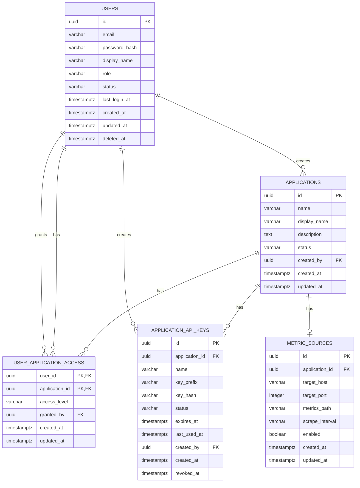
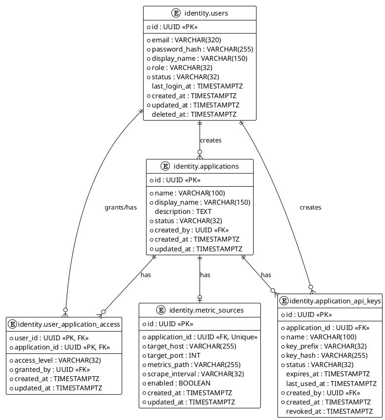
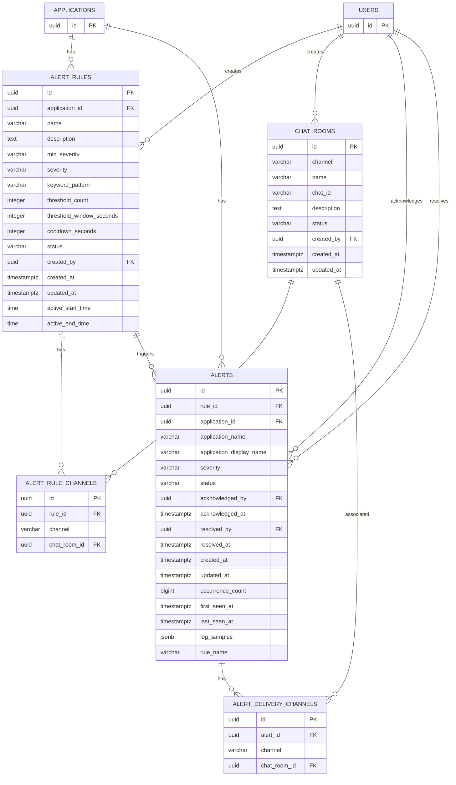
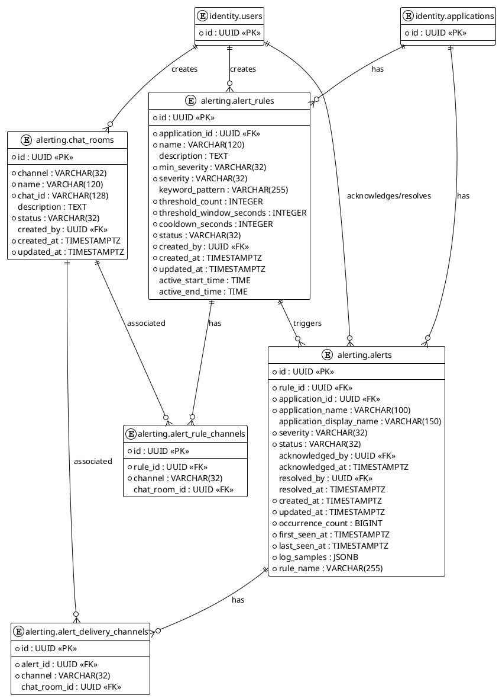
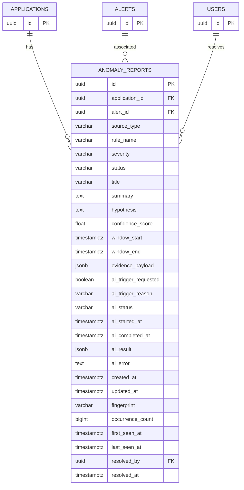
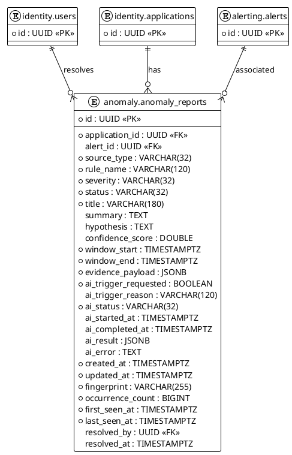
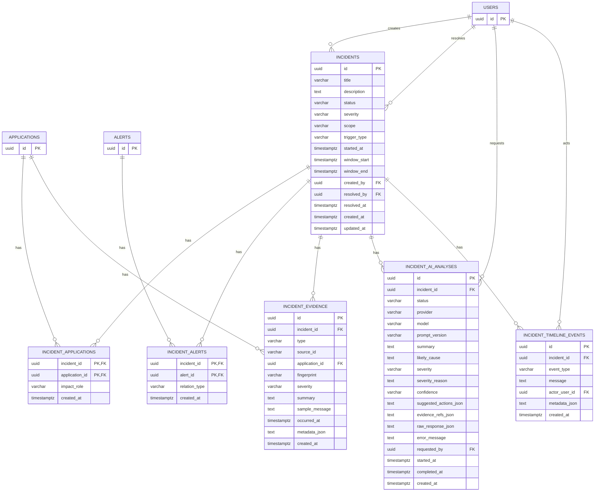
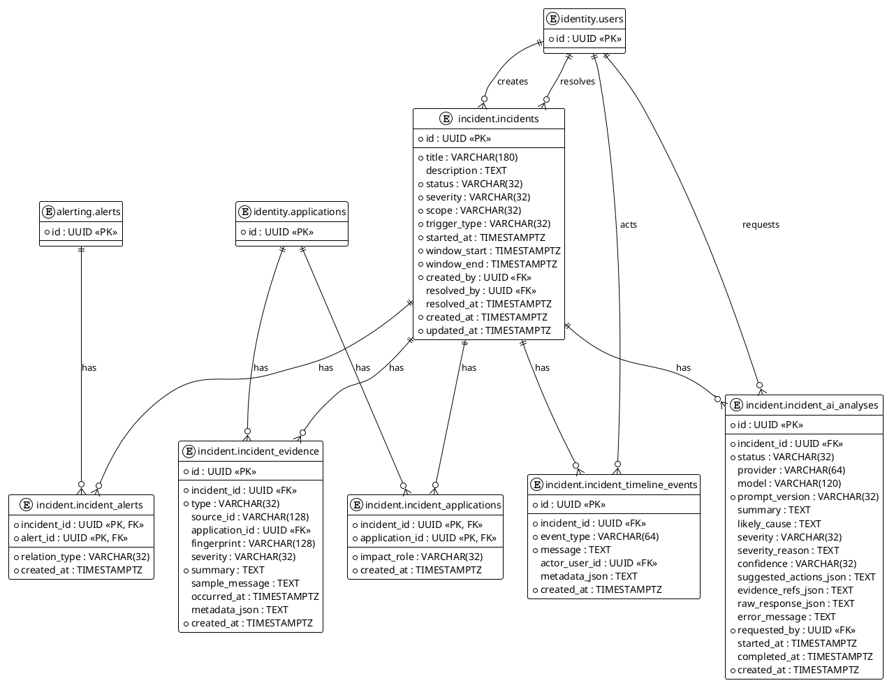
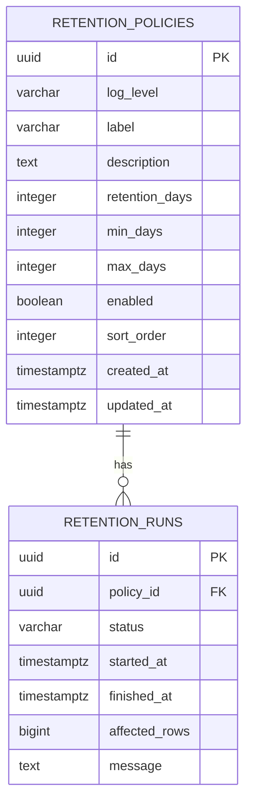
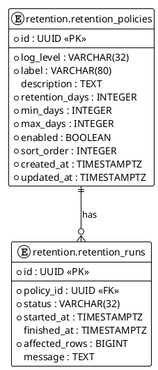

# Database

## Overview

Hệ thống giám sát log (Log Monitoring System) sử dụng kiến trúc lưu trữ tối ưu hóa hiệu năng cao kết hợp giữa cơ sở dữ liệu quan hệ (**PostgreSQL**) và cơ sở dữ liệu dạng cột (**ClickHouse**), kết hợp với bộ đệm **Apache Kafka** và bộ nhớ đệm **Redis**.

### Chiến lược tối ưu ghi nhanh (Fast-Write Optimization Strategy)

Để đáp ứng yêu cầu nhận 500 logs trong 2 giây liên tục mà không gây nghẽn hệ thống hoặc mất dữ liệu, hệ thống triển khai các chiến lược tối ưu ghi nhanh sau:

1. **Bộ đệm Message Queue (Apache Kafka)**:
   - Toàn bộ log thô được gửi đến `Ingestion API` sẽ được đẩy ngay lập tức vào Kafka topic `logs.raw`. API phản hồi HTTP `202 Accepted` ngay khi Kafka xác nhận đã nhận tin nhắn (ACK), không chờ ghi xuống cơ sở dữ liệu.
   - Tránh việc thực hiện các câu lệnh `INSERT` đơn lẻ trực tiếp xuống SQL DB vốn gây nghẽn kết nối và sập hệ thống trong vài phút khi có tải cao.

2. **Cơ chế Batch Insert trong Processing Worker**:
   - Processing Worker tiêu thụ logs từ `logs.raw` theo cơ chế bất đồng bộ.
   - Worker gom dữ liệu log đã chuẩn hóa thành các mẻ lớn (ví dụ: tối thiểu 5.000 logs hoặc mỗi 2 giây) trước khi thực hiện ghi hàng loạt (`bulk insert`) vào ClickHouse. ClickHouse được tối ưu hóa đặc biệt cho việc ghi chèn hàng loạt này, giảm thiểu I/O đĩa và overhead trên bộ điều phối transaction.

3. **Cấu trúc bảng ClickHouse tối ưu**:
   - Bảng `processed_logs` sử dụng công cụ **ReplacingMergeTree** với khóa sắp xếp (Sorted Key) được tối ưu hóa.
   - Phân vùng dữ liệu (`PARTITION BY`) theo tháng dựa trên cột `log_timestamp` (`toYYYYMM(log_timestamp)`), giúp tối ưu hóa vùng ghi và dễ dàng dọn dẹp dữ liệu cũ (Log Retention).
   - Thứ tự sắp xếp (`ORDER BY (application_id, log_timestamp, event_id)`) giúp truy cập nhanh theo ứng dụng và mốc thời gian mà không cần quét toàn bộ bảng.

4. **Bộ nhớ đệm Redis**:
   - Xác thực API Key của các ứng dụng gửi log thông qua bộ nhớ đệm Redis để giảm tải truy vấn `SELECT` xuống PostgreSQL.
   - Xử lý chống ghi đúp bằng khóa idempotency của log (`event_id` / `ingestion_id`) trực tiếp trên Redis với thời gian hết hạn (TTL).
   - Thực hiện đếm tần suất lỗi nguyên tử (atomic increment) trên Redis phục vụ cho cơ chế chống trùng lặp cảnh báo (Alert Deduplication), tránh ghi nhận quá nhiều bản ghi alert xuống PostgreSQL cùng một lúc.

5. **Cách ly tài nguyên**:
   - Tách biệt luồng của Ingestion API (chỉ tương tác với Kafka và Redis) với Processing Worker (ghi ClickHouse) và Query Engine (đọc ClickHouse), đảm bảo tải ghi không ảnh hưởng đến độ mượt của màn hình Live Viewer trên Dashboard.

---

## Storage Ownership

Hệ thống phân chia rạch ròi quyền sở hữu dữ liệu giữa các module:
- **`identity`**: Sở hữu schema `identity` trong PostgreSQL. Quản lý người dùng, ứng dụng, phân quyền và API keys.
- **`logs`**: Sở hữu bảng `processed_logs` trong ClickHouse. Quản lý việc chuẩn hóa, làm sạch và lưu trữ log.
- **`alerting`**: Sở hữu schema `alerting` trong PostgreSQL và các khóa cấu hình cảnh báo trong Redis. Quản lý rule, thông tin alert phát sinh và chat room.
- **`anomaly`**: Sở hữu schema `anomaly` trong PostgreSQL. Quản lý các cấu hình phát hiện bất thường và báo cáo bất thường.
- **`incident`**: Sở hữu schema `incident` trong PostgreSQL. Quản lý thông tin sự cố, timeline, bằng chứng (evidence) và phân tích AI.
- **`retention`**: Sở hữu schema `retention` trong PostgreSQL. Điều phối chính sách dọn dẹp log.

---

## Tables

### 1. PostgreSQL Tables

#### `identity.users`
* **Purpose**: Lưu trữ thông tin người dùng và tài khoản quản trị hệ thống.
* **Owner**: `identity`

| Field | Type | Nullable | Default | Description |
| ----- | ---- | -------- | ------- | ----------- |
| `id` | UUID | NO | | Khóa chính của người dùng |
| `email` | VARCHAR(320) | NO | | Email đăng nhập (Unique, viết thường) |
| `password_hash` | VARCHAR(255) | NO | | Mật khẩu đã được mã hóa |
| `display_name` | VARCHAR(150) | NO | | Tên hiển thị của người dùng |
| `role` | VARCHAR(32) | NO | | Vai trò: `ADMIN`, `ENGINEER` |
| `status` | VARCHAR(32) | NO | `'ACTIVE'` | Trạng thái: `ACTIVE`, `DISABLED`, `LOCKED`, `DELETED` |
| `last_login_at` | TIMESTAMPTZ | YES | | Lần đăng nhập cuối |
| `created_at` | TIMESTAMPTZ | NO | `CURRENT_TIMESTAMP` | Thời gian tạo tài khoản |
| `updated_at` | TIMESTAMPTZ | NO | `CURRENT_TIMESTAMP` | Thời gian cập nhật tài khoản |
| `deleted_at` | TIMESTAMPTZ | YES | | Thời gian xóa tài khoản (Soft Delete) |

* **Keys and Relationships**:
  - `id` là khóa chính (`pk_users`).
* **Indexes and Constraints**:
  - Unique Index `uk_users_email` trên `LOWER(email)`.
  - Index `idx_users_status` trên cột `status`.
  - Index `idx_users_deleted_at` trên cột `deleted_at`.
  - Check constraint `ck_users_role` giới hạn vai trò là `ADMIN` hoặc `ENGINEER`.
  - Check constraint `ck_users_status` giới hạn trạng thái là `ACTIVE`, `DISABLED`, `LOCKED`, `DELETED`.

---

#### `identity.applications`
* **Purpose**: Quản lý danh sách các ứng dụng đăng ký gửi log vào hệ thống.
* **Owner**: `identity`

| Field | Type | Nullable | Default | Description |
| ----- | ---- | -------- | ------- | ----------- |
| `id` | UUID | NO | | Khóa chính của ứng dụng |
| `name` | VARCHAR(100) | NO | | Tên định danh ứng dụng (Unique, viết thường) |
| `display_name` | VARCHAR(150) | NO | | Tên hiển thị ứng dụng |
| `description` | TEXT | YES | | Mô tả chi tiết ứng dụng |
| `status` | VARCHAR(32) | NO | `'ACTIVE'` | Trạng thái: `ACTIVE`, `INACTIVE` |
| `created_by` | UUID | NO | | ID người dùng tạo ứng dụng |
| `created_at` | TIMESTAMPTZ | NO | `CURRENT_TIMESTAMP` | Thời gian đăng ký ứng dụng |
| `updated_at` | TIMESTAMPTZ | NO | `CURRENT_TIMESTAMP` | Thời gian cập nhật ứng dụng |

* **Keys and Relationships**:
  - Khóa chính `pk_applications` trên `id`.
  - Khóa ngoại `fk_applications_created_by` liên kết tới `identity.users(id)` (ON DELETE RESTRICT).
* **Indexes and Constraints**:
  - Unique Index `uk_applications_name` trên `LOWER(name)`.
  - Index `idx_applications_status` trên cột `status`.
  - Check constraint `ck_applications_status` giới hạn trạng thái là `ACTIVE` hoặc `INACTIVE`.

---

#### `identity.user_application_access`
* **Purpose**: Bảng trung gian phân quyền hiển thị log của từng ứng dụng cho các kỹ sư (Engineer).
* **Owner**: `identity`

| Field | Type | Nullable | Default | Description |
| ----- | ---- | -------- | ------- | ----------- |
| `user_id` | UUID | NO | | ID người dùng (Khóa chính phần 1) |
| `application_id` | UUID | NO | | ID ứng dụng được phân quyền (Khóa chính phần 2) |
| `access_level` | VARCHAR(32) | NO | | Mức truy cập: `VIEW`, `MANAGE` |
| `granted_by` | UUID | NO | | ID người dùng đã cấp quyền |
| `created_at` | TIMESTAMPTZ | NO | `CURRENT_TIMESTAMP` | Thời gian cấp quyền |
| `updated_at` | TIMESTAMPTZ | NO | `CURRENT_TIMESTAMP` | Thời gian cập nhật quyền |

* **Keys and Relationships**:
  - Khóa chính phức hợp `pk_user_application_access` trên `(user_id, application_id)`.
  - Khóa ngoại `fk_user_application_access_user` liên kết tới `identity.users(id)` (ON DELETE CASCADE).
  - Khóa ngoại `fk_user_application_access_application` liên kết tới `identity.applications(id)` (ON DELETE CASCADE).
  - Khóa ngoại `fk_user_application_access_granted_by` liên kết tới `identity.users(id)` (ON DELETE RESTRICT).
* **Indexes and Constraints**:
  - Index `idx_user_application_access_application_user` trên `(application_id, user_id)`.
  - Check constraint `ck_user_application_access_level` giới hạn giá trị `VIEW` hoặc `MANAGE`.

---

#### `identity.application_api_keys`
* **Purpose**: Lưu trữ API Keys của từng ứng dụng để xác thực lúc gửi log.
* **Owner**: `identity`

| Field | Type | Nullable | Default | Description |
| ----- | ---- | -------- | ------- | ----------- |
| `id` | UUID | NO | | Khóa chính của API Key |
| `application_id` | UUID | NO | | ID ứng dụng sở hữu API Key |
| `name` | VARCHAR(100) | NO | | Tên gợi nhớ của API Key |
| `key_prefix` | VARCHAR(32) | NO | | Phần tiền tố hiển thị công khai |
| `key_hash` | VARCHAR(255) | NO | | Chuỗi băm bảo mật của API Key |
| `status` | VARCHAR(32) | NO | `'ACTIVE'` | Trạng thái: `ACTIVE`, `REVOKED`, `EXPIRED` |
| `expires_at` | TIMESTAMPTZ | YES | | Thời gian hết hạn |
| `last_used_at` | TIMESTAMPTZ | YES | | Thời gian sử dụng cuối cùng |
| `created_by` | UUID | NO | | ID người dùng tạo API Key |
| `created_at` | TIMESTAMPTZ | NO | `CURRENT_TIMESTAMP` | Thời gian tạo |
| `revoked_at` | TIMESTAMPTZ | YES | | Thời gian bị thu hồi |

* **Keys and Relationships**:
  - Khóa chính `pk_application_api_keys` trên `id`.
  - Khóa ngoại `fk_application_api_keys_application` liên kết tới `identity.applications(id)` (ON DELETE CASCADE).
  - Khóa ngoại `fk_application_api_keys_created_by` liên kết tới `identity.users(id)` (ON DELETE RESTRICT).
* **Indexes and Constraints**:
  - Unique Index `uk_application_api_keys_prefix` trên `key_prefix`.
  - Index `idx_application_api_keys_application_status` trên `(application_id, status)`.
  - Check constraint `ck_application_api_keys_status` giới hạn trạng thái: `ACTIVE`, `REVOKED`, `EXPIRED`.

---

#### `identity.metric_sources`
* **Purpose**: Cấu hình các nguồn thu thập metrics từ các ứng dụng (Prometheus exporter endpoint).
* **Owner**: `identity`

| Field | Type | Nullable | Default | Description |
| ----- | ---- | -------- | ------- | ----------- |
| `id` | UUID | NO | | Khóa chính nguồn metrics |
| `application_id` | UUID | NO | | ID ứng dụng liên kết (Unique) |
| `target_host` | VARCHAR(255) | NO | | Tên miền hoặc IP máy chủ ứng dụng |
| `target_port` | INT | NO | | Cổng ứng dụng |
| `metrics_path` | VARCHAR(255) | NO | `'/actuator/prometheus'` | Đường dẫn API lấy metrics |
| `scrape_interval` | VARCHAR(32) | NO | `'15s'` | Chu kỳ thu thập metrics |
| `enabled` | BOOLEAN | NO | `true` | Trạng thái kích hoạt |
| `created_at` | TIMESTAMPTZ | NO | | Thời gian tạo |
| `updated_at` | TIMESTAMPTZ | NO | | Thời gian cập nhật |

* **Keys and Relationships**:
  - Khóa chính trên `id`.
  - Khóa ngoại liên kết tới `identity.applications(id)` (ON DELETE CASCADE, Unique).

---

#### `alerting.alert_rules`
* **Purpose**: Cấu hình các quy tắc kích hoạt cảnh báo cho log của ứng dụng.
* **Owner**: `alerting`

| Field | Type | Nullable | Default | Description |
| ----- | ---- | -------- | ------- | ----------- |
| `id` | UUID | NO | | Khóa chính của quy tắc |
| `application_id` | UUID | NO | | ID ứng dụng áp dụng quy tắc |
| `name` | VARCHAR(120) | NO | | Tên luật cảnh báo |
| `description` | TEXT | YES | | Mô tả chi tiết quy tắc |
| `min_severity` | VARCHAR(32) | NO | | Cấp độ log tối thiểu để quét (Legacy) |
| `severity` | VARCHAR(32) | NO | | Cấp độ lỗi khi kích hoạt cảnh báo |
| `keyword_pattern` | VARCHAR(255) | YES | | Từ khóa hoặc biểu thức chính quy cần lọc |
| `threshold_count` | INTEGER | NO | | Ngưỡng số lỗi tối đa trước khi báo động |
| `threshold_window_seconds` | INTEGER | NO | | Khoảng thời gian theo dõi ngưỡng (giây) |
| `cooldown_seconds` | INTEGER | NO | | Khoảng thời gian ngưng gửi cảnh báo lặp (giây) |
| `status` | VARCHAR(32) | NO | `'ACTIVE'` | Trạng thái quy tắc: `ACTIVE`, `DISABLED` |
| `created_by` | UUID | NO | | ID người dùng tạo quy tắc |
| `created_at` | TIMESTAMPTZ | NO | `CURRENT_TIMESTAMP` | Thời gian tạo |
| `updated_at` | TIMESTAMPTZ | NO | `CURRENT_TIMESTAMP` | Thời gian cập nhật |
| `active_start_time` | TIME | YES | | Thời gian bắt đầu khung giờ hiệu lực |
| `active_end_time` | TIME | YES | | Thời gian kết thúc khung giờ hiệu lực |

* **Keys and Relationships**:
  - Khóa chính `pk_alert_rules` trên `id`.
  - Khóa ngoại `fk_alert_rules_application` liên kết tới `identity.applications(id)` (ON DELETE CASCADE).
  - Khóa ngoại `fk_alert_rules_created_by` liên kết tới `identity.users(id)` (ON DELETE RESTRICT).
* **Indexes and Constraints**:
  - Unique Index `uk_alert_rules_application_name` trên `(application_id, LOWER(name))`.
  - Index `idx_alert_rules_application_status` trên `(application_id, status)`.
  - Index `idx_alert_rules_min_severity` trên cột `min_severity`.
  - Check constraints giới hạn các giá trị dương cho ngưỡng đếm, khoảng thời gian và cooldown.
  - Check constraint `ck_alert_rules_active_time_window` đảm bảo cả hai khoảng thời gian rảnh hoặc đều được điền giá trị và khác nhau.

---

#### `alerting.chat_rooms`
* **Purpose**: Cấu hình các kênh phân phối tin nhắn cảnh báo (ví dụ phòng chat Telegram).
* **Owner**: `alerting`

| Field | Type | Nullable | Default | Description |
| ----- | ---- | -------- | ------- | ----------- |
| `id` | UUID | NO | | Khóa chính |
| `channel` | VARCHAR(32) | NO | | Loại kênh: `TELEGRAM`, `WEBSOCKET` |
| `name` | VARCHAR(120) | NO | | Tên hiển thị kênh chat |
| `chat_id` | VARCHAR(128) | NO | | ID kỹ thuật của phòng chat (như Telegram Chat ID) |
| `description` | TEXT | YES | | Mô tả phòng chat |
| `status` | VARCHAR(32) | NO | `'ACTIVE'` | Trạng thái: `ACTIVE`, `DISABLED` |
| `created_by` | UUID | YES | | Người tạo cấu hình |
| `created_at` | TIMESTAMPTZ | NO | `CURRENT_TIMESTAMP` | Thời gian tạo |
| `updated_at` | TIMESTAMPTZ | NO | `CURRENT_TIMESTAMP` | Thời gian cập nhật |

* **Keys and Relationships**:
  - Khóa chính `pk_chat_rooms` trên `id`.
  - Khóa ngoại `fk_chat_rooms_created_by` liên kết tới `identity.users(id)` (ON DELETE SET NULL).
* **Indexes and Constraints**:
  - Unique Index `uk_chat_rooms_channel_chat_id` trên `(channel, chat_id)`.
  - Index `idx_chat_rooms_channel_status` trên `(channel, status)`.
  - Check constraint giới hạn kênh trong `TELEGRAM`, `WEBSOCKET`.

---

#### `alerting.alert_rule_channels`
* **Purpose**: Liên kết nhiều kênh thông báo/phòng chat vào một luật cảnh báo.
* **Owner**: `alerting`

| Field | Type | Nullable | Default | Description |
| ----- | ---- | -------- | ------- | ----------- |
| `id` | UUID | NO | `gen_random_uuid()` | Khóa chính của bản ghi |
| `rule_id` | UUID | NO | | ID quy tắc cảnh báo |
| `channel` | VARCHAR(32) | NO | | Phương thức gửi: `TELEGRAM`, `WEBSOCKET` |
| `chat_room_id` | UUID | YES | | ID phòng chat liên kết |

* **Keys and Relationships**:
  - Khóa chính `pk_alert_rule_channels` trên `id`.
  - Khóa ngoại `fk_alert_rule_channels_rule` liên kết tới `alerting.alert_rules(id)` (ON DELETE CASCADE).
  - Khóa ngoại `fk_alert_rule_channels_chat_room` liên kết tới `alerting.chat_rooms(id)` (ON DELETE RESTRICT).
* **Indexes and Constraints**:
  - Unique Index `uk_alert_rule_delivery_target` trên `(rule_id, channel, COALESCE(chat_room_id, '0000...'))`.

---

#### `alerting.alerts`
* **Purpose**: Lưu trữ danh sách cảnh báo đã kích hoạt trong hệ thống.
* **Owner**: `alerting`

| Field | Type | Nullable | Default | Description |
| ----- | ---- | -------- | ------- | ----------- |
| `id` | UUID | NO | | Khóa chính cảnh báo |
| `rule_id` | UUID | NO | | ID luật cảnh báo kích hoạt |
| `application_id` | UUID | NO | | ID ứng dụng bị cảnh báo |
| `application_name` | VARCHAR(100) | NO | | Tên ứng dụng |
| `application_display_name` | VARCHAR(150) | YES | | Tên hiển thị ứng dụng |
| `severity` | VARCHAR(32) | NO | | Cấp độ cảnh báo: `INFO`, `WARN`, `ERROR`, `CRITICAL` |
| `status` | VARCHAR(32) | NO | `'OPEN'` | Trạng thái: `OPEN`, `ACKNOWLEDGED`, `RESOLVED` |
| `acknowledged_by` | UUID | YES | | Kỹ sư vận hành xác nhận |
| `acknowledged_at` | TIMESTAMPTZ | YES | | Thời gian xác nhận |
| `resolved_by` | UUID | YES | | Kỹ sư giải quyết |
| `resolved_at` | TIMESTAMPTZ | YES | | Thời gian giải quyết |
| `created_at` | TIMESTAMPTZ | NO | `CURRENT_TIMESTAMP` | Thời gian tạo bản ghi |
| `updated_at` | TIMESTAMPTZ | NO | `CURRENT_TIMESTAMP` | Thời gian cập nhật |
| `occurrence_count` | BIGINT | NO | `1` | Số lần lỗi lặp lại gộp vào alert này |
| `first_seen_at` | TIMESTAMPTZ | NO | | Thời điểm ghi nhận lỗi đầu tiên |
| `last_seen_at` | TIMESTAMPTZ | NO | | Thời điểm ghi nhận lỗi cuối cùng |
| `log_samples` | JSONB | NO | `'[]'::jsonb` | Mẫu log chi tiết đại diện (Lưu dưới dạng JSON) |
| `rule_name` | VARCHAR(255) | NO | `'Unknown Rule'` | Tên luật cảnh báo tại thời điểm kích hoạt |

* **Keys and Relationships**:
  - Khóa chính `pk_alerts` trên `id`.
  - Khóa ngoại `fk_alerts_rule` liên kết tới `alerting.alert_rules(id)` (ON DELETE CASCADE).
  - Khóa ngoại `fk_alerts_application` liên kết tới `identity.applications(id)` (ON DELETE CASCADE).
  - Khóa ngoại `fk_alerts_acknowledged_by` liên kết tới `identity.users(id)` (ON DELETE SET NULL).
  - Khóa ngoại `fk_alerts_resolved_by` liên kết tới `identity.users(id)` (ON DELETE SET NULL).
* **Indexes and Constraints**:
  - Index `idx_alerts_application_status` trên `(application_id, status)`.
  - Index `idx_alerts_rule_triggered_at` trên `(rule_id, triggered_at DESC)` hoặc `(application_id, last_seen_at DESC)`.
  - Check constraint giới hạn trạng thái: `OPEN`, `ACKNOWLEDGED`, `RESOLVED`.

---

#### `alerting.alert_delivery_channels`
* **Purpose**: Theo dõi các kênh đã thực tế phân phối tin nhắn cho cảnh báo này.
* **Owner**: `alerting`

| Field | Type | Nullable | Default | Description |
| ----- | ---- | -------- | ------- | ----------- |
| `id` | UUID | NO | `gen_random_uuid()` | Khóa chính |
| `alert_id` | UUID | NO | | ID cảnh báo |
| `channel` | VARCHAR(32) | NO | | Kênh đã gửi: `TELEGRAM`, `WEBSOCKET` |
| `chat_room_id` | UUID | YES | | ID phòng chat đã nhận |

* **Keys and Relationships**:
  - Khóa chính `pk_alert_delivery_channels` trên `id`.
  - Khóa ngoại `fk_alert_delivery_channels_alert` liên kết tới `alerting.alerts(id)` (ON DELETE CASCADE).
  - Khóa ngoại `fk_alert_delivery_channels_chat_room` liên kết tới `alerting.chat_rooms(id)` (ON DELETE RESTRICT).
* **Indexes and Constraints**:
  - Unique Index `uk_alert_delivery_target` trên `(alert_id, channel, COALESCE(chat_room_id, '0000...'))`.

---

#### `anomaly.anomaly_reports`
* **Purpose**: Lưu trữ thông tin phát hiện bất thường từ log và metrics, phục vụ cho phân tích sự cố.
* **Owner**: `anomaly`

| Field | Type | Nullable | Default | Description |
| ----- | ---- | -------- | ------- | ----------- |
| `id` | UUID | NO | | Khóa chính báo cáo bất thường |
| `application_id` | UUID | NO | | ID ứng dụng xảy ra bất thường |
| `alert_id` | UUID | YES | | ID cảnh báo liên kết (nếu có) |
| `source_type` | VARCHAR(32) | NO | | Nguồn bất thường: `ANOMALY_LOG`, `ANOMALY_METRIC` |
| `rule_name` | VARCHAR(120) | NO | | Tên quy tắc phát hiện bất thường |
| `severity` | VARCHAR(32) | NO | | Độ nghiêm trọng: `WARN`, `WARNING`, `ERROR`, `CRITICAL` |
| `status` | VARCHAR(32) | NO | | Trạng thái: `DETECTED`, `ALERTED`, `AI_PENDING`, `AI_SUCCEEDED`, `AI_FAILED`, `RESOLVED` |
| `title` | VARCHAR(180) | NO | | Tiêu đề báo cáo |
| `summary` | TEXT | YES | | Tóm tắt bất thường |
| `hypothesis` | TEXT | YES | | Giả thuyết nguyên nhân |
| `confidence_score` | DOUBLE PRECISION| YES| | Điểm tin cậy (0.0 đến 1.0) |
| `window_start` | TIMESTAMPTZ | NO | | Thời điểm bắt đầu khung thời gian nghi ngờ |
| `window_end` | TIMESTAMPTZ | NO | | Thời điểm kết thúc khung thời gian nghi ngờ |
| `evidence_payload` | JSONB | NO | | Dữ liệu bằng chứng chi tiết dạng JSON |
| `ai_trigger_requested` | BOOLEAN | NO | `FALSE` | Đánh dấu yêu cầu kích hoạt AI phân tích |
| `ai_trigger_reason` | VARCHAR(120) | YES | | Lý do gửi lên AI |
| `ai_status` | VARCHAR(32) | NO | `'NOT_REQUESTED'`| Trạng thái xử lý AI: `NOT_REQUESTED`, `PENDING`, `SUCCEEDED`, `FAILED` |
| `ai_started_at` | TIMESTAMPTZ | YES | | Thời điểm AI bắt đầu xử lý |
| `ai_completed_at` | TIMESTAMPTZ | YES | | Thời điểm AI hoàn tất xử lý |
| `ai_result` | JSONB | YES | | Kết quả phân tích chi tiết của AI |
| `ai_error` | TEXT | YES | | Lỗi phản hồi từ AI (nếu có) |
| `created_at` | TIMESTAMPTZ | NO | `CURRENT_TIMESTAMP` | Thời gian tạo báo cáo |
| `updated_at` | TIMESTAMPTZ | NO | `CURRENT_TIMESTAMP` | Thời gian cập nhật |
| `fingerprint` | VARCHAR(255) | NO | | Vân tay nhận diện dòng lỗi bất thường |
| `occurrence_count` | BIGINT | NO | `1` | Số lượng lỗi trùng lặp gộp vào báo cáo |
| `first_seen_at` | TIMESTAMPTZ | NO | | Ghi nhận lỗi bất thường đầu tiên |
| `last_seen_at` | TIMESTAMPTZ | NO | | Ghi nhận lỗi bất thường cuối cùng |
| `resolved_by` | UUID | YES | | Người giải quyết bất thường |
| `resolved_at` | TIMESTAMPTZ | YES | | Thời điểm giải quyết |

* **Keys and Relationships**:
  - Khóa chính trên `id`.
  - Khóa ngoại `fk_anomaly_reports_application` liên kết tới `identity.applications(id)` (ON DELETE CASCADE).
  - Khóa ngoại `fk_anomaly_reports_alert` liên kết tới `alerting.alerts(id)` (ON DELETE SET NULL).
* **Indexes and Constraints**:
  - Index `idx_anomaly_reports_application_created_at` trên `(application_id, created_at DESC)`.
  - Index `idx_anomaly_reports_source_rule_window` trên `(source_type, rule_name, window_start, window_end)`.
  - Index `idx_anomaly_reports_open_identity` trên `(application_id, source_type, rule_name, fingerprint, status)`.

---

#### `public.incident_anomaly_reports`
* **Purpose**: Bảng tạm/cầu nối trung gian liên kết sự cố với báo cáo bất thường trong các phiên bản cũ.
* **Owner**: `incident`

| Field | Type | Nullable | Default | Description |
| ----- | ---- | -------- | ------- | ----------- |
| `id` | UUID | NO | | Khóa chính |
| `alert_id` | UUID | NO | | ID cảnh báo kích hoạt |
| `evidence_payload` | JSONB | NO | | Bộ bằng chứng gốc dạng JSON |
| `ai_analysis_result` | TEXT | YES | | Nội dung phản hồi thô từ AI |
| `status` | VARCHAR(50) | NO | `'PENDING'` | Trạng thái phân tích: `PENDING`, `SUCCEEDED`, `FAILED`,... |
| `created_at` | TIMESTAMPTZ | NO | `CURRENT_TIMESTAMP` | Thời gian tạo |
| `updated_at` | TIMESTAMPTZ | NO | `CURRENT_TIMESTAMP` | Thời gian cập nhật |

---

#### `incident.incidents`
* **Purpose**: Quản lý thông tin điều tra các sự cố nghiêm trọng do vận hành viên tạo hoặc kích hoạt tự động từ cảnh báo.
* **Owner**: `incident`

| Field | Type | Nullable | Default | Description |
| ----- | ---- | -------- | ------- | ----------- |
| `id` | UUID | NO | | Khóa chính sự cố |
| `title` | VARCHAR(180) | NO | | Tiêu đề sự cố |
| `description` | TEXT | YES | | Mô tả chi tiết sự cố |
| `status` | VARCHAR(32) | NO | | Trạng thái: `INVESTIGATING`, `MITIGATED`, `RESOLVED` |
| `severity` | VARCHAR(32) | NO | | Mức độ nghiêm trọng: `SEV1`, `SEV2`, `SEV3`, `UNKNOWN` |
| `scope` | VARCHAR(32) | NO | | Phạm vi ảnh hưởng: `APPLICATION`, `MULTI_APPLICATION`, `SYSTEM_WIDE` |
| `trigger_type` | VARCHAR(32) | NO | | Cách thức kích hoạt: `MANUAL`, `ALERT` |
| `started_at` | TIMESTAMPTZ | NO | | Thời điểm sự cố bắt đầu phát sinh |
| `window_start` | TIMESTAMPTZ | NO | | Bắt đầu khung thời gian thu thập bằng chứng |
| `window_end` | TIMESTAMPTZ | NO | | Kết thúc khung thời gian thu thập bằng chứng |
| `created_by` | UUID | NO | | ID người tạo sự cố |
| `resolved_by` | UUID | YES | | ID người giải quyết sự cố |
| `resolved_at` | TIMESTAMPTZ | YES | | Thời điểm giải quyết |
| `created_at` | TIMESTAMPTZ | NO | `CURRENT_TIMESTAMP` | Thời điểm tạo bản ghi sự cố |
| `updated_at` | TIMESTAMPTZ | NO | `CURRENT_TIMESTAMP` | Thời điểm cập nhật |

* **Keys and Relationships**:
  - Khóa chính `pk_incidents` trên `id`.
  - Khóa ngoại `fk_incidents_created_by` liên kết tới `identity.users(id)` (ON DELETE RESTRICT).
  - Khóa ngoại `fk_incidents_resolved_by` liên kết tới `identity.users(id)` (ON DELETE SET NULL).
* **Indexes and Constraints**:
  - Index `idx_incidents_status_severity_started_at` trên `(status, severity, started_at DESC)`.
  - Index `idx_incidents_created_by_started_at` trên `(created_by, started_at DESC)`.
  - Index `idx_incidents_window` trên `(window_start, window_end)`.
  - Check constraint `ck_incidents_status` giới hạn: `INVESTIGATING`, `MITIGATED`, `RESOLVED`.
  - Check constraint `ck_incidents_severity` giới hạn: `SEV1`, `SEV2`, `SEV3`, `UNKNOWN`.
  - Check constraint `ck_incidents_trigger_type` giới hạn: `MANUAL`, `ALERT`.

---

#### `incident.incident_applications`
* **Purpose**: Liên kết các ứng dụng chịu ảnh hưởng trực tiếp hoặc gián tiếp bởi sự cố.
* **Owner**: `incident`

| Field | Type | Nullable | Default | Description |
| ----- | ---- | -------- | ------- | ----------- |
| `incident_id` | UUID | NO | | ID sự cố (Khóa chính phần 1) |
| `application_id` | UUID | NO | | ID ứng dụng bị ảnh hưởng (Khóa chính phần 2) |
| `impact_role` | VARCHAR(32) | NO | | Vai trò ảnh hưởng: `PRIMARY` (chính), `RELATED` (liên quan), `SUSPECTED` (nghi ngờ) |
| `created_at` | TIMESTAMPTZ | NO | `CURRENT_TIMESTAMP` | Thời gian liên kết |

* **Keys and Relationships**:
  - Khóa chính phức hợp `pk_incident_applications` trên `(incident_id, application_id)`.
  - Khóa ngoại `fk_incident_applications_incident` liên kết tới `incident.incidents(id)` (ON DELETE CASCADE).
  - Khóa ngoại `fk_incident_applications_application` liên kết tới `identity.applications(id)` (ON DELETE CASCADE).
* **Indexes and Constraints**:
  - Index `idx_incident_applications_application` trên `(application_id, incident_id)`.
  - Check constraint giới hạn vai trò ảnh hưởng.

---

#### `incident.incident_alerts`
* **Purpose**: Liên kết các Alert kích hoạt hoặc phát sinh trong khoảng thời gian diễn ra sự cố.
* **Owner**: `incident`

| Field | Type | Nullable | Default | Description |
| ----- | ---- | -------- | ------- | ----------- |
| `incident_id` | UUID | NO | | ID sự cố (Khóa chính phần 1) |
| `alert_id` | UUID | NO | | ID cảnh báo liên kết (Khóa chính phần 2) |
| `relation_type` | VARCHAR(32) | NO | | Loại liên kết: `TRIGGER` (kích hoạt), `RELATED` (liên quan), `EVIDENCE` (bằng chứng) |
| `created_at` | TIMESTAMPTZ | NO | `CURRENT_TIMESTAMP` | Thời gian liên kết |

* **Keys and Relationships**:
  - Khóa chính phức hợp `pk_incident_alerts` trên `(incident_id, alert_id)`.
  - Khóa ngoại `fk_incident_alerts_incident` liên kết tới `incident.incidents(id)` (ON DELETE CASCADE).
  - Khóa ngoại `fk_incident_alerts_alert` liên kết tới `alerting.alerts(id)` (ON DELETE CASCADE).
* **Indexes and Constraints**:
  - Index `idx_incident_alerts_alert` trên `alert_id`.

---

#### `incident.incident_evidence`
* **Purpose**: Lưu trữ chi tiết các bằng chứng (Log, Trace, Alert) được trích xuất phục vụ điều tra sự cố.
* **Owner**: `incident`

| Field | Type | Nullable | Default | Description |
| ----- | ---- | -------- | ------- | ----------- |
| `id` | UUID | NO | | Khóa chính bằng chứng |
| `incident_id` | UUID | NO | | ID sự cố chứa bằng chứng |
| `type` | VARCHAR(32) | NO | | Loại bằng chứng: `ALERT`, `LOG`, `TRACE`, `HEALTH`, `DEPLOYMENT` |
| `source_id` | VARCHAR(128) | YES | | ID gốc của đối tượng làm bằng chứng (ví dụ event_id của log) |
| `application_id` | UUID | YES | | ID ứng dụng phát sinh bằng chứng |
| `fingerprint` | VARCHAR(128) | YES | | Vân tay lỗi của bằng chứng log/alert |
| `severity` | VARCHAR(32) | YES | | Mức độ nghiêm trọng của bằng chứng |
| `summary` | TEXT | NO | | Tóm tắt bằng chứng |
| `sample_message` | TEXT | YES | | Log message mẫu |
| `occurred_at` | TIMESTAMPTZ | YES | | Thời gian xảy ra |
| `metadata_json` | TEXT | YES | | Dữ liệu siêu thông tin chi tiết dạng JSON |
| `created_at` | TIMESTAMPTZ | NO | `CURRENT_TIMESTAMP` | Thời gian thu thập bằng chứng |

* **Keys and Relationships**:
  - Khóa chính `pk_incident_evidence` trên `id`.
  - Khóa ngoại `fk_incident_evidence_incident` liên kết tới `incident.incidents(id)` (ON DELETE CASCADE).
  - Khóa ngoại `fk_incident_evidence_application` liên kết tới `identity.applications(id)` (ON DELETE SET NULL).
* **Indexes and Constraints**:
  - Index `idx_incident_evidence_incident_type` trên `(incident_id, type)`.
  - Index `idx_incident_evidence_application_occurred_at` trên `(application_id, occurred_at DESC)`.
  - Index `idx_incident_evidence_fingerprint` trên cột `fingerprint`.

---

#### `incident.incident_ai_analyses`
* **Purpose**: Lưu trữ lịch sử và kết quả phân tích sự cố bằng trí tuệ nhân tạo (AI Provider).
* **Owner**: `incident`

| Field | Type | Nullable | Default | Description |
| ----- | ---- | -------- | ------- | ----------- |
| `id` | UUID | NO | | Khóa chính của bản phân tích AI |
| `incident_id` | UUID | NO | | ID sự cố được phân tích |
| `status` | VARCHAR(32) | NO | | Trạng thái cuộc gọi AI: `PENDING`, `RUNNING`, `SUCCEEDED`, `FAILED` |
| `provider` | VARCHAR(64) | YES | | Nhà cung cấp AI (ví dụ: `OpenAI`, `Gemini`) |
| `model` | VARCHAR(120) | YES | | Model AI sử dụng |
| `prompt_version` | VARCHAR(32) | NO | | Phiên bản prompt hệ thống |
| `summary` | TEXT | YES | | Tóm tắt sự cố do AI viết |
| `likely_cause` | TEXT | YES | | Nguyên nhân khả nghi nhất do AI xác định |
| `severity` | VARCHAR(32) | YES | | Mức độ nghiêm trọng AI đề xuất |
| `severity_reason` | TEXT | YES | | Lý do đề xuất mức độ nghiêm trọng đó |
| `confidence` | VARCHAR(32) | YES | | Độ tin cậy của AI: `LOW`, `MEDIUM`, `HIGH` |
| `suggested_actions_json`| TEXT| YES | | Các bước xử lý gợi ý từ AI (định dạng JSON) |
| `evidence_refs_json` | TEXT | YES | | Các liên kết bằng chứng AI đã dùng để phân tích |
| `raw_response_json` | TEXT | YES | | Phản hồi thô đầy đủ của AI |
| `error_message` | TEXT | YES | | Nội dung lỗi nếu cuộc gọi thất bại |
| `requested_by` | UUID | NO | | Kỹ sư yêu cầu AI phân tích |
| `started_at` | TIMESTAMPTZ | YES | | Thời gian bắt đầu gọi AI |
| `completed_at` | TIMESTAMPTZ | YES | | Thời gian hoàn tất phản hồi từ AI |
| `created_at` | TIMESTAMPTZ | NO | `CURRENT_TIMESTAMP` | Thời điểm tạo bản ghi |

* **Keys and Relationships**:
  - Khóa chính `pk_incident_ai_analyses` trên `id`.
  - Khóa ngoại `fk_incident_ai_analyses_incident` liên kết tới `incident.incidents(id)` (ON DELETE CASCADE).
  - Khóa ngoại `fk_incident_ai_analyses_requested_by` liên kết tới `identity.users(id)` (ON DELETE RESTRICT).
* **Indexes and Constraints**:
  - Index `idx_incident_ai_analyses_incident_created_at` trên `(incident_id, created_at DESC)`.
  - Index `idx_incident_ai_analyses_status_created_at` trên `(status, created_at)`.

---

#### `incident.incident_timeline_events`
* **Purpose**: Theo dõi nhật ký/dòng thời gian của sự cố (từ lúc mở, thêm bằng chứng, thay đổi trạng thái, đến lúc đóng).
* **Owner**: `incident`

| Field | Type | Nullable | Default | Description |
| ----- | ---- | -------- | ------- | ----------- |
| `id` | UUID | NO | | Khóa chính của dòng sự kiện |
| `incident_id` | UUID | NO | | ID sự cố liên quan |
| `event_type` | VARCHAR(64) | NO | | Loại sự kiện diễn ra |
| `message` | TEXT | NO | | Nội dung mô tả sự kiện |
| `actor_user_id` | UUID | YES | | Kỹ sư thực hiện hành động này (nếu có) |
| `metadata_json` | TEXT | YES | | Siêu dữ liệu bổ sung dạng JSON |
| `created_at` | TIMESTAMPTZ | NO | `CURRENT_TIMESTAMP` | Thời điểm sự kiện diễn ra |

* **Keys and Relationships**:
  - Khóa chính `pk_incident_timeline_events` trên `id`.
  - Khóa ngoại `fk_incident_timeline_events_incident` liên kết tới `incident.incidents(id)` (ON DELETE CASCADE).
  - Khóa ngoại `fk_incident_timeline_events_actor` liên kết tới `identity.users(id)` (ON DELETE SET NULL).
* **Indexes and Constraints**:
  - Index `idx_incident_timeline_events_incident_created_at` trên `(incident_id, created_at ASC)`.

---

#### `retention.retention_policies`
* **Purpose**: Cấu hình chính sách dọn dẹp log cũ lưu trữ trong ClickHouse theo từng cấp độ log.
* **Owner**: `retention`

| Field | Type | Nullable | Default | Description |
| ----- | ---- | -------- | ------- | ----------- |
| `id` | UUID | NO | | Khóa chính chính sách |
| `log_level` | VARCHAR(32) | NO | | Cấp độ log áp dụng (Unique): `INFO`, `WARN`, `ERROR`, `CRITICAL` |
| `label` | VARCHAR(80) | NO | | Nhãn hiển thị chính sách |
| `description` | TEXT | YES | | Mô tả chính sách |
| `retention_days` | INTEGER | NO | | Số ngày lưu trữ hiện tại trước khi xóa |
| `min_days` | INTEGER | NO | | Giới hạn số ngày tối thiểu có thể cấu hình |
| `max_days` | INTEGER | NO | | Giới hạn số ngày tối đa có thể cấu hình |
| `enabled` | BOOLEAN | NO | `TRUE` | Trạng thái kích hoạt chính sách |
| `sor## Relationships

Do cấu trúc của hệ thống được xây dựng theo kiến trúc **Modular Monolith** với ranh giới cơ sở dữ liệu phân tách độc lập, việc vẽ toàn bộ các bảng trên cùng một sơ đồ sẽ gây rối và khó nhìn. 

Hệ thống phân rã mối quan hệ dữ liệu thành các **sơ đồ thực thể quan hệ theo từng mô-đun (Modular ERD)** riêng biệt. Các bảng thuộc mô-đun khác được định nghĩa dưới dạng các thực thể đơn giản (chỉ hiển thị trường khóa chính `id`) để làm rõ ranh giới liên kết chéo mô-đun.

---

### 1. Mô-đun Identity & Access (Quản lý định danh và quyền truy cập)

* **Phạm vi**: Người dùng (`users`), ứng dụng (`applications`), quyền hiển thị log (`user_application_access`), khóa kết nối API (`application_api_keys`) và nguồn dữ liệu metrics (`metric_sources`).

#### Sơ đồ bằng Mermaid:



#### Sơ đồ bằng PlantUML:



---

### 2. Mô-đun Alerting (Quản lý cảnh báo và luật kích hoạt)

* **Phạm vi**: Luật cảnh báo (`alert_rules`), kênh phòng chat (`chat_rooms`), liên kết kênh cho luật (`alert_rule_channels`), lịch sử cảnh báo (`alerts`) và lịch sử phân phối tin nhắn (`alert_delivery_channels`).
* **Liên kết chéo**: Liên kết tới ứng dụng (`identity.applications`) và người dùng (`identity.users`).

#### Sơ đồ bằng Mermaid:



#### Sơ đồ bằng PlantUML:



---

### 3. Mô-đun Anomaly (Phát hiện bất thường của hệ thống)

* **Phạm vi**: Bản ghi báo cáo bất thường log/metric (`anomaly_reports`).
* **Liên kết chéo**: Liên kết tới ứng dụng (`identity.applications`), cảnh báo lôi kéo (`alerting.alerts`) và người xử lý giải quyết (`identity.users`).

#### Sơ đồ bằng Mermaid:



#### Sơ đồ bằng PlantUML:



---

### 4. Mô-đun Incident (Điều tra sự cố & Trí tuệ Nhân tạo)

* **Phạm vi**: Sự cố (`incidents`), ứng dụng chịu tác động (`incident_applications`), cảnh báo liên đới (`incident_alerts`), bằng chứng sự cố (`incident_evidence`), phân tích của AI (`incident_ai_analyses`) và dòng thời gian timeline (`incident_timeline_events`).
* **Liên kết chéo**: Liên kết tới người dùng hành động (`identity.users`), ứng dụng (`identity.applications`), và các cảnh báo gốc (`alerting.alerts`).

#### Sơ đồ bằng Mermaid:



#### Sơ đồ bằng PlantUML:



---

### 5. Mô-đun Retention (Quản lý thời hạn và dọn dẹp log)

* **Phạm vi**: Chính sách xóa log (`retention_policies`) và nhật ký phiên chạy (`retention_runs`).

#### Sơ đồ bằng Mermaid:



#### Sơ đồ bằng PlantUML:




----

## Data Lifecycle

### Chính sách lưu giữ Log (Log Retention Policy)

Cơ chế dọn dẹp log tự động đảm bảo giải phóng tài nguyên đĩa cứng định kỳ bằng cách xóa các bản ghi log quá hạn dựa trên cấu hình trong bảng `retention.retention_policies`.

1. **Job ngầm định kỳ (Scheduled Background Job)**:
   - Hệ thống định kỳ kích hoạt một tiến trình ngầm (Scheduled Service).
   - Tiến trình này đọc cấu hình số ngày lưu trữ (`retention_days`) và trạng thái kích hoạt (`enabled`) từ bảng `retention_policies`.

2. **Dọn dẹp phân vùng trong ClickHouse**:
   - Thay vì chạy câu lệnh `DELETE FROM processed_logs WHERE log_timestamp < ...` vốn rất đắt đỏ trên cơ sở dữ liệu phân tích dạng cột, hệ thống tận dụng cơ chế phân vùng của ClickHouse.
   - Job dọn dẹp sẽ xác định các phân vùng (`PARTITION`) cũ đã hết hạn lưu trữ hoàn toàn (ví dụ: các phân vùng tháng cũ trước mốc `retention_days`) để thực hiện câu lệnh xóa phân vùng nhẹ nhàng:
     ```sql
     ALTER TABLE processed_logs DROP PARTITION 'partition_name';
     ```
   - Đối với dữ liệu hết hạn lẻ tẻ trong các phân vùng hiện tại, ClickHouse thực hiện xóa mềm hoặc thông qua câu lệnh `ALTER TABLE processed_logs DELETE WHERE ...` bất đồng bộ để tránh ảnh hưởng đến luồng ghi nhanh.

3. **Ghi nhận lịch sử chạy (Audit Trail)**:
   - Mỗi lượt chạy của Job dọn dẹp đều được tạo bản ghi trong bảng `retention.retention_runs` ghi lại: thời điểm bắt đầu/kết thúc, trạng thái kết quả (`SUCCESS` hoặc `FAILED`), số lượng log bị xóa (`affected_rows`), và thông điệp chi tiết/lỗi nếu có.

4. **Ngưỡng lưu giữ mặc định**:
   - **`INFO` logs**: Lưu trữ trong **7 ngày** (dành cho log thông thường, chiếm dung lượng lớn nhất).
   - **`WARN` logs**: Lưu trữ trong **30 ngày** (dành cho log cảnh báo trung bình).
   - **`ERROR` logs**: Lưu trữ trong **90 ngày** (dành cho log lỗi nghiệp vụ phục vụ điều tra sự cố).
   - **`CRITICAL` logs**: Lưu trữ trong **180 ngày** (dành cho lỗi hệ thống nghiêm trọng).
