# Database

## ERD

```mermaid
erDiagram
    IDENTITY_USERS ||--o{ IDENTITY_APPLICATIONS : created_by
    IDENTITY_USERS ||--o{ IDENTITY_USER_APPLICATION_ACCESS : user_id
    IDENTITY_USERS ||--o{ IDENTITY_USER_APPLICATION_ACCESS : granted_by
    IDENTITY_APPLICATIONS ||--o{ IDENTITY_USER_APPLICATION_ACCESS : application_id
    IDENTITY_APPLICATIONS ||--o{ IDENTITY_APPLICATION_API_KEYS : application_id
    IDENTITY_APPLICATIONS ||--o| IDENTITY_METRIC_SOURCES : application_id

    IDENTITY_APPLICATIONS ||--o{ ALERTING_ALERT_RULES : application_id
    IDENTITY_USERS ||--o{ ALERTING_ALERT_RULES : created_by
    ALERTING_ALERT_RULES ||--o{ ALERTING_ALERT_RULE_CHANNELS : rule_id
    ALERTING_CHAT_ROOMS |o--o{ ALERTING_ALERT_RULE_CHANNELS : chat_room_id
    ALERTING_ALERT_RULES |o--o{ ALERTING_ALERTS : rule_id
    IDENTITY_APPLICATIONS ||--o{ ALERTING_ALERTS : application_id
    IDENTITY_USERS |o--o{ ALERTING_ALERTS : acknowledged_by
    IDENTITY_USERS |o--o{ ALERTING_ALERTS : resolved_by
    ALERTING_ALERTS ||--o{ ALERTING_ALERT_DELIVERY_CHANNELS : alert_id
    ALERTING_CHAT_ROOMS |o--o{ ALERTING_ALERT_DELIVERY_CHANNELS : chat_room_id
    IDENTITY_USERS |o--o{ ALERTING_CHAT_ROOMS : created_by

    IDENTITY_APPLICATIONS ||--o{ ANOMALY_ANOMALY_REPORTS : application_id
    ALERTING_ALERTS |o--o{ ANOMALY_ANOMALY_REPORTS : alert_id

    IDENTITY_USERS ||--o{ INCIDENT_INCIDENTS : created_by
    IDENTITY_USERS |o--o{ INCIDENT_INCIDENTS : resolved_by
    INCIDENT_INCIDENTS ||--o{ INCIDENT_INCIDENT_APPLICATIONS : incident_id
    IDENTITY_APPLICATIONS ||--o{ INCIDENT_INCIDENT_APPLICATIONS : application_id
    INCIDENT_INCIDENTS ||--o{ INCIDENT_INCIDENT_ALERTS : incident_id
    ALERTING_ALERTS ||--o{ INCIDENT_INCIDENT_ALERTS : alert_id
    INCIDENT_INCIDENTS ||--o{ INCIDENT_INCIDENT_EVIDENCE : incident_id
    IDENTITY_APPLICATIONS |o--o{ INCIDENT_INCIDENT_EVIDENCE : application_id
    INCIDENT_INCIDENTS ||--o{ INCIDENT_INCIDENT_AI_ANALYSES : incident_id
    IDENTITY_USERS ||--o{ INCIDENT_INCIDENT_AI_ANALYSES : requested_by
    INCIDENT_INCIDENTS ||--o{ INCIDENT_INCIDENT_TIMELINE_EVENTS : incident_id
    IDENTITY_USERS |o--o{ INCIDENT_INCIDENT_TIMELINE_EVENTS : actor_user_id

    RETENTION_RETENTION_POLICIES ||--o{ RETENTION_RETENTION_RUNS : policy_id

    IDENTITY_USERS {
        UUID id PK
        string email UK
        string role
        string status
    }
    IDENTITY_APPLICATIONS {
        UUID id PK
        string name UK
        UUID created_by FK
        string status
    }
    IDENTITY_USER_APPLICATION_ACCESS {
        UUID user_id PK,FK
        UUID application_id PK,FK
        UUID granted_by FK
        string access_level
    }
    IDENTITY_APPLICATION_API_KEYS {
        UUID id PK
        UUID application_id FK
        UUID created_by FK
        string key_prefix UK
        string status
    }
    IDENTITY_METRIC_SOURCES {
        UUID id PK
        UUID application_id FK,UK
        string target_host
        int target_port
    }
    ALERTING_ALERT_RULES {
        UUID id PK
        UUID application_id FK
        UUID created_by FK
        string status
    }
    ALERTING_ALERT_RULE_CHANNELS {
        UUID id PK
        UUID rule_id FK
        UUID chat_room_id FK
        string channel
    }
    ALERTING_CHAT_ROOMS {
        UUID id PK
        UUID created_by FK
        string channel
        string status
    }
    ALERTING_ALERTS {
        UUID id PK
        UUID rule_id FK
        UUID application_id FK
        UUID acknowledged_by FK
        UUID resolved_by FK
        string status
    }
    ALERTING_ALERT_DELIVERY_CHANNELS {
        UUID id PK
        UUID alert_id FK
        UUID chat_room_id FK
        string channel
    }
    ANOMALY_ANOMALY_REPORTS {
        UUID id PK
        UUID application_id FK
        UUID alert_id FK
        string source_type
        string status
    }
    INCIDENT_INCIDENTS {
        UUID id PK
        UUID created_by FK
        UUID resolved_by FK
        string status
        string severity
    }
    INCIDENT_INCIDENT_APPLICATIONS {
        UUID incident_id PK,FK
        UUID application_id PK,FK
        string impact_role
    }
    INCIDENT_INCIDENT_ALERTS {
        UUID incident_id PK,FK
        UUID alert_id PK,FK
        string relation_type
    }
    INCIDENT_INCIDENT_EVIDENCE {
        UUID id PK
        UUID incident_id FK
        UUID application_id FK
        string type
    }
    INCIDENT_INCIDENT_AI_ANALYSES {
        UUID id PK
        UUID incident_id FK
        UUID requested_by FK
        string status
    }
    INCIDENT_INCIDENT_TIMELINE_EVENTS {
        UUID id PK
        UUID incident_id FK
        UUID actor_user_id FK
        string event_type
    }
    RETENTION_RETENTION_POLICIES {
        UUID id PK
        string log_level UK
        int retention_days
        boolean enabled
    }
    RETENTION_RETENTION_RUNS {
        UUID id PK
        UUID policy_id FK
        string status
        bigint affected_rows
    }
    CLICKHOUSE_PROCESSED_LOGS {
        UUID event_id
        UUID ingestion_id
        UUID application_id
        string level
        string status
    }
```

`CLICKHOUSE_PROCESSED_LOGS` là bảng ClickHouse dùng `application_id` để truy vấn theo application nhưng không có foreign key enforced tới PostgreSQL. Redis và Kafka là runtime stores/message transport nên không biểu diễn bằng ERD quan hệ.

## Overview

Dự án dùng nhiều loại storage cho các nhu cầu khác nhau:

| Store | Mục đích | Bằng chứng |
| --- | --- | --- |
| PostgreSQL | Transactional data cho identity, alerting, anomaly reports, incidents, và retention policy/run history | Flyway migrations trong `db/migration/postgresql`, JPA entities/repositories |
| ClickHouse | Lưu processed logs khối lượng lớn và phục vụ analytics queries | `processed_logs` migration, ClickHouse writer/analytics/retention repositories |
| Redis | Runtime cache cho JWT blacklist, refresh tokens, API key verification, ingestion idempotency, alert rule cache, alert threshold/dedup state, anomaly indexes | `application.yaml`, service/cache classes |
| Kafka | Durable event transport giữa ingestion, processing, realtime, alerting, và anomaly modules | `application.yaml`, Kafka producers/consumers |

PostgreSQL migrations chạy qua Spring Flyway tại `classpath:db/migration/postgresql`. ClickHouse migrations được application chạy bằng `ClickHouseMigrationRunner` khi `app.clickhouse.migration.enabled=true`.

## Storage Ownership

| Owner | Storage |
| --- | --- |
| `identity` | PostgreSQL schema `identity`: users, applications, access grants, API keys, metric sources |
| `alerting` | PostgreSQL schema `alerting`: rules, alerts, delivery channels, chat rooms |
| `anomaly` | PostgreSQL schema `anomaly`: anomaly reports |
| `incident` | PostgreSQL schema `incident`: incidents, related applications/alerts/evidence/AI/timeline |
| `retention` | PostgreSQL schema `retention`: retention policies and run history |
| `processing` | ClickHouse table `processed_logs` |
| runtime services | Redis keyspaces cấu hình dưới `app.security`, `app.logs`, `app.alerting`, và `app.anomaly` |

## PostgreSQL Tables

### `identity.users`

**Mục đích:** Tài khoản người dùng cho dashboard/API authentication và authorization.

**Owner:** `identity`

| Field | Type | Nullable | Default |
| --- | --- | --- | --- |
| `id` | UUID | no | none |
| `email` | VARCHAR(320) | no | none |
| `password_hash` | VARCHAR(255) | no | none |
| `display_name` | VARCHAR(150) | no | none |
| `role` | VARCHAR(32) | no | none |
| `status` | VARCHAR(32) | no | `ACTIVE` |
| `last_login_at` | TIMESTAMPTZ | yes | none |
| `created_at` | TIMESTAMPTZ | no | `CURRENT_TIMESTAMP` |
| `updated_at` | TIMESTAMPTZ | no | `CURRENT_TIMESTAMP` |
| `deleted_at` | TIMESTAMPTZ | yes | none |

**Keys, relationships, indexes, constraints:** primary key `id`; unique index `uk_users_email` on `LOWER(email)`; indexes `idx_users_status`, `idx_users_deleted_at`; role is `ADMIN` or `ENGINEER`; status is `ACTIVE`, `DISABLED`, `LOCKED`, or `DELETED`.

### `identity.applications`

**Mục đích:** Các application đã đăng ký để gửi log và gán quyền cho user.

**Owner:** `identity`

| Field | Type | Nullable | Default |
| --- | --- | --- | --- |
| `id` | UUID | no | none |
| `name` | VARCHAR(100) | no | none |
| `display_name` | VARCHAR(150) | no | none |
| `description` | TEXT | yes | none |
| `status` | VARCHAR(32) | no | `ACTIVE` |
| `created_by` | UUID | no | none |
| `created_at` | TIMESTAMPTZ | no | `CURRENT_TIMESTAMP` |
| `updated_at` | TIMESTAMPTZ | no | `CURRENT_TIMESTAMP` |

**Keys, relationships, indexes, constraints:** primary key `id`; `created_by` references `identity.users(id)` with `ON DELETE RESTRICT`; unique index `uk_applications_name` on `LOWER(name)`; index `idx_applications_status`; status is `ACTIVE` or `INACTIVE`.

### `identity.user_application_access`

**Mục đích:** Gán quyền truy cập application cho user.

**Owner:** `identity`

| Field | Type | Nullable | Default |
| --- | --- | --- | --- |
| `user_id` | UUID | no | none |
| `application_id` | UUID | no | none |
| `access_level` | VARCHAR(32) | no | none |
| `granted_by` | UUID | no | none |
| `created_at` | TIMESTAMPTZ | no | `CURRENT_TIMESTAMP` |
| `updated_at` | TIMESTAMPTZ | no | `CURRENT_TIMESTAMP` |

**Keys, relationships, indexes, constraints:** composite primary key `(user_id, application_id)`; references users, applications, and granting user; user/application references cascade on delete; index `idx_user_application_access_application_user`; access level is `VIEW` or `MANAGE`.

### `identity.application_api_keys`

**Mục đích:** Lưu hashed application API keys dùng bởi log ingestion.

**Owner:** `identity`

| Field | Type | Nullable | Default |
| --- | --- | --- | --- |
| `id` | UUID | no | none |
| `application_id` | UUID | no | none |
| `name` | VARCHAR(100) | no | none |
| `key_prefix` | VARCHAR(32) | no | none |
| `key_hash` | VARCHAR(255) | no | none |
| `status` | VARCHAR(32) | no | `ACTIVE` |
| `expires_at` | TIMESTAMPTZ | yes | none |
| `last_used_at` | TIMESTAMPTZ | yes | none |
| `created_by` | UUID | no | none |
| `created_at` | TIMESTAMPTZ | no | `CURRENT_TIMESTAMP` |
| `revoked_at` | TIMESTAMPTZ | yes | none |

**Keys, relationships, indexes, constraints:** primary key `id`; `application_id` references applications with cascade delete; `created_by` references users with restrict delete; unique index `uk_application_api_keys_prefix`; index `idx_application_api_keys_application_status`; status is `ACTIVE`, `REVOKED`, or `EXPIRED`.

### `identity.metric_sources`

**Mục đích:** Lưu cấu hình Prometheus scrape target cho applications.

**Owner:** `identity`

| Field | Type | Nullable | Default |
| --- | --- | --- | --- |
| `id` | UUID | no | none |
| `application_id` | UUID | no | none |
| `target_host` | VARCHAR(255) | no | none |
| `target_port` | INT | no | none |
| `metrics_path` | VARCHAR(255) | no | `/actuator/prometheus` |
| `scrape_interval` | VARCHAR(32) | no | `15s` |
| `enabled` | BOOLEAN | no | `true` |
| `created_at` | TIMESTAMPTZ | no | none |
| `updated_at` | TIMESTAMPTZ | no | none |

**Keys, relationships, indexes, constraints:** primary key `id`; `application_id` is unique and references `identity.applications(id)`.

### `alerting.alert_rules`

**Mục đích:** Định nghĩa log alert rules theo từng application.

**Owner:** `alerting`

| Field | Type | Nullable | Default |
| --- | --- | --- | --- |
| `id` | UUID | no | none |
| `application_id` | UUID | no | none |
| `name` | VARCHAR(120) | no | none |
| `description` | TEXT | yes | none |
| `min_severity` | VARCHAR(32) | no | none |
| `severity` | VARCHAR(32) | no | populated from `min_severity` in migration |
| `keyword_pattern` | VARCHAR(255) | yes | none |
| `threshold_count` | INTEGER | no | none |
| `threshold_window_seconds` | INTEGER | no | none |
| `cooldown_seconds` | INTEGER | no | none |
| `status` | VARCHAR(32) | no | `ACTIVE` |
| `created_by` | UUID | no | none |
| `created_at` | TIMESTAMPTZ | no | `CURRENT_TIMESTAMP` |
| `updated_at` | TIMESTAMPTZ | no | `CURRENT_TIMESTAMP` |
| `active_start_time` | TIME | yes | none |
| `active_end_time` | TIME | yes | none |

**Keys, relationships, indexes, constraints:** primary key `id`; references applications and creator user; unique index `(application_id, LOWER(name))`; indexes on `(application_id, status)` and `min_severity`; severity values are `INFO`, `WARN`, `ERROR`, `CRITICAL`; thresholds/cooldown must be positive; active time window must be both null or both non-null and different.

### `alerting.chat_rooms`

**Mục đích:** Điểm đến notification delivery, ví dụ Telegram rooms.

**Owner:** `alerting`

| Field | Type | Nullable | Default |
| --- | --- | --- | --- |
| `id` | UUID | no | none |
| `channel` | VARCHAR(32) | no | none |
| `name` | VARCHAR(120) | no | none |
| `chat_id` | VARCHAR(128) | no | none |
| `description` | TEXT | yes | none |
| `status` | VARCHAR(32) | no | `ACTIVE` |
| `created_by` | UUID | yes | none |
| `created_at` | TIMESTAMPTZ | no | `CURRENT_TIMESTAMP` |
| `updated_at` | TIMESTAMPTZ | no | `CURRENT_TIMESTAMP` |

**Keys, relationships, indexes, constraints:** primary key `id`; `created_by` references users with set null on delete; unique index `(channel, chat_id)`; index `(channel, status)`; channel is `TELEGRAM` or `WEBSOCKET`; status is `ACTIVE` or `DISABLED`.

### `alerting.alert_rule_channels`

**Mục đích:** Kết nối alert rules với delivery channels và optional chat rooms.

**Owner:** `alerting`

| Field | Type | Nullable | Default |
| --- | --- | --- | --- |
| `id` | UUID | no | `gen_random_uuid()` |
| `rule_id` | UUID | no | none |
| `channel` | VARCHAR(32) | no | none |
| `chat_room_id` | UUID | yes | none |

**Keys, relationships, indexes, constraints:** primary key `id`; `rule_id` references alert rules with cascade delete; `chat_room_id` references chat rooms with restrict delete; unique index `uk_alert_rule_delivery_target` covers rule/channel/chat-room target.

### `alerting.alerts`

**Mục đích:** Alerts được persist từ log rules hoặc anomaly detections.

**Owner:** `alerting`

| Field | Type | Nullable | Default |
| --- | --- | --- | --- |
| `id` | UUID | no | none |
| `rule_id` | UUID | yes | none |
| `application_id` | UUID | no | none |
| `application_name` | VARCHAR(100) | no | none |
| `rule_name` | VARCHAR(255) | no | `Unknown Rule` |
| `trigger_type` | VARCHAR(32) | no | `LOG_RULE` |
| `source_type` | VARCHAR(32) | yes | none |
| `source_id` | UUID | yes | none |
| `summary` | TEXT | yes | none |
| `metadata_json` | JSONB | yes | none |
| `application_display_name` | VARCHAR(150) | yes | none |
| `severity` | VARCHAR(32) | no | none |
| `log_samples` | JSONB | no | `[]` |
| `triggered_at` | TIMESTAMPTZ | no | `CURRENT_TIMESTAMP` |
| `occurrence_count` | BIGINT | no | `1` |
| `first_seen_at` | TIMESTAMPTZ | no | populated during migration |
| `last_seen_at` | TIMESTAMPTZ | no | populated during migration |
| `status` | VARCHAR(32) | no | `OPEN` |
| `acknowledged_by` | UUID | yes | none |
| `acknowledged_at` | TIMESTAMPTZ | yes | none |
| `resolved_by` | UUID | yes | none |
| `resolved_at` | TIMESTAMPTZ | yes | none |
| `created_at` | TIMESTAMPTZ | no | `CURRENT_TIMESTAMP` |
| `updated_at` | TIMESTAMPTZ | no | `CURRENT_TIMESTAMP` |

**Keys, relationships, indexes, constraints:** primary key `id`; nullable `rule_id` references alert rules; `application_id` references applications; acknowledged/resolved users set null on delete; indexes `(application_id, status)`, `(rule_id, triggered_at DESC)`, `(application_id, last_seen_at DESC)`, `(trigger_type, source_id)`; status is `OPEN`, `ACKNOWLEDGED`, `RESOLVED`; trigger type is `LOG_RULE`, `ANOMALY_LOG`, or `ANOMALY_METRIC`; source type is nullable or `LOG`, `METRIC`, `ANOMALY_REPORT`.

### `alerting.alert_delivery_channels`

**Mục đích:** Ghi nhận delivery targets đã dùng cho một alert.

**Owner:** `alerting`

| Field | Type | Nullable | Default |
| --- | --- | --- | --- |
| `id` | UUID | no | `gen_random_uuid()` |
| `alert_id` | UUID | no | none |
| `channel` | VARCHAR(32) | no | none |
| `chat_room_id` | UUID | yes | none |

**Keys, relationships, indexes, constraints:** primary key `id`; `alert_id` references alerts with cascade delete; `chat_room_id` references chat rooms with restrict delete; unique index `uk_alert_delivery_target` covers alert/channel/chat-room target.

### `anomaly.anomaly_reports`

**Mục đích:** Lưu detected log/metric anomalies và optional AI result state.

**Owner:** `anomaly`

| Field | Type | Nullable | Default |
| --- | --- | --- | --- |
| `id` | UUID | no | none |
| `application_id` | UUID | no | none |
| `alert_id` | UUID | yes | none |
| `source_type` | VARCHAR(32) | no | none |
| `rule_name` | VARCHAR(120) | no | none |
| `severity` | VARCHAR(32) | no | none |
| `status` | VARCHAR(32) | no | none |
| `title` | VARCHAR(180) | no | none |
| `summary` | TEXT | yes | none |
| `hypothesis` | TEXT | yes | none |
| `confidence_score` | DOUBLE PRECISION | yes | none |
| `window_start` | TIMESTAMPTZ | no | none |
| `window_end` | TIMESTAMPTZ | no | none |
| `evidence_payload` | JSONB | no | none |
| `ai_trigger_requested` | BOOLEAN | no | `FALSE` |
| `ai_trigger_reason` | VARCHAR(120) | yes | none |
| `ai_status` | VARCHAR(32) | no | `NOT_REQUESTED` |
| `ai_started_at` | TIMESTAMPTZ | yes | none |
| `ai_completed_at` | TIMESTAMPTZ | yes | none |
| `ai_result` | JSONB | yes | none |
| `ai_error` | TEXT | yes | none |
| `resolved_by` | UUID | yes | none |
| `resolved_at` | TIMESTAMPTZ | yes | none |
| `fingerprint` | VARCHAR(255) | no | populated during migration |
| `occurrence_count` | BIGINT | no | `1` |
| `first_seen_at` | TIMESTAMPTZ | no | populated during migration |
| `last_seen_at` | TIMESTAMPTZ | no | populated during migration |
| `created_at` | TIMESTAMPTZ | no | `CURRENT_TIMESTAMP` |
| `updated_at` | TIMESTAMPTZ | no | `CURRENT_TIMESTAMP` |

**Keys, relationships, indexes, constraints:** primary key `id`; `application_id` references applications with cascade delete; `alert_id` references alerts with set null on delete; indexes `(application_id, created_at DESC)`, `(source_type, rule_name, window_start, window_end)`, `alert_id`, and open identity `(application_id, source_type, rule_name, fingerprint, status)`; source type is `ANOMALY_LOG` or `ANOMALY_METRIC`; status includes `DETECTED`, `ALERTED`, `AI_PENDING`, `AI_SUCCEEDED`, `AI_FAILED`, `RESOLVED`; confidence scores are constrained to `0..1`.

### `incident.incidents`

**Mục đích:** Root record cho incident lifecycle.

**Owner:** `incident`

| Field | Type | Nullable | Default |
| --- | --- | --- | --- |
| `id` | UUID | no | none |
| `title` | VARCHAR(180) | no | none |
| `description` | TEXT | yes | none |
| `status` | VARCHAR(32) | no | none |
| `severity` | VARCHAR(32) | no | none |
| `scope` | VARCHAR(32) | no | none |
| `trigger_type` | VARCHAR(32) | no | none |
| `started_at` | TIMESTAMPTZ | no | none |
| `window_start` | TIMESTAMPTZ | no | none |
| `window_end` | TIMESTAMPTZ | no | none |
| `created_by` | UUID | no | none |
| `resolved_by` | UUID | yes | none |
| `resolved_at` | TIMESTAMPTZ | yes | none |
| `last_evidence_collected_at` | TIMESTAMPTZ | yes | none |
| `created_at` | TIMESTAMPTZ | no | `CURRENT_TIMESTAMP` |
| `updated_at` | TIMESTAMPTZ | no | `CURRENT_TIMESTAMP` |

**Keys, relationships, indexes, constraints:** primary key `id`; created/resolved users reference `identity.users`; indexes `(status, severity, started_at DESC)`, `(created_by, started_at DESC)`, `(window_start, window_end)`, and `last_evidence_collected_at`; status is `INVESTIGATING`, `MITIGATED`, or `RESOLVED`; trigger type is `MANUAL` or `ALERT`.

### `incident.incident_applications`

**Mục đích:** Applications bị ảnh hưởng bởi một incident.

**Owner:** `incident`

| Field | Type | Nullable | Default |
| --- | --- | --- | --- |
| `incident_id` | UUID | no | none |
| `application_id` | UUID | no | none |
| `impact_role` | VARCHAR(32) | no | none |
| `created_at` | TIMESTAMPTZ | no | `CURRENT_TIMESTAMP` |

**Keys, relationships, indexes, constraints:** composite primary key `(incident_id, application_id)`; references incidents and applications with cascade delete; index `(application_id, incident_id)`; impact role is `PRIMARY`, `RELATED`, or `SUSPECTED`.

### `incident.incident_alerts`

**Mục đích:** Alerts liên quan tới một incident.

**Owner:** `incident`

| Field | Type | Nullable | Default |
| --- | --- | --- | --- |
| `incident_id` | UUID | no | none |
| `alert_id` | UUID | no | none |
| `relation_type` | VARCHAR(32) | no | none |
| `created_at` | TIMESTAMPTZ | no | `CURRENT_TIMESTAMP` |

**Keys, relationships, indexes, constraints:** composite primary key `(incident_id, alert_id)`; references incidents and alerts with cascade delete; index `idx_incident_alerts_alert`; relation type is `TRIGGER`, `RELATED`, or `EVIDENCE`.

### `incident.incident_evidence`

**Mục đích:** Evidence gắn với incident từ alert/log/health/deployment sources.

**Owner:** `incident`

| Field | Type | Nullable | Default |
| --- | --- | --- | --- |
| `id` | UUID | no | none |
| `incident_id` | UUID | no | none |
| `type` | VARCHAR(32) | no | none |
| `source_id` | VARCHAR(128) | yes | none |
| `application_id` | UUID | yes | none |
| `fingerprint` | VARCHAR(128) | yes | none |
| `severity` | VARCHAR(32) | yes | none |
| `summary` | TEXT | no | none |
| `sample_message` | TEXT | yes | none |
| `occurred_at` | TIMESTAMPTZ | yes | none |
| `metadata_json` | TEXT | yes | none |
| `created_at` | TIMESTAMPTZ | no | `CURRENT_TIMESTAMP` |

**Keys, relationships, indexes, constraints:** primary key `id`; references incidents with cascade delete and applications with set null on delete; indexes `(incident_id, type)`, `(application_id, occurred_at DESC)`, `fingerprint`; type is `ALERT`, `LOG`, `TRACE`, `HEALTH`, or `DEPLOYMENT`. Migration V17 drops the original `trace_id` column.

### `incident.incident_ai_analyses`

**Mục đích:** Lưu các lần chạy AI analysis và output cho incidents.

**Owner:** `incident`

| Field | Type | Nullable | Default |
| --- | --- | --- | --- |
| `id` | UUID | no | none |
| `incident_id` | UUID | no | none |
| `status` | VARCHAR(32) | no | none |
| `provider` | VARCHAR(64) | yes | none |
| `model` | VARCHAR(120) | yes | none |
| `prompt_version` | VARCHAR(32) | no | none |
| `summary` | TEXT | yes | none |
| `likely_cause` | TEXT | yes | none |
| `severity` | VARCHAR(32) | yes | none |
| `severity_reason` | TEXT | yes | none |
| `confidence` | VARCHAR(32) | yes | none |
| `suggested_actions_json` | TEXT | yes | none |
| `evidence_refs_json` | TEXT | yes | none |
| `raw_response_json` | TEXT | yes | none |
| `error_message` | TEXT | yes | none |
| `requested_by` | UUID | no | none |
| `started_at` | TIMESTAMPTZ | yes | none |
| `completed_at` | TIMESTAMPTZ | yes | none |
| `created_at` | TIMESTAMPTZ | no | `CURRENT_TIMESTAMP` |

**Keys, relationships, indexes, constraints:** primary key `id`; references incidents with cascade delete and requested user with restrict delete; indexes `(incident_id, created_at DESC)` and `(status, created_at)`; status is `PENDING`, `RUNNING`, `SUCCEEDED`, or `FAILED`; confidence is nullable or `LOW`, `MEDIUM`, `HIGH`.

### `incident.incident_timeline_events`

**Mục đích:** Timeline/audit entries cho incident activity.

**Owner:** `incident`

| Field | Type | Nullable | Default |
| --- | --- | --- | --- |
| `id` | UUID | no | none |
| `incident_id` | UUID | no | none |
| `event_type` | VARCHAR(64) | no | none |
| `message` | TEXT | no | none |
| `actor_user_id` | UUID | yes | none |
| `metadata_json` | TEXT | yes | none |
| `created_at` | TIMESTAMPTZ | no | `CURRENT_TIMESTAMP` |

**Keys, relationships, indexes, constraints:** primary key `id`; references incidents with cascade delete and users with set null on delete; index `(incident_id, created_at ASC)`.

### `retention.retention_policies`

**Mục đích:** Retention settings theo log level.

**Owner:** `retention`

| Field | Type | Nullable | Default |
| --- | --- | --- | --- |
| `id` | UUID | no | none |
| `log_level` | VARCHAR(32) | no | none |
| `label` | VARCHAR(80) | no | none |
| `description` | TEXT | yes | none |
| `retention_days` | INTEGER | no | none |
| `min_days` | INTEGER | no | none |
| `max_days` | INTEGER | no | none |
| `enabled` | BOOLEAN | no | `TRUE` |
| `sort_order` | INTEGER | no | none |
| `created_at` | TIMESTAMPTZ | no | `NOW()` |
| `updated_at` | TIMESTAMPTZ | no | `NOW()` |

**Keys, relationships, indexes, constraints:** primary key `id`; `log_level` unique; `sort_order` unique; `retention_days` must be between `min_days` and `max_days`; levels are `INFO`, `WARN`, `ERROR`, `CRITICAL`. Migration V24 seeds defaults: INFO 7 days, WARN 30 days, ERROR 90 days, CRITICAL 180 days.

### `retention.retention_runs`

**Mục đích:** Ghi nhận kết quả mỗi lần chạy retention.

**Owner:** `retention`

| Field | Type | Nullable | Default |
| --- | --- | --- | --- |
| `id` | UUID | no | none |
| `policy_id` | UUID | no | none |
| `status` | VARCHAR(32) | no | none |
| `started_at` | TIMESTAMPTZ | no | none |
| `finished_at` | TIMESTAMPTZ | yes | none |
| `affected_rows` | BIGINT | no | `0` |
| `message` | TEXT | yes | none |

**Keys, relationships, indexes, constraints:** primary key `id`; `policy_id` references `retention.retention_policies(id)`; index `(policy_id, started_at DESC)`; status is `SUCCESS` or `FAILED`.

### `incident_anomaly_reports`

**Mục đích:** Migration V16 tạo root-schema table này cho anomaly report evidence.

**Owner:** Chưa xác minh được owner trong implementation hiện tại.

| Field | Type | Nullable | Default |
| --- | --- | --- | --- |
| `id` | UUID | no | none |
| `alert_id` | UUID | no | none |
| `evidence_payload` | JSONB | no | none |
| `ai_analysis_result` | TEXT | yes | none |
| `status` | VARCHAR(50) | no | `PENDING` |
| `created_at` | TIMESTAMPTZ | no | `CURRENT_TIMESTAMP` |
| `updated_at` | TIMESTAMPTZ | no | `CURRENT_TIMESTAMP` |

**Keys, relationships, indexes, constraints:** primary key `id`; index `idx_incident_anomaly_reports_alert_id`. No entity, repository, or service usage was found in current source.

## ClickHouse Tables

### `processed_logs`

**Mục đích:** Lưu normalized logs cho analytics, live search/evidence reads, và retention.

**Owner:** `processing`

| Field | Type | Nullable | Default |
| --- | --- | --- | --- |
| `event_id` | UUID | no | none |
| `ingestion_id` | UUID | no | none |
| `application_id` | UUID | no | none |
| `application_name` | String | no | none |
| `application_display_name` | Nullable(String) | yes | none |
| `level` | LowCardinality(String) | no | none |
| `message` | String | no | none |
| `trace_id` | Nullable(String) | yes | none |
| `log_timestamp` | DateTime64(3, 'UTC') | no | none |
| `received_at` | DateTime64(3, 'UTC') | no | none |
| `processed_at` | DateTime64(3, 'UTC') | no | none |
| `fingerprint` | Nullable(String) | yes | none |
| `status` | LowCardinality(String) | no | none |

**Engine and ordering:** `ReplacingMergeTree(processed_at)`, partition theo `toYYYYMM(log_timestamp)`, order theo `(application_id, log_timestamp, event_id)`.

**Writers and readers:** `ClickHouseProcessedLogWriter` buffer và flush rows; `ClickHouseAnalyticsRepository`, `ProcessedLogEvidenceReader`, và `ClickHouseRetentionRepository` đọc/xóa từ table này.

## Redis Keyspaces

| Keyspace/config | Mục đích |
| --- | --- |
| `identity:access_token:blacklist:` | Kiểm tra JWT access token revocation |
| `identity:refresh_token:` and `identity:user_refresh_token:` | Refresh token storage/indexing |
| `identity:api_key:verification:` and `identity:api_key:verification_index:` | API key verification cache |
| `logs:ingestion:idempotency` | Log ingestion idempotency keys |
| `alerting:rules:active:` | Active alert rule cache |
| `alerting:evaluation:` | Alert threshold/dedup cache |
| `app.anomaly.index-ttl` controlled keys | Anomaly indexing/dedup support |

## Relationships

- `identity.users` tạo applications, grants access, API keys, alert rules/chat rooms, acknowledge/resolve alerts, và tham gia incident/AI/timeline records.
- `identity.applications` là root business entity cho application-scoped logs, metric sources, alert rules, alerts, anomaly reports, incident impacts, và ClickHouse log rows.
- `alerting.alert_rules` có thể sinh `alerting.alerts`; anomaly-sourced alerts có thể có `rule_id` null.
- `alerting.alerts` có thể khởi tạo incidents qua `incident.incident_alerts` và có thể được link từ `anomaly.anomaly_reports`.
- `incident.incidents` sở hữu child tables cho applications, alerts, evidence, AI analyses, và timeline events.
- `retention.retention_policies` sở hữu `retention.retention_runs`; mỗi enabled policy xóa ClickHouse `processed_logs` theo `level` và cutoff timestamp.

## Data Lifecycle

- Log ingestion chỉ giữ request đủ lâu để validate và publish raw event; parsing/storage dài hơn chạy bất đồng bộ.
- `ClickHouseProcessedLogWriter` giữ logs trong memory đến khi buffer đạt 100 entries hoặc scheduled flush 500 ms chạy, sau đó insert batch vào ClickHouse.
- Dashboard và incident evidence queries đọc `processed_logs` theo application/time/level/fingerprint.
- Retention chạy theo `app.retention.interval-ms`; với mỗi enabled policy:
  1. Tính cutoff bằng `startedAt - retentionDays`.
  2. Count rows trong `processed_logs` theo `level` và cutoff.
  3. Execute `ALTER TABLE processed_logs DELETE WHERE level = ? AND log_timestamp < ?`.
  4. Lưu `retention.retention_runs` record với success hoặc failure.
- User deletion là soft-delete qua `identity.users.deleted_at` và `status='DELETED'`.
- API keys bị revoke bằng status và `revoked_at`; raw API key values không được lưu, chỉ lưu prefix/hash metadata.
