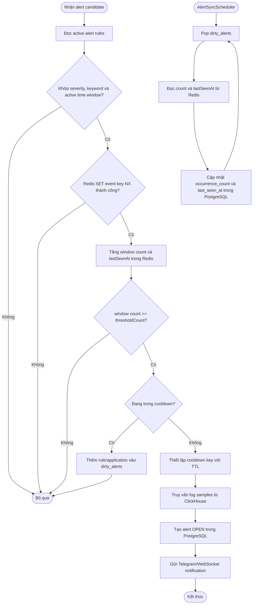

# Alerting & Deduplication

**Loại sơ đồ:** Flowchart  
**Mô tả:** Luồng đánh giá alert candidate, kiểm tra idempotency, threshold, cooldown và đồng bộ occurrence về PostgreSQL.

```mermaid
flowchart TD
    Start([Nhận alert candidate]) --> FetchRules[Đọc active alert rules]
    FetchRules --> MatchRules{Khớp severity, keyword và active time window?}
    MatchRules -- Không --> Skip([Bỏ qua])

    MatchRules -- Có --> Idempotency{Redis SET event key NX thành công?}
    Idempotency -- Không --> Skip
    Idempotency -- Có --> IncWindow[Tăng window count và lastSeenAt trong Redis]
    IncWindow --> Threshold{window count >= thresholdCount?}
    Threshold -- Không --> Skip

    Threshold -- Có --> Cooldown{Đang trong cooldown?}
    Cooldown -- Có --> Dirty[Thêm rule/application vào dirty_alerts]
    Dirty --> Skip

    Cooldown -- Không --> SetCooldown[Thiết lập cooldown key với TTL]
    SetCooldown --> QuerySamples[Truy vấn log samples từ ClickHouse]
    QuerySamples --> SaveAlert[Tạo alert OPEN trong PostgreSQL]
    SaveAlert --> Notify[Gửi Telegram/WebSocket notification]
    Notify --> End([Kết thúc])

    Scheduler([AlertSyncScheduler]) --> PopDirty[Pop dirty_alerts]
    PopDirty --> ReadState[Đọc count và lastSeenAt từ Redis]
    ReadState --> SyncPostgres[Cập nhật occurrence_count và last_seen_at trong PostgreSQL]
    SyncPostgres --> PopDirty
```
