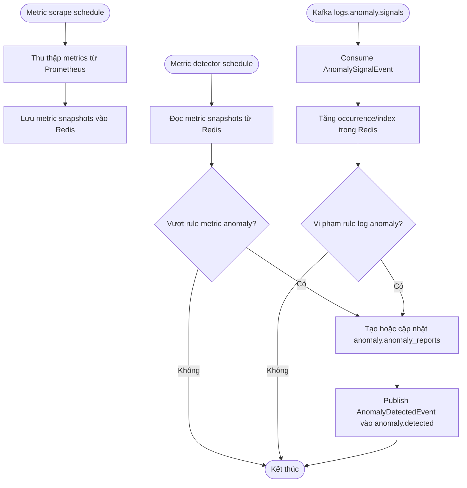

# Anomaly Detection

**Loại sơ đồ:** Flowchart  
**Mô tả:** Hai nhánh phát hiện bất thường: metric anomaly từ Prometheus và log anomaly từ Kafka signal.

```mermaid
flowchart TD
    MetricScrape([Metric scrape schedule]) --> ScrapeProm[Thu thập metrics từ Prometheus]
    ScrapeProm --> SaveRedis[Lưu metric snapshots vào Redis]
    MetricDetect([Metric detector schedule]) --> ReadRedis[Đọc metric snapshots từ Redis]
    ReadRedis --> EvaluateMetrics{Vượt rule metric anomaly?}

    LogSignal([Kafka logs.anomaly.signals]) --> ConsumeLog[Consume AnomalySignalEvent]
    ConsumeLog --> IncRedis[Tăng occurrence/index trong Redis]
    IncRedis --> EvaluateLogs{Vi phạm rule log anomaly?}

    EvaluateMetrics -- Không --> End([Kết thúc])
    EvaluateLogs -- Không --> End
    EvaluateMetrics -- Có --> UpsertReport[Tạo hoặc cập nhật anomaly.anomaly_reports]
    EvaluateLogs -- Có --> UpsertReport
    UpsertReport --> PublishDetected[Publish AnomalyDetectedEvent vào anomaly.detected]
    PublishDetected --> End
```
