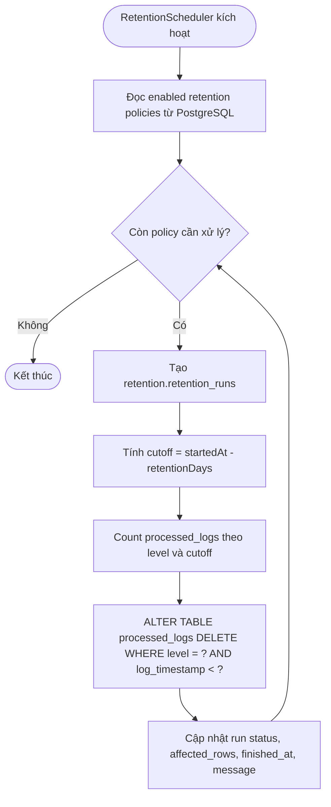

# Data Retention

**Loại sơ đồ:** Flowchart  
**Mô tả:** Luồng chạy retention policies và xóa log hết hạn trong ClickHouse.

```mermaid
flowchart TD
    Start([RetentionScheduler kích hoạt]) --> FetchPolicies[Đọc enabled retention policies từ PostgreSQL]
    FetchPolicies --> HasPolicy{Còn policy cần xử lý?}
    HasPolicy -- Không --> End([Kết thúc])

    HasPolicy -- Có --> CreateRun[Tạo retention.retention_runs]
    CreateRun --> CalcCutoff[Tính cutoff = startedAt - retentionDays]
    CalcCutoff --> CountRows[Count processed_logs theo level và cutoff]
    CountRows --> DeleteRows[ALTER TABLE processed_logs DELETE WHERE level = ? AND log_timestamp < ?]
    DeleteRows --> UpdateRun[Cập nhật run status, affected_rows, finished_at, message]
    UpdateRun --> HasPolicy
```
