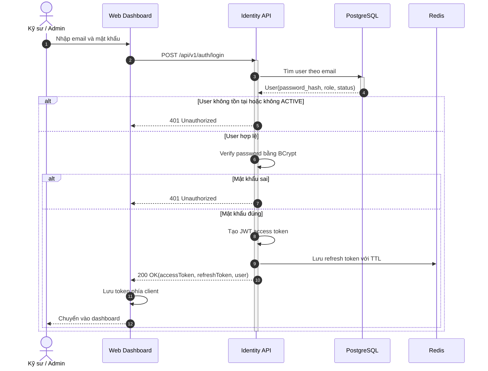

# Identity & Access

**Loại sơ đồ:** Sequence diagram  
**Mô tả:** Luồng đăng nhập, kiểm tra user trong PostgreSQL, tạo JWT access token và lưu refresh token vào Redis.

```mermaid
sequenceDiagram
    autonumber
    actor User as Kỹ sư / Admin
    participant Dashboard as Web Dashboard
    participant API as Identity API
    participant DB as PostgreSQL
    participant Redis as Redis

    User->>Dashboard: Nhập email và mật khẩu
    Dashboard->>API: POST /api/v1/auth/login
    activate API
    API->>DB: Tìm user theo email
    activate DB
    DB-->>API: User(password_hash, role, status)
    deactivate DB

    alt User không tồn tại hoặc không ACTIVE
        API-->>Dashboard: 401 Unauthorized
    else User hợp lệ
        API->>API: Verify password bằng BCrypt
        alt Mật khẩu sai
            API-->>Dashboard: 401 Unauthorized
        else Mật khẩu đúng
            API->>API: Tạo JWT access token
            API->>Redis: Lưu refresh token với TTL
            API-->>Dashboard: 200 OK(accessToken, refreshToken, user)
            Dashboard->>Dashboard: Lưu token phía client
            Dashboard-->>User: Chuyển vào dashboard
        end
    end
    deactivate API
```
