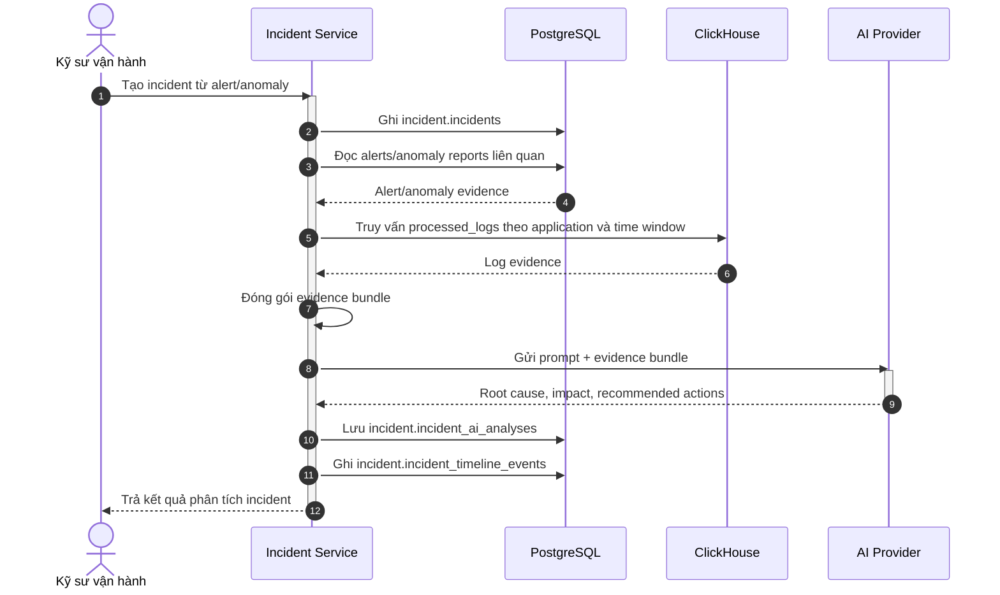

# Incident Management & AI Assistant

**Loại sơ đồ:** Sequence diagram  
**Mô tả:** Luồng tạo incident, gom evidence từ alerts/anomalies/logs và gọi AI provider để phân tích.

```mermaid
sequenceDiagram
    autonumber
    actor Op as Kỹ sư vận hành
    participant Service as Incident Service
    participant PG as PostgreSQL
    participant CH as ClickHouse
    participant AI as AI Provider

    Op->>Service: Tạo incident từ alert/anomaly
    activate Service
    Service->>PG: Ghi incident.incidents
    Service->>PG: Đọc alerts/anomaly reports liên quan
    PG-->>Service: Alert/anomaly evidence
    Service->>CH: Truy vấn processed_logs theo application và time window
    CH-->>Service: Log evidence

    Service->>Service: Đóng gói evidence bundle
    Service->>AI: Gửi prompt + evidence bundle
    activate AI
    AI-->>Service: Root cause, impact, recommended actions
    deactivate AI

    Service->>PG: Lưu incident.incident_ai_analyses
    Service->>PG: Ghi incident.incident_timeline_events
    Service-->>Op: Trả kết quả phân tích incident
    deactivate Service
```
