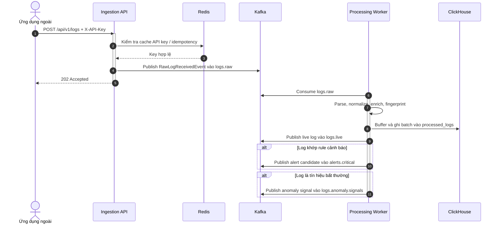

# Log Ingestion & Processing

**Loại sơ đồ:** Sequence diagram  
**Mô tả:** Luồng nhận raw log, xác thực API key, publish vào Kafka, xử lý bất đồng bộ, ghi ClickHouse và phát downstream events.

```mermaid
sequenceDiagram
    autonumber
    actor App as Ứng dụng ngoài
    participant Ingest as Ingestion API
    participant Redis as Redis
    participant Kafka as Kafka
    participant Worker as Processing Worker
    participant CH as ClickHouse

    App->>Ingest: POST /api/v1/logs + X-API-Key
    activate Ingest
    Ingest->>Redis: Kiểm tra cache API key / idempotency
    Redis-->>Ingest: Key hợp lệ
    Ingest->>Kafka: Publish RawLogReceivedEvent vào logs.raw
    Ingest-->>App: 202 Accepted
    deactivate Ingest

    Worker->>Kafka: Consume logs.raw
    activate Worker
    Worker->>Worker: Parse, normalize, enrich, fingerprint
    Worker->>CH: Buffer và ghi batch vào processed_logs
    Worker->>Kafka: Publish live log vào logs.live

    alt Log khớp rule cảnh báo
        Worker->>Kafka: Publish alert candidate vào alerts.critical
    end

    alt Log là tín hiệu bất thường
        Worker->>Kafka: Publish anomaly signal vào logs.anomaly.signals
    end
    deactivate Worker
```
