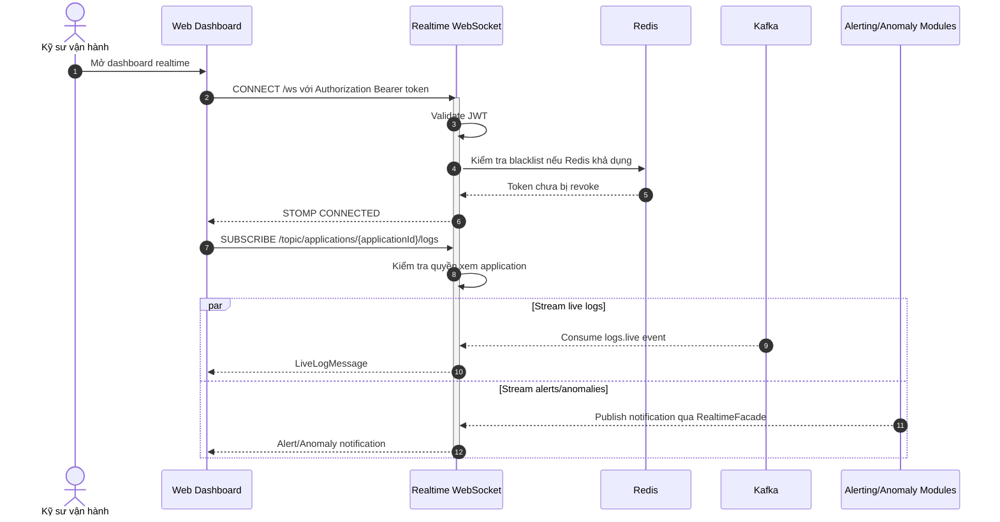

# Realtime Stream

**Loại sơ đồ:** Sequence diagram  
**Mô tả:** Luồng kết nối WebSocket/STOMP, xác thực JWT và stream logs/alerts/anomaly notifications tới dashboard.

```mermaid
sequenceDiagram
    autonumber
    actor Op as Kỹ sư vận hành
    participant Dashboard as Web Dashboard
    participant Gateway as Realtime WebSocket
    participant Redis as Redis
    participant Kafka as Kafka
    participant Alerting as Alerting/Anomaly Modules

    Op->>Dashboard: Mở dashboard realtime
    Dashboard->>Gateway: CONNECT /ws với Authorization Bearer token
    activate Gateway
    Gateway->>Gateway: Validate JWT
    Gateway->>Redis: Kiểm tra blacklist nếu Redis khả dụng
    Redis-->>Gateway: Token chưa bị revoke
    Gateway-->>Dashboard: STOMP CONNECTED

    Dashboard->>Gateway: SUBSCRIBE /topic/applications/{applicationId}/logs
    Gateway->>Gateway: Kiểm tra quyền xem application

    par Stream live logs
        Kafka-->>Gateway: Consume logs.live event
        Gateway-->>Dashboard: LiveLogMessage
    and Stream alerts/anomalies
        Alerting-->>Gateway: Publish notification qua RealtimeFacade
        Gateway-->>Dashboard: Alert/Anomaly notification
    end
    deactivate Gateway
```
