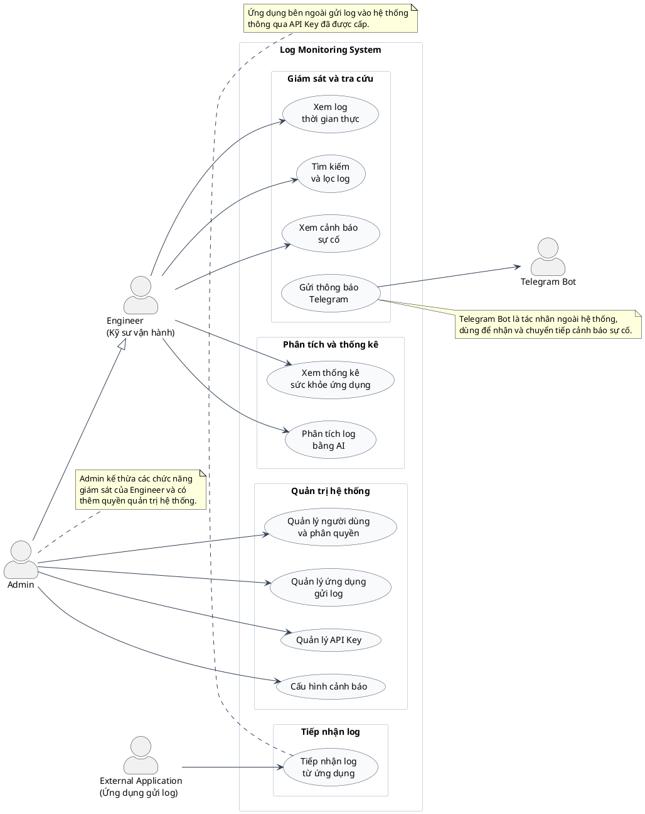

# Use Case tổng quan của hệ thống

Sơ đồ này dùng cho mục `2.5 Use case tổng quan` trong báo cáo.

**Caption đề xuất:** Hình 2.x. Use Case tổng quan của hệ thống.

## Danh sách Use Case chính

| STT | Use Case | Tác nhân chính | Mô tả ngắn |
| --- | --- | --- | --- |
| 1 | Quản lý ứng dụng gửi log | Admin | Quản lý các application được phép gửi log vào hệ thống. |
| 2 | Quản lý API Key | Admin | Tạo, quản lý hoặc thu hồi API Key dùng để xác thực application gửi log. |
| 3 | Tiếp nhận log từ ứng dụng | External Application | Ứng dụng bên ngoài gửi log vào hệ thống để lưu trữ, xử lý và giám sát. |
| 4 | Xem log thời gian thực | Engineer, Admin | Theo dõi log mới phát sinh theo thời gian thực trên giao diện. |
| 5 | Tìm kiếm và lọc log | Engineer, Admin | Tra cứu log theo application, thời gian, mức độ lỗi hoặc nội dung. |
| 6 | Xem cảnh báo sự cố | Engineer, Admin | Theo dõi các cảnh báo được tạo ra khi hệ thống phát hiện log lỗi nghiêm trọng. |
| 7 | Quản lý người dùng và phân quyền | Admin | Quản lý tài khoản người dùng và phân quyền truy cập theo application. |
| 8 | Cấu hình cảnh báo | Admin | Thiết lập điều kiện hoặc quy tắc cảnh báo cho hệ thống giám sát log. |
| 9 | Xem thống kê sức khỏe ứng dụng | Engineer, Admin | Theo dõi tình trạng hoạt động, tỷ lệ lỗi và xu hướng log của từng application. |
| 10 | Phân tích log bằng AI | Engineer, Admin | Phân tích log để hỗ trợ nhận diện nguyên nhân lỗi hoặc gợi ý hướng xử lý. |

## Ghi chú

- Sơ đồ chỉ mô tả use case ở mức tổng quan, phù hợp với báo cáo ngắn khoảng 30
  trang.
- `Telegram Bot` là tác nhân phụ trợ bên ngoài hệ thống, phục vụ việc gửi thông
  báo cảnh báo và không nhất thiết phải đưa vào bảng use case chính.
- Các chi tiết như Kafka, ClickHouse, Redis, worker xử lý log và WebSocket nên
  được trình bày ở sơ đồ kiến trúc hoặc sequence diagram thay vì đưa vào use
  case diagram.
- Nếu phần AI chưa triển khai hoàn chỉnh, có thể ghi chú trong báo cáo rằng
  đây là use case mở rộng hoặc định hướng phát triển.
