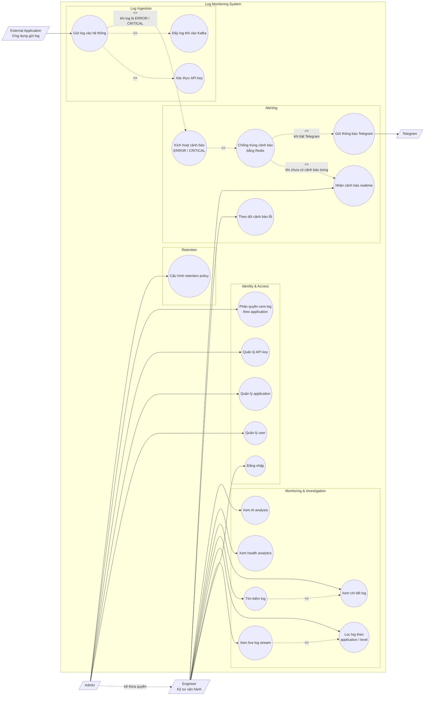

# Use case tổng quan

Sơ đồ này dùng cho mục `2.5 Use case tổng quan` trong báo cáo. Sơ đồ được viết
bằng Mermaid để dễ nhúng trực tiếp trong Markdown.

## Ghi chú

- `Admin` kế thừa quyền của `Engineer`, nghĩa là Admin có thể dùng các chức
  năng giám sát và điều tra log như Engineer, đồng thời có thêm quyền quản trị.
- `<<include>>` dùng cho bước luôn xảy ra trong use case chính.
- `<<extend>>` dùng cho hành vi chỉ xảy ra khi có điều kiện.
- Sơ đồ này chỉ mô tả use case ở mức tổng quan. Chi tiết Kafka, worker,
  ClickHouse và WebSocket nên trình bày ở sơ đồ kiến trúc hoặc sequence diagram.
